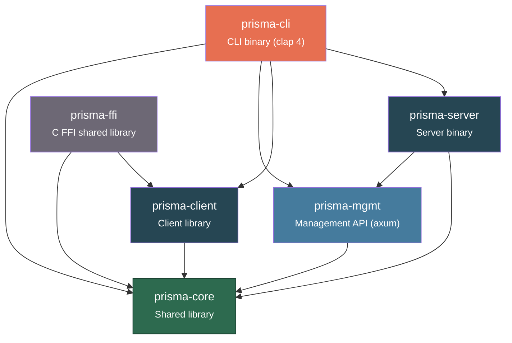
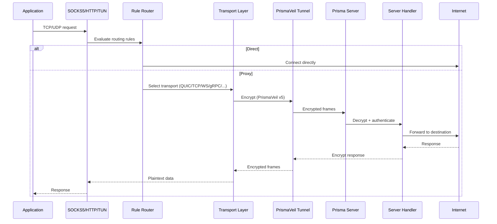

# Developer Documentation

Comprehensive internal reference for the Prisma proxy system -- architecture, module APIs, wire protocol, configuration fields, CLI commands, management endpoints, FFI functions, and extension recipes.

**Workspace version:** v2.32.0 | **Protocol:** PrismaVeil v5 | **Rust edition:** 2021

---

## Workspace Architecture

The Prisma workspace consists of six crates with well-defined dependency boundaries:



| Crate | Role |
|-------|------|
| **prisma-core** | Shared library: crypto, protocol (PrismaVeil v5), config, types, bandwidth, DNS, routing, mux, ACL, proxy groups, subscriptions, import |
| **prisma-server** | Server binary: listeners (TCP/QUIC/WS/gRPC/XHTTP/XPorta/SSH/WireGuard/CDN), relay, auth, camouflage, hot-reload |
| **prisma-client** | Client library: SOCKS5/HTTP inbound, transport selection, TUN, connection pool, DNS resolver/server, PAC, port forwarding |
| **prisma-cli** | CLI binary (clap 4): server/client runners, management commands, daemon mode, web console, diagnostics |
| **prisma-mgmt** | Management API (axum): REST + WebSocket endpoints, auth middleware, Prometheus export |
| **prisma-ffi** | C FFI shared library for GUI/mobile: lifecycle, profiles, QR, system proxy, auto-update, per-app proxy, proxy groups |

---

## Multi-Repository Layout

The Prisma project spans four repositories:

| Repository | Purpose | Stack |
|------------|---------|-------|
| [prisma](https://github.com/prisma-proxy/prisma) | Core monorepo — all Rust crates, CLI, server | Rust |
| [prisma-gui](https://github.com/prisma-proxy/prisma-gui) | Desktop/mobile client | Tauri 2 + React 19 |
| [prisma-console](https://github.com/prisma-proxy/prisma-console) | Web management dashboard | Next.js 15 |
| [prisma-docs](https://github.com/prisma-proxy/prisma-docs) | This documentation site | Docusaurus 4 |

The GUI uses the core monorepo as a git submodule for FFI/core path dependencies.

---

## Development Prerequisites

| Tool | Version | Purpose |
|------|---------|---------|
| Rust | stable (1.80+) | Core, server, client, FFI |
| Node.js | 22+ | GUI frontend, console, docs |
| npm | 10+ | Package management |
| Git | 2.30+ | Version control, submodules |

Optional:
- **Docker** — for container builds and testing
- **cargo-nextest** — faster test runner (`cargo install cargo-nextest`)
- **cargo-fuzz** — for fuzz testing (`cargo install cargo-fuzz`)

---

## Data Flow

End-to-end data flow from an application through the client to the server and out to the internet:



---

## Build Instructions

```bash
# Build all crates
cargo build --workspace

# Build in release mode
cargo build --workspace --release

# Test all crates
cargo test --workspace

# Lint with clippy
cargo clippy --workspace --all-targets

# Format check
cargo fmt --all -- --check

# Run the server
cargo run -p prisma-cli -- server -c server.toml

# Run the client
cargo run -p prisma-cli -- client -c client.toml

# Generate config files
cargo run -p prisma-cli -- init
```

All workspace dependencies are declared in the root `Cargo.toml` under `[workspace.dependencies]`. Crates reference them with `dep.workspace = true`.

---

## Sub-Pages

| Page | Contents |
|------|----------|
| [prisma-core](./prisma-core) | Shared library reference: every public module, type, and function |
| [prisma-server](./prisma-server) | Server binary reference: listeners, handler pipeline, relay, reload |
| [prisma-client](./prisma-client) | Client library reference: proxy flow, transports, TUN, DNS, connection pool |
| [prisma-mgmt](./prisma-mgmt) | Management API reference: every REST endpoint, WebSocket, auth |
| [prisma-ffi](./prisma-ffi) | FFI reference: every exported C function, error codes, mobile lifecycle |
| [prisma-cli](./prisma-cli) | CLI reference: every command, flag, default, and example |
| [protocol](./protocol) | Wire protocol reference: PrismaVeil v5 handshake, frame format, commands |
| [contributing](./contributing) | Contributing guide: adding transports, commands, endpoints, testing, fuzzing |
