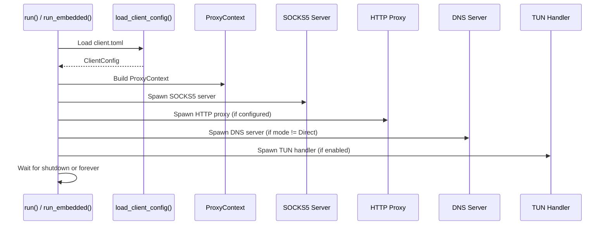

# prisma-client Reference

`prisma-client` is the client-side library crate. It provides SOCKS5 and HTTP proxy inbound handlers, an outbound connector with transport selection, TUN mode, and connection state management.

**Path:** `prisma-client/src/`

---

## Client Startup Flow



---

## Module Map

| Module | Purpose |
|--------|---------|
| `client` | `PrismaClient` -- top-level client struct managing all subsystems |
| `connector` | TCP/TLS outbound connection establishment |
| `socks5` | SOCKS5 inbound server (connect + UDP associate) |
| `http_proxy` | HTTP CONNECT proxy inbound server |
| `tun` | TUN device mode for transparent proxying |
| `state` | `ClientState` -- shared connection state (active, total, bytes) |
| `transport_selector` | Adaptive transport selector with health monitoring and automatic fallback |
| `dns_resolver` | Client-side DNS resolver with Fake IP pool, domain-based routing, and smart blocklist |
| `udp_relay` | SOCKS5 UDP ASSOCIATE relay between local clients and proxy server |
| `latency` | TCP connect latency testing with parallel server testing and best-server selection |
| `pac` | PAC (Proxy Auto-Configuration) file generation and HTTP serving |
| `metrics` | Lock-free atomic traffic counters (bytes up/down, connections, active) |

---

## Transport Selection

| Transport | Description |
|-----------|-------------|
| `quic` | QUIC v1 via quinn. ALPN masquerade, congestion control |
| `quic-v2` | QUIC v2 with enhanced header protection |
| `quic-v2-salamander` | QUIC v2 + Salamander UDP obfuscation |
| `tcp` | Raw TCP with TLS |
| `prisma-tls` | TCP + PrismaTLS fingerprint randomization (replaces REALITY) |
| `ws` | WebSocket over HTTPS. CDN-compatible |
| `grpc` | gRPC bidirectional streaming. CDN-compatible |
| `xhttp` | HTTP-native chunked transfer. CDN-compatible |
| `xporta` | REST API simulation. CDN-compatible |
| `shadow-tls` | ShadowTLS v3 |
| `ssh` | SSH channel tunnel |
| `wireguard` | WireGuard-compatible UDP |

The transport selector supports automatic fallback: if the preferred transport fails, the client tries the next in the configured list. VLESS connections support **Vision splice** -- a zero-copy optimization that splices TLS records directly between the inbound and outbound sockets, eliminating double-encryption overhead. In v2.0.0, connection pool health checking ensures only healthy transport connections are reused.

### Adaptive Transport Selector (v2.0.0)

The `TransportSelector` monitors connection health per transport in a sliding window (default 5 minutes). When a transport's failure rate exceeds the threshold (default 50%), it is marked unhealthy and the selector falls back to the next transport in the configured order. Healthy transports are automatically re-enabled when the monitoring window resets.

**Default fallback order:**

1. QUIC v2 + Salamander (lowest latency)
2. QUIC v2 plain
3. PrismaTLS (best active probing resistance)
4. WebSocket over CDN
5. XPorta over CDN (last resort)

**Configuration:**

```toml
[client]
transport_fallback = ["quic-v2-salamander", "quic-v2", "prisma-tls", "websocket", "xporta"]
```

**Health snapshot API** -- the `health_snapshot()` method returns `(transport, healthy, failure_rate)` tuples for dashboard display.

---

## TUN Mode

| Module | Description |
|--------|-------------|
| `tun::device` | Create and configure TUN device |
| `tun::handler` | Read IP packets, proxy through tunnel |
| `tun::process` | Per-app filtering |

Per-app filter config: `{"mode": "include"|"exclude", "apps": ["Firefox"]}`

---

## Client DNS Resolver (v2.0.0)

The `ClientDnsResolver` wraps the core `DnsResolver` with client-specific features:

| Mode | Behavior |
|------|----------|
| `System` | Use system resolver; tunnel DNS only for domains matching the blocklist |
| `Doh` | DNS-over-HTTPS -- all queries tunneled through the proxy |
| `Doq` | DNS-over-QUIC -- all queries tunneled through the proxy |
| `FakeIp` | Assign fake IPs from a pool (`198.18.0.0/15`); real resolution happens at the server |

**Fake IP features:**

- `assign_fake_ip(domain)` -- allocate a fake IP for a domain (idempotent)
- `lookup_fake_ip(ip)` -- reverse-lookup the real domain for a fake IP
- `is_fake_ip(ip)` -- check if an IP belongs to the fake IP pool

**Smart DNS blocklist** -- in `System` mode, commonly censored domains (Google, YouTube, Facebook, Twitter, Telegram, GitHub, etc.) are automatically tunneled. In production, the blocklist is loaded from a GeoSite database.

**DNS tunneling** -- `build_tunnel_dns_query()` and `parse_tunnel_dns_response()` construct minimal DNS wire-format queries for forwarding through the proxy tunnel.

---

## UDP Relay (v2.0.0)

The `UdpRelay` module handles SOCKS5 UDP ASSOCIATE sessions. When a SOCKS5 client requests UDP association, a relay task is spawned that:

1. Binds a local UDP socket for the client
2. Strips the SOCKS5 UDP request header on the send path
3. Forwards raw UDP payloads to the proxy server
4. Prepends the SOCKS5 UDP response header on the receive path

Each relay runs as an independent tokio task and stops automatically when dropped.

---

## PAC Support (v2.0.0)

The `pac` module generates and serves Proxy Auto-Configuration files:

- **`generate_pac(rules, proxy_addr, default_proxy)`** -- converts routing rules into JavaScript `FindProxyForURL()` logic
- **`serve_pac(content, port, stop_rx)`** -- HTTP server on `127.0.0.1:<port>` serving the PAC file with `application/x-ns-proxy-autoconfig` content type

**Supported rule types in PAC output:**

| Rule Type | PAC Expression |
|-----------|---------------|
| `Domain` | `host === "example.com"` |
| `DomainSuffix` | `dnsDomainIs(host, ".google.com")` |
| `DomainKeyword` | `host.indexOf("keyword") !== -1` |
| `IpCidr` | `isInNet(host, "10.0.0.0", "255.0.0.0")` |
| `Final` | Default return value |
| `GeoIp`, `ProcessName` | Skipped (not expressible in PAC) |

**Usage:** Configure the OS or browser to use `http://127.0.0.1:8070/proxy.pac` as the automatic proxy configuration URL. The PAC server automatically bypasses private networks (10.x, 172.16.x, 192.168.x, localhost).

---

## Client Metrics (v2.0.0)

`ClientMetrics` provides thread-safe atomic counters shared across all connection handler tasks:

| Counter | Method | Description |
|---------|--------|-------------|
| `bytes_up` | `add_up(n)` / `get_up()` | Total bytes sent upstream |
| `bytes_down` | `add_down(n)` / `get_down()` | Total bytes received downstream |
| `connections` | `connection_opened()` / `total_connections()` | Total connections handled |
| `active` | `connection_opened()` / `connection_closed()` / `active_connections()` | Currently active connections |

Uses `Arc<AtomicU64>` for lock-free, zero-contention counting. The `Clone` impl is cheap (Arc reference count bump). Call `to_json()` for a JSON snapshot.

---

## Latency Testing (v2.0.0)

The `latency` module provides TCP connect latency measurement:

- **`test_latency(addr, config)`** -- blocking, multiple attempts, returns median
- **`test_latency_async(addr, config)`** -- async with tokio timeout
- **`test_all_servers(servers, config)`** -- parallel testing with semaphore-bounded concurrency (default 10)
- **`select_best(servers, config)`** -- returns the index of the lowest-latency reachable server
- **`periodic_latency_test(servers, config, interval, on_result)`** -- continuous re-testing loop with callback

**Configuration:**

```rust
LatencyTestConfig {
    connect_timeout: Duration::from_secs(5),
    attempts: 3,
    concurrency: 10,
}
```

Results are sorted fastest-first; unreachable servers sort to the end.

---

## Entry Points

| Function | Use Case |
|----------|----------|
| `PrismaClient::new(config)` | Create a new client instance from `ClientConfig` |
| `PrismaClient::run(shutdown_rx)` | Run the client event loop (accepts connections until shutdown signal) |
| `PrismaClient::state()` | Get a reference to `ClientState` for metrics queries |
