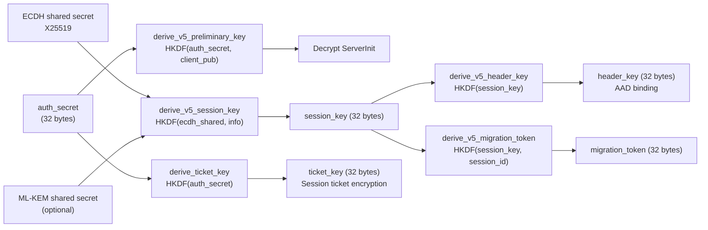
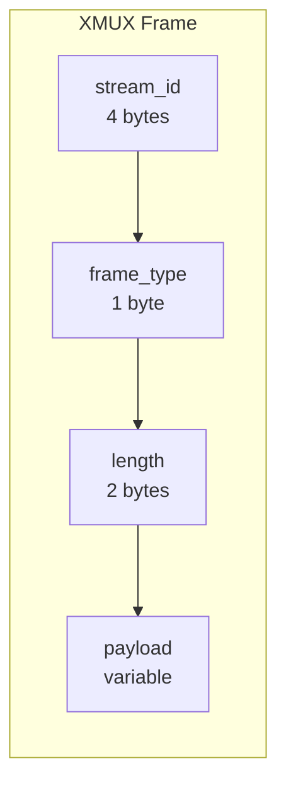

# prisma-core Reference

`prisma-core` is the shared foundation library used by every other crate in the workspace. It provides cryptography, the PrismaVeil v5 protocol, configuration parsing, routing, DNS, multiplexing, access control, proxy groups, subscriptions, and common types.

**Path:** `crates/prisma-core/src/`

---

## Module Map

| Module | Path | Purpose |
|--------|------|---------|
| `crypto` | `crypto/` | AEAD ciphers, KDF, ECDH, PQ-KEM, padding, ticket key ring |
| `protocol` | `protocol/` | PrismaVeil handshake, codec, frame types, anti-replay |
| `config` | `config/` | Client and server config parsing, validation |
| `router` | `router/` | Rule-based routing engine |
| `dns` | `dns/` | DNS modes, DoH resolver, Fake IP |
| `mux` | `mux.rs` | XMUX stream multiplexing |
| `acl` | `acl.rs` | Access control lists |
| `proxy_group` | `proxy_group.rs` | Proxy group manager |
| `subscription` | `subscription.rs` | Subscription fetch and parse |
| `rule_provider` | `rule_provider.rs` | External rule provider manager |
| `buffer_pool` | `buffer_pool.rs` | Pooled buffer allocator |
| `state` | `state.rs` | Server state, metrics, connection tracking |
| `wireguard` | `wireguard.rs` | WireGuard packet format |
| `types` | `types.rs` | Protocol constants, CipherSuite, ClientId, ProxyAddress |
| `bandwidth` | `bandwidth/` | Rate limiter, traffic quota |
| `util` | `util.rs` | Hex encoding, constant-time equality, auth token computation |
| `congestion` | `congestion/` | Congestion control modes (BBR, Brutal, Adaptive) |
| `entropy` | `entropy.rs` | Entropy camouflage for GFW evasion |
| `fec` | `fec.rs` | Forward Error Correction (Reed-Solomon) |
| `geodata` | `geodata/` | GeoIP database loading and matching |
| `cache` | `cache.rs` | DNS cache |
| `logging` | `logging.rs` | Logging initialization with broadcast support |
| `port_hop` | `port_hop.rs` | HMAC-based port hopping |
| `traffic_shaping` | `traffic_shaping.rs` | Chaff, jitter, coalescing |
| `prisma_auth` | `prisma_auth/` | PrismaAuth authentication extensions |
| `prisma_flow` | `prisma_flow/` | PrismaFlow traffic analysis resistance |
| `prisma_fp` | `prisma_fp/` | Browser fingerprint mimicry |
| `prisma_mask` | `prisma_mask/` | Entropy camouflage masks |
| `salamander` | `salamander.rs` | Salamander v2 UDP obfuscation |
| `utls` | `utls/` | uTLS fingerprinting support |
| `xporta` | `xporta/` | XPorta REST API simulation transport |
| `error` | `error.rs` | Unified error types |
| `proto` | `proto/` | Protobuf definitions (gRPC) |

---

## crypto -- Cryptography

### crypto::aead

AEAD cipher abstraction layer supporting multiple cipher suites.

| Type | Description |
|------|-------------|
| `AeadCipher` (trait) | Trait for authenticated encryption: `encrypt(nonce, plaintext, aad) -> ciphertext`, `decrypt(nonce, ciphertext, aad) -> plaintext` |
| `ChaCha20Poly1305Cipher` | ChaCha20-Poly1305 implementation (default cipher) |
| `Aes256GcmCipher` | AES-256-GCM implementation |
| `TransportOnlyCipher` | BLAKE3 keyed MAC for integrity only (no encryption); safe when the transport already provides confidentiality (TLS/QUIC) |

| Function | Signature | Description |
|----------|-----------|-------------|
| `create_cipher` | `fn create_cipher(suite: CipherSuite, key: &[u8; 32]) -> Box<dyn AeadCipher>` | Factory function that creates the appropriate cipher from a suite enum and key |

### crypto::kdf

Key derivation functions using HKDF-SHA256 with domain-separated labels.

| Function | Description |
|----------|-------------|
| `derive_v5_preliminary_key(auth_secret, client_pub) -> [u8; 32]` | Derives the key used to encrypt the ServerInit message. Uses HKDF-SHA256 with domain label `"prisma-v5-preliminary"` |
| `derive_v5_session_key(ecdh_shared, pq_shared, info) -> [u8; 32]` | Derives the session key from ECDH (and optionally PQ-KEM) shared secrets. Domain label `"prisma-v5-session"` |
| `derive_v5_header_key(session_key) -> [u8; 32]` | Derives the header authentication key from the session key. Domain label `"prisma-v5-header-auth"` |
| `derive_v5_migration_token(session_key, session_id) -> [u8; 32]` | Derives a connection migration token for seamless reconnection. Domain label `"prisma-v5-migration"` |
| `derive_ticket_key(auth_secret) -> [u8; 32]` | Derives the key used to encrypt session tickets for 0-RTT resumption |

### crypto::ecdh

X25519 ephemeral key exchange.

| Type/Method | Description |
|-------------|-------------|
| `EphemeralKeyPair::generate() -> Self` | Generate a new random X25519 keypair |
| `EphemeralKeyPair::public_key_bytes() -> [u8; 32]` | Get the public key bytes |
| `EphemeralKeyPair::diffie_hellman(peer_public: &[u8; 32]) -> [u8; 32]` | Compute the ECDH shared secret |

### crypto::pq_kem

Hybrid post-quantum key exchange using ML-KEM-768 (Kyber).

| Function | Description |
|----------|-------------|
| `generate_mlkem_keypair() -> MlKemKeypair` | Generate a new ML-KEM-768 keypair |
| `encapsulate(ek_bytes: &[u8]) -> (Vec<u8>, [u8; 32])` | Encapsulate to produce ciphertext (1088 bytes) and shared secret (32 bytes) |
| `decapsulate(keypair: &MlKemKeypair, ciphertext: &[u8]) -> [u8; 32]` | Decapsulate to recover the shared secret |

### crypto::ticket_key_ring

| Type/Method | Description |
|-------------|-------------|
| `TicketKeyRing::new(initial_key, rotation_interval, retain_count) -> Self` | Create with initial key, rotation period (default 6h), and number of retired keys to retain (default 3) |
| `current_key() -> [u8; 32]` | Get the active encryption key |
| `try_decrypt(data) -> Option<Vec<u8>>` | Try decrypting with the current key, then retired keys |

---

## protocol -- PrismaVeil v5

See the dedicated [Protocol Reference](./protocol) for full wire format details.

### Command bytes

| Constant | Value | Direction | Description |
|----------|-------|-----------|-------------|
| `CMD_CONNECT` | `0x01` | C->S | Open a proxy connection to a destination |
| `CMD_DATA` | `0x02` | Both | Relay data |
| `CMD_CLOSE` | `0x03` | Both | Close a stream |
| `CMD_PING` | `0x04` | Both | Keepalive ping |
| `CMD_PONG` | `0x05` | Both | Keepalive pong |
| `CMD_REGISTER_FORWARD` | `0x06` | C->S | Register a port forward |
| `CMD_FORWARD_READY` | `0x07` | S->C | Acknowledge a port forward |
| `CMD_FORWARD_CONNECT` | `0x08` | S->C | New inbound connection on a forwarded port |
| `CMD_UDP_ASSOCIATE` | `0x09` | C->S | Set up UDP relay |
| `CMD_UDP_DATA` | `0x0A` | Both | UDP datagram |
| `CMD_SPEED_TEST` | `0x0B` | Both | Bandwidth measurement |
| `CMD_DNS_QUERY` | `0x0C` | C->S | Encrypted DNS query |
| `CMD_DNS_RESPONSE` | `0x0D` | S->C | Encrypted DNS response |
| `CMD_CHALLENGE_RESP` | `0x0E` | C->S | Challenge-response verification |
| `CMD_MIGRATION` | `0x0F` | C->S | Connection migration request (v5) |

### Flag bits (2-byte LE bitmask)

| Constant | Value | Description |
|----------|-------|-------------|
| `FLAG_PADDED` | `0x0001` | Frame contains random padding |
| `FLAG_FEC` | `0x0002` | Frame includes FEC data |
| `FLAG_PRIORITY` | `0x0004` | High-priority frame |
| `FLAG_DATAGRAM` | `0x0008` | UDP datagram mode |
| `FLAG_COMPRESSED` | `0x0010` | Payload is compressed |
| `FLAG_0RTT` | `0x0020` | 0-RTT resumed frame |
| `FLAG_BUCKETED` | `0x0040` | Bucket padding (anti-TLS fingerprinting) |
| `FLAG_CHAFF` | `0x0080` | Chaff traffic (dummy) |
| `FLAG_HEADER_AUTHENTICATED` | `0x0100` | Header bound as AAD (v5) |
| `FLAG_MIGRATION` | `0x0200` | Carries migration token (v5) |

### Server feature flags (32-bit bitmask)

| Constant | Value | Description |
|----------|-------|-------------|
| `FEATURE_UDP_RELAY` | `0x0001` | UDP relay support |
| `FEATURE_FEC` | `0x0002` | Forward Error Correction |
| `FEATURE_PORT_HOPPING` | `0x0004` | HMAC-based port hopping |
| `FEATURE_SPEED_TEST` | `0x0008` | Speed test support |
| `FEATURE_DNS_TUNNEL` | `0x0010` | Encrypted DNS tunnel |
| `FEATURE_BANDWIDTH_LIMIT` | `0x0020` | Per-client bandwidth limits |
| `FEATURE_TRANSPORT_ONLY_CIPHER` | `0x0040` | Transport-only cipher mode |
| `FEATURE_EXTENDED_ANTI_REPLAY` | `0x0080` | 2048-bit anti-replay window (v5) |
| `FEATURE_V5_KDF` | `0x0100` | v5 key derivation (v5) |
| `FEATURE_HEADER_AUTH` | `0x0200` | Header-authenticated encryption (v5) |
| `FEATURE_CONNECTION_MIGRATION` | `0x0400` | Connection migration tokens (v5) |
| `FEATURE_PQ_KEM` | `0x0800` | Hybrid PQ key exchange (v5) |

### Key types

| Type | Description |
|------|-------------|
| `PrismaClientInit` | Client hello: version, flags, ephemeral public key, client ID, timestamp, cipher suite, auth token, optional ML-KEM encap key, padding |
| `PrismaServerInit` | Server hello: status, session ID, ephemeral public key, challenge, padding range, server features, session ticket, bucket sizes, optional PQ ciphertext |
| `PrismaClientResume` | 0-RTT resumption: version, flags, ephemeral public key, session ticket, encrypted 0-RTT data |
| `DataFrame` | Wire frame: command, 2-byte flags, 4-byte stream ID |
| `SessionKeys` | Post-handshake keys: session key, cipher suite, session ID, nonce counters, padding range, challenge, ticket, header key, migration token |
| `AtomicNonceCounter` | Lock-free atomic nonce counter for high-throughput relay |
| `Command` | Enum of all command variants |
| `AcceptStatus` | Handshake result: Ok, AuthFailed, ServerBusy, VersionMismatch, QuotaExceeded |

### protocol::codec

| Function | Description |
|----------|-------------|
| `encode_client_init(msg) -> Vec<u8>` | Encode PrismaClientInit to wire bytes |
| `decode_client_init(data) -> Result<PrismaClientInit>` | Decode PrismaClientInit from wire bytes |
| `encode_server_init(msg) -> Vec<u8>` | Encode PrismaServerInit to plaintext bytes |
| `decode_server_init(data) -> Result<PrismaServerInit>` | Decode PrismaServerInit from plaintext bytes |
| `encode_data_frame(frame) -> Vec<u8>` | Encode a DataFrame to plaintext bytes |
| `decode_data_frame(data) -> Result<DataFrame>` | Decode a DataFrame from plaintext bytes |
| `encrypt_frame(cipher, nonce, plaintext) -> Result<Vec<u8>>` | Encrypt a frame with AEAD |
| `decrypt_frame(cipher, ciphertext) -> Result<(Vec<u8>, [u8; 12])>` | Decrypt a frame |

---

## config -- Configuration

### Server config (`ServerConfig`)

| Field | Type | Default | Description |
|-------|------|---------|-------------|
| `listen_addr` | `String` | `"0.0.0.0:8443"` | TCP listener address |
| `quic_listen_addr` | `String` | `"0.0.0.0:8443"` | QUIC listener address |
| `authorized_clients` | `Vec<AuthorizedClient>` | `[]` | Authorized client credentials |
| `tls` | `Option<TlsConfig>` | `None` | TLS certificate and key paths |
| `logging` | `LoggingConfig` | level=info | Logging configuration |
| `management_api` | `ManagementApiConfig` | disabled | Management API settings |
| `camouflage` | `CamouflageConfig` | disabled | TLS camouflage |
| `cdn` | `CdnConfig` | disabled | CDN/WS/gRPC/XHTTP listener |
| `ssh` | `SshConfig` | disabled | SSH transport |
| `wireguard` | `WireGuardConfig` | disabled | WireGuard UDP |
| `prisma_tls` | `PrismaTlsConfig` | disabled | PrismaTLS |
| `routing` | `RoutingConfig` | empty | Server-side routing |
| `config_watch` | `bool` | `false` | Auto-reload on change |
| `ticket_rotation_hours` | `u64` | `6` | Ticket key rotation interval |

### Client config (`ClientConfig`)

| Field | Type | Default | Description |
|-------|------|---------|-------------|
| `server_addr` | `String` | required | Server address (host:port) |
| `socks5_listen_addr` | `String` | `"127.0.0.1:1080"` | SOCKS5 listen address |
| `http_listen_addr` | `Option<String>` | `None` | HTTP proxy listen address |
| `transport` | `String` | `"quic"` | Transport type |
| `identity` | `IdentityConfig` | required | Client ID and auth secret |
| `cipher_suite` | `String` | `"chacha20-poly1305"` | Cipher suite |
| `dns` | `DnsConfig` | direct | DNS configuration |
| `routing` | `ClientRoutingConfig` | empty | Routing rules |
| `tun` | `TunConfig` | disabled | TUN mode |
| `pac_port` | `Option<u16>` | `None` | PAC server port |
| `port_forwards` | `Vec<PortForwardConfig>` | `[]` | Port forwards |
| `congestion` | `CongestionConfig` | default | Congestion control |
| `fingerprint` | `String` | `"chrome"` | Browser fingerprint |

---

## router -- Rule-Based Routing

| Type | Description |
|------|-------------|
| `Router` | Routing engine with sorted rules |
| `RuleCondition` | Enum: `DomainExact`, `DomainMatch`, `DomainKeyword`, `IpCidr`, `GeoIp`, `PortRange`, `Port`, `All` |
| `RouteAction` | Enum: `Proxy`, `Direct`, `Block` |

---

## mux -- XMUX Stream Multiplexing

| Constant | Value | Description |
|----------|-------|-------------|
| `MUX_SYN` | `0x01` | Open new stream |
| `MUX_DATA` | `0x02` | Stream data |
| `MUX_FIN` | `0x03` | Close stream |
| `MUX_RST` | `0x04` | Reset stream |

---

## types -- Common Types

| Constant | Value | Description |
|----------|-------|-------------|
| `PRISMA_PROTOCOL_VERSION` | `0x05` | Protocol version |
| `MAX_FRAME_SIZE` | `32768` | Max encrypted frame size |
| `NONCE_SIZE` | `12` | AEAD nonce size |

| Type | Description |
|------|-------------|
| `ClientId` | UUID v4 client identifier |
| `CipherSuite` | `ChaCha20Poly1305` (default), `Aes256Gcm`, `TransportOnly` |
| `ProxyAddress` | `Ipv4`, `Ipv6`, or `Domain` |
| `ProxyDestination` | Address + port |

---

## bandwidth -- Rate Limiting and Quotas

| Type | Description |
|------|-------------|
| `BandwidthLimiterStore` | Per-client rate limiters |
| `QuotaStore` | Per-client traffic quotas |
| `parse_bandwidth(s) -> Option<u64>` | Parse `"100mbps"` to bits/sec |
| `parse_quota(s) -> Option<u64>` | Parse `"10gb"` to bytes |

---

