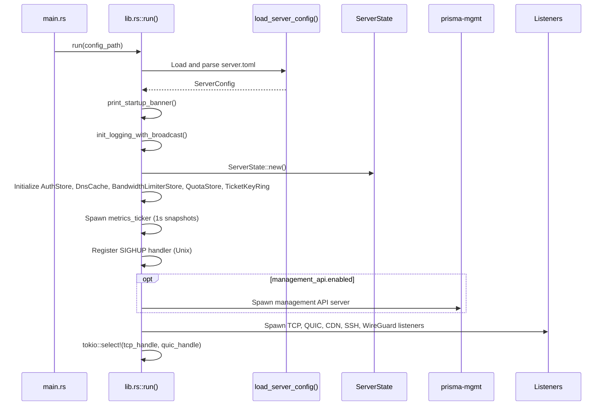
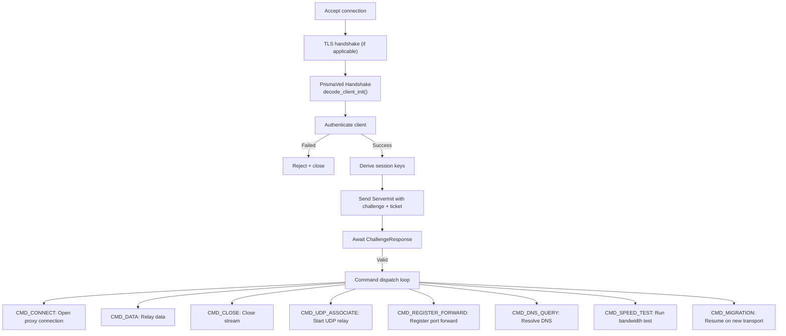

# prisma-server Reference

`prisma-server` is the server-side binary crate. It accepts encrypted connections from clients over multiple transport protocols, authenticates them, and relays traffic to the internet.

**Path:** `crates/prisma-server/src/`

---

## Startup Sequence

---

## Module Map

| Module | Purpose |
|--------|---------|
| `listener::tcp` | TCP listener: accept, TLS handshake, dispatch to handler |
| `listener::quic` | QUIC listener: quinn-based, H3 ALPN masquerade |
| `listener::cdn` | CDN HTTPS: WS/gRPC/XHTTP/XPorta multiplexing |
| `listener::ssh` | SSH transport listener |
| `listener::wireguard` | WireGuard-compatible UDP listener |
| `handler` | Main connection handler pipeline |
| `auth` | Authentication store and verification |
| `relay` | Bidirectional data relay |
| `mux_handler` | XMUX multiplexed connection handler |
| `forward` | Port forward system |
| `udp_relay` | UDP relay handler |
| `outbound` | Outbound connection establishment |
| `camouflage` | TLS camouflage (website cloning) |
| `reload` | Hot-reload: config diff, apply changes |
| `state` | ServerContext wrapping ServerState |
| `bandwidth` | Server-side bandwidth limiter and quota enforcement |

---

## Connection Handler Pipeline

---

## Listener Types

| Listener | Description |
|----------|-------------|
| TCP | Raw TCP, optional TLS, supports PrismaTLS |
| QUIC | Quinn-based QUIC v1/v2, H3 ALPN |
| CDN | HTTPS multi-protocol: WS, gRPC, XHTTP, XPorta. Falls back to reverse proxy |
| SSH | SSH channel tunnel |
| WireGuard | WireGuard-compatible UDP |

---

## Relay Modes

| Mode | Description |
|------|-------------|
| Encrypted | Standard per-frame encryption/decryption |
| Transport-only | BLAKE3 MAC integrity check only (for TLS/QUIC) |
| Splice | Zero-copy splice on Linux |
| io_uring | Linux io_uring-based relay for maximum throughput |

---

## Forward System

1. Client sends `CMD_REGISTER_FORWARD` with remote port, name, protocol, and ACL
2. Server opens a listener on the requested port
3. When a third party connects, server sends `CMD_FORWARD_CONNECT` to the client
4. Client opens a local connection and relays data through the tunnel

---

## Reload System

Triggered by: SIGHUP signal (Unix), `POST /api/reload`, or file watcher (2s debounce).

Process: load new config, diff against current, apply changes atomically (clients, bandwidth, quotas, routing, logging level), return summary.

---

## Graceful Shutdown

The server runs TCP and QUIC listeners in a `tokio::select!` loop. When either exits, the runtime drops all spawned tasks.
