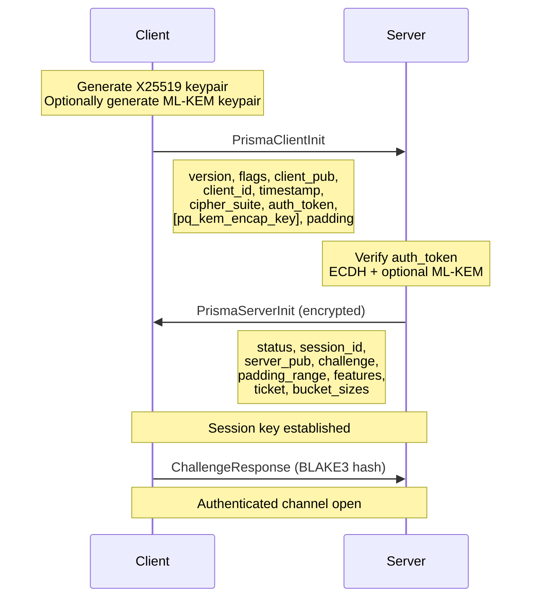
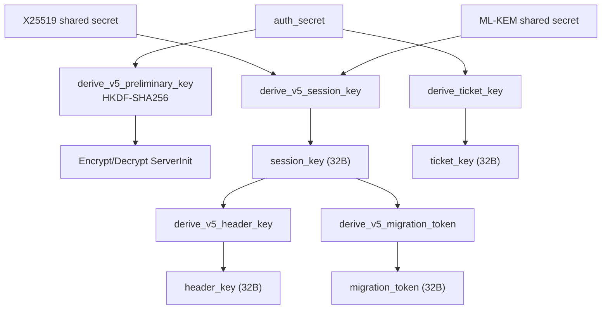
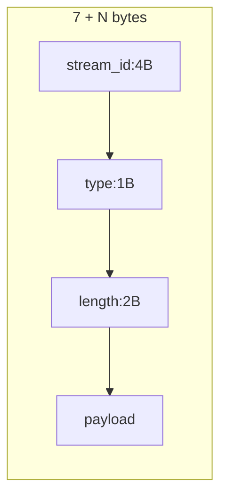

# Wire Protocol Reference

Complete specification of the PrismaVeil v5 wire protocol: handshake, frame format, command bytes, flags, nonce construction, key derivation, session tickets, XMUX frames, and WireGuard.

---

## PrismaVeil v5 Handshake

1 RTT handshake (2 messages):



### PrismaClientInit Wire Format

```
[version:1][flags:1][client_pub:32][client_id:16][timestamp:8]
[cipher_suite:1][auth_token:32][pq_encap_key_len:2][pq_encap_key:var][padding:var]
```

Min size: 91 bytes. PQ fields only when `CLIENT_INIT_FLAG_PQ_KEM` (0x10) set.

### PrismaServerInit Wire Format

Encrypted with preliminary key:

```
[status:1][session_id:16][server_pub:32][challenge:32]
[padding_min:2][padding_max:2][features:4]
[ticket_len:2][ticket:var][bucket_count:2][bucket_sizes:2*N]
[pq_ct_len:2][pq_ct:var][padding:var]
```

---

## Key Derivation Chain



---

## Frame Format

### Outer (encrypted)

```
[frame_length: 2B BE u16][encrypted_frame: frame_length bytes]
```

Max: 32768 bytes.

### Inner (plaintext)

```
[cmd:1][flags:2 LE][stream_id:4 BE][payload:var]
```

With `FLAG_BUCKETED`: `[cmd:1][flags:2][stream_id:4][bucket_pad_len:2][payload:var][padding:var]`

With `FLAG_HEADER_AUTHENTICATED` (v5): header bytes bound as AAD.

---

## Nonce Construction

```
[direction:1][zero:3][counter:8 BE]
```

Direction: `0x00` = client->server, `0x01` = server->client.

---

## Command Bytes

| Byte | Constant | Direction | Description |
|------|----------|-----------|-------------|
| `0x01` | `CMD_CONNECT` | C->S | Open proxy connection |
| `0x02` | `CMD_DATA` | Both | Relay data |
| `0x03` | `CMD_CLOSE` | Both | Close stream |
| `0x04` | `CMD_PING` | Both | Keepalive |
| `0x05` | `CMD_PONG` | Both | Keepalive response |
| `0x06` | `CMD_REGISTER_FORWARD` | C->S | Register port forward |
| `0x07` | `CMD_FORWARD_READY` | S->C | Acknowledge forward |
| `0x08` | `CMD_FORWARD_CONNECT` | S->C | New forward connection |
| `0x09` | `CMD_UDP_ASSOCIATE` | C->S | UDP relay setup |
| `0x0A` | `CMD_UDP_DATA` | Both | UDP datagram |
| `0x0B` | `CMD_SPEED_TEST` | Both | Bandwidth test |
| `0x0C` | `CMD_DNS_QUERY` | C->S | Encrypted DNS query |
| `0x0D` | `CMD_DNS_RESPONSE` | S->C | Encrypted DNS response |
| `0x0E` | `CMD_CHALLENGE_RESP` | C->S | Challenge-response |
| `0x0F` | `CMD_MIGRATION` | C->S | Connection migration (v5) |

---

## Frame Flags (2-byte LE)

| Bit | Value | Description |
|-----|-------|-------------|
| 0 | `0x0001` | Padded |
| 1 | `0x0002` | FEC data |
| 2 | `0x0004` | High priority |
| 3 | `0x0008` | UDP datagram |
| 4 | `0x0010` | Compressed |
| 5 | `0x0020` | 0-RTT frame |
| 6 | `0x0040` | Bucket padding |
| 7 | `0x0080` | Chaff (dummy) |
| 8 | `0x0100` | Header authenticated (v5) |
| 9 | `0x0200` | Migration token (v5) |

---

## Server Feature Flags (32-bit)

| Bit | Value | Feature |
|-----|-------|---------|
| 0-6 | `0x0001`-`0x0040` | UDP, FEC, port hop, speed test, DNS tunnel, bandwidth, transport-only |
| 7 | `0x0080` | Extended anti-replay (v5) |
| 8 | `0x0100` | v5 KDF (v5) |
| 9 | `0x0200` | Header auth (v5) |
| 10 | `0x0400` | Connection migration (v5) |
| 11 | `0x0800` | PQ-KEM (v5) |

---

## XMUX Frame Format



Types: SYN(0x01), DATA(0x02), FIN(0x03), RST(0x04). Max payload: 32768B.

---

## Session Ticket Format

```
[nonce:12][encrypted: client_id(16) + session_key(32) + cipher(1) + issued_at(8) + pad_range(4)][tag:16]
```

Encrypted with `ticket_key`. Rotated via `TicketKeyRing` (default: 6h, 3 retired keys).

---

## WireGuard Packet Types

Type 1: Handshake Init, Type 2: Response, Type 3: Cookie, Type 4: Transport Data (Prisma payload).
