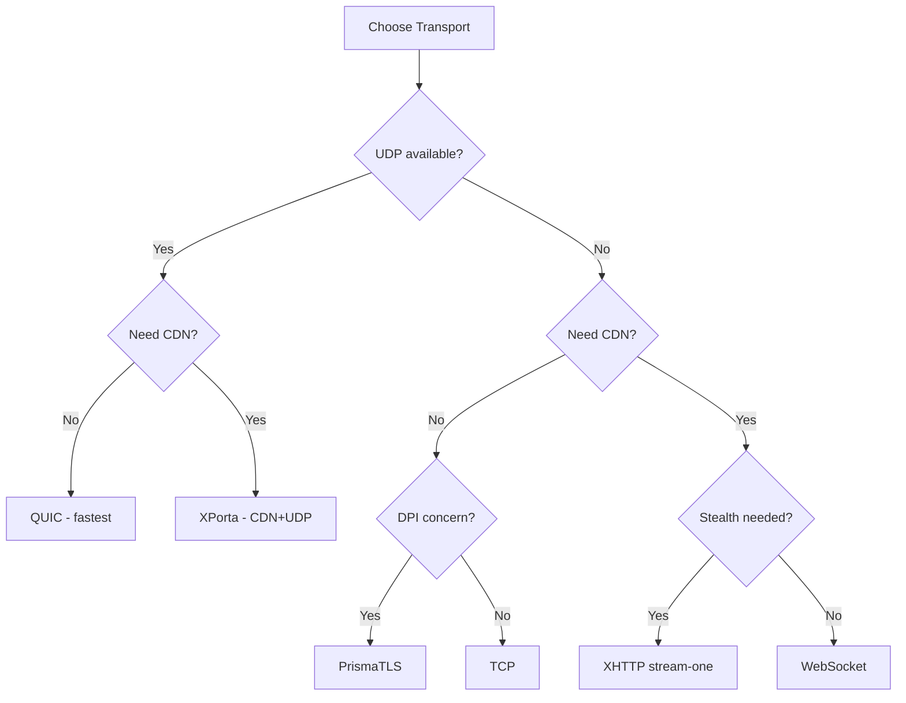

# Client Configuration

The client is configured via a TOML file (default: `client.toml`). Configuration is resolved in three layers -- compiled defaults, then TOML file, then environment variables. See [Environment Variables](./environment-variables.md) for override details.

:::info Version
This page reflects Prisma **v2.28.0**. Protocol v4 support has been removed; only PrismaVeil v5 (0x05) is accepted.
:::

## Top-level fields

| Field | Type | Default | Description |
|-------|------|---------|-------------|
| `server_addr` | string | -- | Remote Prisma server address (e.g. `"1.2.3.4:8443"`) |
| `socks5_listen_addr` | string | `"127.0.0.1:1080"` | Local SOCKS5 proxy bind address |
| `http_listen_addr` | string? | -- | Local HTTP CONNECT proxy bind address (optional, omit to disable) |
| `pac_port` | u16? | `8070` | PAC (Proxy Auto-Configuration) server port |
| `cipher_suite` | string | `"chacha20-poly1305"` | `"chacha20-poly1305"` / `"aes-256-gcm"` / `"auto"`. When `"auto"`, selects AES-256-GCM on hardware with AES-NI/NEON, ChaCha20-Poly1305 otherwise |
| `transport` | string | `"quic"` | `"quic"` / `"tcp"` / `"ws"` / `"grpc"` / `"xhttp"` / `"xporta"` / `"prisma-tls"` / `"ssh"` / `"wireguard"` |
| `skip_cert_verify` | bool | `false` | Skip TLS certificate verification (dev only) |
| `tls_on_tcp` | bool | `false` | Connect via TLS-wrapped TCP (must match server camouflage) |
| `tls_server_name` | string? | -- | TLS SNI server name override (defaults to `server_addr` hostname) |
| `alpn_protocols` | string[] | `["h2", "http/1.1"]` | TLS/QUIC ALPN protocols |
| `fingerprint` | string | `"chrome"` | uTLS fingerprint: `"chrome"` / `"firefox"` / `"safari"` / `"random"` / `"none"` |
| `quic_version` | string | `"auto"` | QUIC version: `"v2"` / `"v1"` / `"auto"` |
| `transport_mode` | string | `"auto"` | Transport mode: `"auto"` or explicit name |
| `fallback_order` | string[] | `["quic-v2", "prisma-tls", "ws-cdn", "xporta"]` | Transport fallback order for auto mode |
| `sni_slicing` | bool | `false` | SNI slicing for QUIC -- fragments the TLS ClientHello across multiple QUIC CRYPTO frames, preventing middleboxes from reading the SNI in a single packet. Effective against SNI-based filtering without requiring ECH support. |
| `entropy_camouflage` | bool | `false` | Entropy camouflage for Salamander/raw UDP -- reshapes the byte distribution of encrypted packets to match typical HTTPS traffic patterns, defeating entropy-based DPI classifiers that flag high-entropy UDP flows. |
| `transport_only_cipher` | bool | `false` | Use transport-only cipher (BLAKE3 MAC, no app-layer encryption). Only safe when transport provides confidentiality (TLS/QUIC). Server must also allow it. |
| `server_key_pin` | string? | -- | SHA-256 hash of server's ephemeral public key (hex). Provides end-to-end server authentication independent of TLS. |
| `salamander_password` | string? | -- | Salamander UDP obfuscation password (QUIC only) |
| `prisma_auth_secret` | string? | -- | PrismaTLS auth secret (hex-encoded, must match server) |
| `user_agent` | string? | -- | Override User-Agent header |
| `referer` | string? | -- | Override Referer header |

## `[connection_pool]` -- Transport connection reuse

Enables transport-level connection pooling to reuse established transport connections across multiple SOCKS5/HTTP proxy requests. Reduces handshake overhead and improves latency for bursty workloads.

| Field | Type | Default | Description |
|-------|------|---------|-------------|
| `enabled` | bool | `false` | Enable transport connection pooling |
| `max_idle` | u16 | `4` | Maximum idle connections kept in the pool |
| `idle_timeout_secs` | u64 | `300` | Close idle pooled connections after N seconds |

Example:

```toml
[connection_pool]
enabled = true
max_idle = 8
idle_timeout_secs = 600
```

:::tip
Connection pooling is most beneficial when using transports with expensive handshakes (PrismaTLS, WebSocket via CDN). For QUIC, the built-in multiplexing makes pooling less impactful.
:::

## `[connection_retry]` -- Automatic retry on failure

When a transport connection attempt fails, the client automatically retries with exponential backoff. This is especially useful for unstable networks or during transport fallback.

| Field | Type | Default | Description |
|-------|------|---------|-------------|
| `max_attempts` | u32 | `3` | Maximum number of connection retry attempts before giving up |
| `initial_backoff_ms` | u64 | `500` | Initial backoff delay in milliseconds. Doubles after each failed attempt (500ms, 1000ms, 2000ms). |

Example:

```toml
[connection_retry]
max_attempts = 3
initial_backoff_ms = 500
```

:::note
Connection retry applies to the initial transport connection only. Once connected, transport-level keepalives and reconnection are handled by the transport itself (e.g., QUIC connection migration).
:::

## `[identity]` -- Client credentials

| Field | Type | Default | Description |
|-------|------|---------|-------------|
| `client_id` | string | -- | Client UUID (must match server `authorized_clients[].id`) |
| `auth_secret` | string | -- | 64 hex character shared secret (must match server) |

## Transport-specific sections

### `[ws]` -- WebSocket transport

| Field | Type | Default | Description |
|-------|------|---------|-------------|
| `url` | string? | -- | WebSocket server URL (e.g. `"wss://domain.com/ws-tunnel"`) |
| `host` | string? | -- | Override WebSocket `Host` header |
| `extra_headers` | \[\[k,v\]\] | `[]` | Extra WebSocket request headers |

### `[grpc]` -- gRPC transport

| Field | Type | Default | Description |
|-------|------|---------|-------------|
| `url` | string? | -- | gRPC server URL |

### `[xhttp]` -- XHTTP transport

| Field | Type | Default | Description |
|-------|------|---------|-------------|
| `mode` | string? | -- | XHTTP mode: `"packet-up"` / `"stream-up"` / `"stream-one"` |
| `upload_url` | string? | -- | XHTTP upload URL for packet-up/stream-up |
| `download_url` | string? | -- | XHTTP download URL for packet-up |
| `stream_url` | string? | -- | XHTTP stream URL for stream-one |
| `extra_headers` | \[\[k,v\]\] | `[]` | Extra XHTTP request headers |

### `[xporta]` -- XPorta transport

| Field | Type | Default | Description |
|-------|------|---------|-------------|
| `base_url` | string | -- | XPorta server base URL (e.g. `"https://your-domain.com"`) |
| `session_path` | string | `"/api/auth"` | Session initialization endpoint |
| `data_paths` | string[] | `["/api/v1/data", "/api/v1/sync", "/api/v1/update"]` | Upload endpoint paths |
| `poll_paths` | string[] | `["/api/v1/notifications", "/api/v1/feed", "/api/v1/events"]` | Long-poll download paths |
| `encoding` | string | `"json"` | Encoding: `"json"` / `"binary"` / `"auto"` |
| `poll_concurrency` | u8 | `3` | Concurrent pending poll requests (1-8) |
| `upload_concurrency` | u8 | `4` | Concurrent upload requests (1-8) |
| `max_payload_size` | u32 | `65536` | Max payload bytes per request |
| `poll_timeout_secs` | u16 | `55` | Long-poll timeout in seconds (10-90) |
| `extra_headers` | \[\[k,v\]\] | `[]` | Extra XPorta request headers |
| `cookie_name` | string | `"_sess"` | Session cookie name (must match server config) |

### `[wireguard]` -- WireGuard transport

| Field | Type | Default | Description |
|-------|------|---------|-------------|
| `endpoint` | string | -- | Server WireGuard endpoint (e.g., `"1.2.3.4:51820"`) |
| `keepalive_secs` | u64 | `25` | Keepalive interval in seconds |

## `[xmux]` -- Stream multiplexing

Enables XMUX stream multiplexing over transport connections. The presence of this section implies mux is enabled -- no separate toggle is needed. Randomizes connection lifecycles to avoid fingerprinting. Used with XHTTP and WebSocket transports.

| Field | Type | Default | Description |
|-------|------|---------|-------------|
| `max_connections_min` | u16 | `1` | Min connections in pool |
| `max_connections_max` | u16 | `4` | Max connections in pool |
| `max_concurrency_min` | u16 | `8` | Min concurrency per connection |
| `max_concurrency_max` | u16 | `16` | Max concurrency per connection |
| `max_lifetime_secs_min` | u64 | `300` | Min connection lifetime (seconds) |
| `max_lifetime_secs_max` | u64 | `600` | Max connection lifetime (seconds) |
| `max_requests_min` | u32 | `100` | Min requests before rotation |
| `max_requests_max` | u32 | `200` | Max requests before rotation |

## `[[port_forwards]]` -- Port forwarding

Expose local services through the server's public port. Each entry is a `[[port_forwards]]` array item.

| Field | Type | Default | Description |
|-------|------|---------|-------------|
| `name` | string | -- | Human-readable label for this port forward |
| `local_addr` | string | -- | Local service address (e.g. `"127.0.0.1:3000"`) |
| `remote_port` | u16 | -- | Port to listen on at the server |
| `protocol` | string | `"tcp"` | Protocol: `"tcp"` / `"udp"` |
| `bind_addr` | string? | -- | Server bind address override (default: `0.0.0.0`) |
| `max_connections` | u32? | -- | Max concurrent connections for this forward (0 = unlimited) |
| `idle_timeout_secs` | u64? | `300` | Close idle connections after N seconds |
| `connect_timeout_secs` | u64? | `10` | Timeout for connecting to local service |
| `bandwidth_up` | string? | -- | Per-forward upload limit (e.g., `"10mbps"`) |
| `bandwidth_down` | string? | -- | Per-forward download limit (e.g., `"10mbps"`) |
| `allowed_ips` | string[] | `[]` | IP whitelist for server-side listener (empty = allow all) |
| `enabled` | bool | `true` | Enable/disable individual forwards |
| `retry_on_failure` | bool | `false` | Auto-retry if local connection fails |
| `buffer_size` | usize? | `8192` | Custom buffer size in bytes |

Example:

```toml
[[port_forwards]]
name = "my-web-app"
local_addr = "127.0.0.1:3000"
remote_port = 10080
protocol = "tcp"
max_connections = 50
idle_timeout_secs = 600
connect_timeout_secs = 5
bandwidth_up = "10mbps"
bandwidth_down = "50mbps"
allowed_ips = ["0.0.0.0/0"]
enabled = true
retry_on_failure = true
buffer_size = 16384

[[port_forwards]]
name = "my-api"
local_addr = "127.0.0.1:8000"
remote_port = 10081
```

## `[dns]` -- DNS handling

| Field | Type | Default | Description |
|-------|------|---------|-------------|
| `mode` | string | `"direct"` | DNS mode: `"smart"` / `"fake"` / `"tunnel"` / `"direct"` |
| `protocol` | string | `"udp"` | DNS protocol: `"udp"` / `"doh"` / `"dot"` |
| `fake_ip_range` | string | `"198.18.0.0/15"` | CIDR range for fake DNS IPs |
| `upstream` | string | `"8.8.8.8:53"` | Upstream DNS server (used with UDP protocol) |
| `doh_url` | string | `"https://1.1.1.1/dns-query"` | DoH server URL (used when protocol is `"doh"`) |
| `dns_listen_addr` | string | `"127.0.0.1:53"` | Local DNS server listen address |
| `geosite_path` | string? | -- | GeoSite database path for smart DNS mode |

## `[tun]` -- TUN mode (system-wide proxy)

| Field | Type | Default | Description |
|-------|------|---------|-------------|
| `enabled` | bool | `false` | Enable TUN mode |
| `device_name` | string | `"prisma-tun0"` | TUN device name |
| `mtu` | u16 | `1500` | TUN device MTU |
| `include_routes` | string[] | `["0.0.0.0/0"]` | Routes to capture in TUN mode |
| `exclude_routes` | string[] | `[]` | Routes to exclude (server IP auto-excluded) |
| `dns` | string | `"fake"` | TUN DNS mode: `"fake"` / `"tunnel"` |

:::warning
TUN mode requires root/administrator privileges. On Linux, run with `sudo` or grant `CAP_NET_ADMIN` capability.
:::

## `[routing]` -- Rule-based routing

| Field | Type | Default | Description |
|-------|------|---------|-------------|
| `geoip_path` | string? | -- | Path to v2fly `geoip.dat` file for GeoIP-based routing |
| `rules` | array | `[]` | Ordered list of routing rules |

Each `[[routing.rules]]`:

| Field | Type | Default | Description |
|-------|------|---------|-------------|
| `type` | string | -- | Rule type: `"domain"` / `"domain-suffix"` / `"domain-keyword"` / `"ip-cidr"` / `"geoip"` / `"port"` / `"all"` |
| `value` | string | -- | Match value (country code for `geoip`, e.g. `"cn"`, `"private"`) |
| `action` | string | `"proxy"` | Action: `"proxy"` / `"direct"` / `"block"` |

## `[traffic_shaping]` -- Anti-fingerprinting

| Field | Type | Default | Description |
|-------|------|---------|-------------|
| `padding_mode` | string | `"none"` | `"none"` / `"random"` / `"bucket"` |
| `bucket_sizes` | u16[] | `[128,256,512,1024,2048,4096,8192,16384]` | Bucket sizes for bucket padding mode |
| `timing_jitter_ms` | u32 | `0` | Max timing jitter (ms) on handshake frames |
| `chaff_interval_ms` | u32 | `0` | Chaff injection interval (ms), 0 = disabled |
| `coalesce_window_ms` | u32 | `0` | Frame coalescing window (ms), 0 = disabled |

## `[congestion]` -- QUIC congestion control

| Field | Type | Default | Description |
|-------|------|---------|-------------|
| `mode` | string | `"bbr"` | Congestion control: `"brutal"` / `"bbr"` / `"adaptive"` |
| `target_bandwidth` | string? | -- | Target bandwidth for brutal/adaptive (e.g., `"100mbps"`) |

## `[port_hopping]` -- QUIC port hopping

| Field | Type | Default | Description |
|-------|------|---------|-------------|
| `enabled` | bool | `false` | Enable QUIC port hopping |
| `base_port` | u16 | `10000` | Start of port range |
| `port_range` | u16 | `50000` | Number of ports in range |
| `interval_secs` | u64 | `60` | Seconds between port hops |
| `grace_period_secs` | u64 | `10` | Dual-port acceptance window |

## `[udp_fec]` -- Forward Error Correction

| Field | Type | Default | Description |
|-------|------|---------|-------------|
| `enabled` | bool | `false` | Enable FEC for UDP relay |
| `data_shards` | usize | `10` | Original packets per FEC group |
| `parity_shards` | usize | `3` | Parity packets per FEC group |

## `[[subscriptions]]` -- Server list subscriptions

| Field | Type | Default | Description |
|-------|------|---------|-------------|
| `url` | string | -- | HTTP(S) URL to fetch the server list from |
| `name` | string | -- | Human-readable name for this subscription |
| `update_interval_secs` | u64 | `3600` | Auto-update interval in seconds (0 = disabled) |
| `last_updated` | string? | -- | ISO 8601 timestamp of last successful update (auto-managed) |

## `[fallback]` -- Client-side transport fallback

Controls how the client handles transport fallback when the primary transport fails or the server advertises alternative transports.

| Field | Type | Default | Description |
|-------|------|---------|-------------|
| `use_server_fallback` | bool | `true` | Whether to use server-advertised fallback transports |
| `max_fallback_attempts` | u32 | `3` | Maximum number of fallback attempts before giving up |
| `connect_timeout_secs` | u64 | `10` | Timeout in seconds for each fallback connection attempt |

Example:

```toml
[fallback]
use_server_fallback = true
max_fallback_attempts = 5
connect_timeout_secs = 15
```

## `[logging]` -- Log output

| Field | Type | Default | Description |
|-------|------|---------|-------------|
| `level` | string | `"info"` | Log level: `trace` / `debug` / `info` / `warn` / `error` |
| `format` | string | `"pretty"` | Log format: `pretty` / `json` |

## Full example

```toml title="client.toml"
socks5_listen_addr = "127.0.0.1:1080"
http_listen_addr = "127.0.0.1:8080"  # optional, remove to disable HTTP proxy
server_addr = "127.0.0.1:8443"
cipher_suite = "auto"                # "auto" | "chacha20-poly1305" | "aes-256-gcm"
transport = "quic"                   # quic | tcp | ws | grpc | xhttp | xporta | ...
skip_cert_verify = true              # set true for self-signed certs in dev
fingerprint = "chrome"               # uTLS fingerprint for ClientHello mimicry
quic_version = "auto"                # "v2", "v1", or "auto"
# server_key_pin = "hex-sha256"      # Pin server public key for CDN scenarios
# prisma_auth_secret = "hex-encoded-32-bytes"   # For PrismaTLS transport

# Must match a key generated with: prisma gen-key
[identity]
client_id = "00000000-0000-0000-0000-000000000001"
auth_secret = "0123456789abcdef0123456789abcdef0123456789abcdef0123456789abcdef"

# Port forwarding (reverse proxy) -- expose local services through the server
[[port_forwards]]
name = "my-web-app"
local_addr = "127.0.0.1:3000"
remote_port = 10080
protocol = "tcp"
enabled = true
retry_on_failure = true

[[port_forwards]]
name = "my-api"
local_addr = "127.0.0.1:8000"
remote_port = 10081

# Connection pooling (reuse transport connections)
# [connection_pool]
# enabled = true
# max_idle = 8
# idle_timeout_secs = 600

# Server list subscriptions
# [[subscriptions]]
# url = "https://example.com/prisma-servers.json"
# name = "my-provider"
# update_interval_secs = 3600

# Client-side transport fallback
# [fallback]
# use_server_fallback = true
# max_fallback_attempts = 3
# connect_timeout_secs = 10

[logging]
level = "info"
format = "pretty"
```

## Validation rules

The client config is validated at startup. The following rules are enforced:

- `socks5_listen_addr` must not be empty
- `server_addr` must not be empty
- `identity.client_id` must not be empty
- `identity.auth_secret` must be valid hex
- `cipher_suite` must be one of: `chacha20-poly1305`, `aes-256-gcm`, `auto`
- `transport` must be one of: `quic`, `tcp`, `ws`, `grpc`, `xhttp`, `xporta`, `prisma-tls`, `ssh`, `wireguard`
- `xhttp.mode` (when transport is `xhttp`) must be one of: `packet-up`, `stream-up`, `stream-one`
- `xhttp.mode = "stream-one"` requires `xhttp.stream_url`
- `xhttp.mode = "packet-up"` or `"stream-up"` requires `xhttp.upload_url` and `xhttp.download_url`
- XMUX ranges must have min ≤ max
- `transport = "xporta"` requires `xporta.base_url` to be set
- XPorta: all paths must start with `/`
- XPorta: `data_paths` and `poll_paths` must not be empty or overlap
- XPorta: `encoding` must be one of: `json`, `binary`, `auto`
- XPorta: `poll_concurrency` must be 1-8, `upload_concurrency` must be 1-8
- XPorta: `poll_timeout_secs` must be 10-90
- `transport = "wireguard"` requires `wireguard.endpoint`
- `logging.level` must be one of: `trace`, `debug`, `info`, `warn`, `error`
- `logging.format` must be one of: `pretty`, `json`

## Transport selection

Use this decision tree to choose the right transport for your network environment:



### QUIC (default)

QUIC provides multiplexed streams over UDP with built-in TLS 1.3. This is the recommended transport for most deployments.

```toml
transport = "quic"
```

### TCP fallback

If your network blocks UDP traffic, use the TCP transport:

```toml
transport = "tcp"
```

### PrismaTLS (active probing resistance)

PrismaTLS replaces REALITY for maximum active probing resistance on direct connections. The server is indistinguishable from a real website to active probers.

```toml
transport = "prisma-tls"
tls_server_name = "www.microsoft.com"
fingerprint = "chrome"
prisma_auth_secret = "hex-encoded-32-bytes"
```

See [PrismaTLS](/docs/features/prisma-tls) for detailed configuration.

### SSH transport

Disguises traffic as SSH sessions.

```toml
transport = "ssh"
server_addr = "proxy.example.com:2222"
```

### WireGuard transport

Uses WireGuard-compatible UDP framing.

```toml
transport = "wireguard"

[wireguard]
endpoint = "proxy.example.com:51820"
keepalive_secs = 25
```

### XPorta (maximum stealth -- CDN)

Next-generation CDN transport that fragments proxy data into many short-lived REST API-style requests. Traffic is indistinguishable from a normal SPA making API calls.

```toml
transport = "xporta"

[xporta]
base_url = "https://your-domain.com"
session_path = "/api/auth"
data_paths = ["/api/v1/data", "/api/v1/sync", "/api/v1/update"]
poll_paths = ["/api/v1/notifications", "/api/v1/feed", "/api/v1/events"]
encoding = "json"
```

See [XPorta Transport](/docs/features/xporta-transport) for detailed configuration.

## Disabling HTTP proxy

The HTTP CONNECT proxy is optional. To disable it, simply omit the `http_listen_addr` field from your config:

```toml
socks5_listen_addr = "127.0.0.1:1080"
# http_listen_addr is not set -- HTTP proxy disabled
server_addr = "1.2.3.4:8443"
```

## Certificate verification

For production deployments with a valid TLS certificate, keep `skip_cert_verify` set to `false` (the default). Only set it to `true` during development with self-signed certificates.
