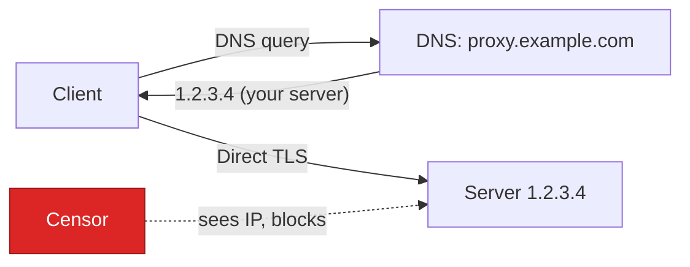
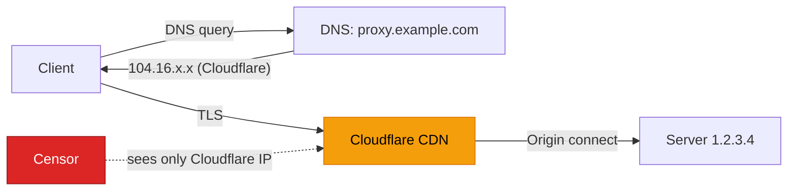

# Cloudflare CDN Deployment

This guide explains how to deploy Prisma behind Cloudflare's CDN proxy to hide your server's real IP address. This is the recommended setup for users in censored network environments (e.g., behind the GFW).

## Why Cloudflare

### The problem

When you connect directly to a proxy server, the server's IP address is visible in two places:

1. **DNS records** — anyone querying your domain sees the real IP
2. **Network traffic** — the destination IP is visible to network observers

A censor can discover the IP, add it to a blocklist, and your proxy becomes unreachable.

### How Cloudflare solves this

When Cloudflare's proxy is enabled (orange cloud), the traffic flow changes:

**Without Cloudflare:**



**With Cloudflare:**



Your real server IP never appears in DNS responses or in the client's network traffic. Only Cloudflare's infrastructure knows your origin IP.

### Why censors won't block Cloudflare

Cloudflare serves roughly 20% of all websites — including major businesses, government portals, and essential services. Blocking Cloudflare's IP ranges would cause catastrophic collateral damage to the domestic internet. Your proxy domain shares the same Cloudflare anycast IPs with thousands of legitimate sites, making it indistinguishable from normal web traffic at the IP layer.

### Remaining attack vectors

| Attack | Description | Mitigation |
|--------|-------------|------------|
| **SNI sniffing** | TLS ClientHello reveals the domain in plaintext | Enable Cloudflare ECH (Encrypted Client Hello), or use an innocent-looking domain name |
| **Domain-level blocking** | Censor blocks DNS resolution of your specific domain | Use encrypted DNS (DoH/DoT) — e.g., `1.1.1.1` or `8.8.8.8` over HTTPS |
| **Traffic analysis** | Detect proxy patterns in packet sizes and timing | PrismaVeil per-frame padding and XHTTP disguise |
| **Active probing** | Censor connects to your domain to fingerprint the service | CDN `cover_upstream` — visitors and probers see a real website |
| **IP leak from origin** | Origin server responds on its own IP to direct connections | Firewall your origin to accept connections only from [Cloudflare IP ranges](https://www.cloudflare.com/ips/) |

## Prerequisites

- A registered domain name (e.g., from Namecheap, Cloudflare Registrar, etc.)
- A Cloudflare account (free plan is sufficient)
- A server with Prisma installed

## Step 1: Add your domain to Cloudflare

1. Log in to Cloudflare Dashboard → **Add a site** → enter your domain
2. Select the **Free** plan (supports WebSocket, gRPC, and XHTTP)
3. Cloudflare provides two nameservers — update your domain registrar to use them
4. Wait for DNS propagation (usually a few minutes)

## Step 2: Create a DNS record

In the Cloudflare DNS settings:

| Type | Name | Content | Proxy status |
|------|------|---------|-------------|
| A | `proxy` (or any subdomain) | Your server's IP | **Proxied** (orange cloud) |

:::warning
The **Proxied** toggle (orange cloud) must be ON. If it's set to "DNS only" (gray cloud), your real IP is exposed.
:::

## Step 3: Generate an Origin Certificate

Cloudflare uses its own TLS certificate to the client. Between Cloudflare and your server, you need a separate certificate.

1. Cloudflare Dashboard → **SSL/TLS** → **Origin Server** → **Create Certificate**
2. Keep the default settings (RSA 2048, 15 years validity)
3. Save the certificate as `origin-cert.pem` and the private key as `origin-key.pem` on your server

Set Cloudflare's SSL/TLS encryption mode to **Full (strict)** under SSL/TLS → Overview.

## Step 4: Configure the server

```toml
# server.toml

listen_addr = "0.0.0.0:8443"
quic_listen_addr = "0.0.0.0:8443"

[tls]
cert_path = "prisma-cert.pem"
key_path = "prisma-key.pem"

[[authorized_clients]]
id = "your-client-uuid"
auth_secret = "your-auth-secret-hex"
name = "my-client"

# ─── CDN transport (Cloudflare → your server) ───
[cdn]
enabled = true
listen_addr = "0.0.0.0:443"
ws_tunnel_path = "/ws-tunnel"
grpc_tunnel_path = "/tunnel.PrismaTunnel"

# Cover traffic — make your site look real to probers and visitors
cover_upstream = "http://127.0.0.1:3000"     # Reverse proxy to a local website
# cover_static_dir = "/var/www/html"          # OR serve local static files

# Accept only Cloudflare IPs (recommended)
trusted_proxies = [
  "173.245.48.0/20",
  "103.21.244.0/22",
  "103.22.200.0/22",
  "103.31.5.0/22",
  "141.101.64.0/18",
  "108.162.192.0/18",
  "190.93.240.0/20",
  "188.114.96.0/20",
  "197.234.240.0/22",
  "198.41.128.0/17",
  "162.158.0.0/15",
  "104.16.0.0/13",
  "104.24.0.0/14",
  "172.64.0.0/13",
  "131.0.72.0/22"
]

[cdn.tls]
cert_path = "origin-cert.pem"                 # Cloudflare Origin Certificate
key_path = "origin-key.pem"

# XHTTP transport paths (optional — for XHTTP mode)
xhttp_upload_path = "/api/v1/upload"
xhttp_download_path = "/api/v1/pull"
xhttp_stream_path = "/api/v1/stream"
xhttp_mode = "stream-one"
response_server_header = "nginx"              # Disguise server identity
padding_header = true

[logging]
level = "info"
format = "pretty"
```

:::tip
Use `cover_upstream` to proxy a real website (e.g., a blog or placeholder page). When Cloudflare health checks hit your server, or someone visits your domain in a browser, they see a legitimate website — not a connection error or suspicious response.
:::

## Step 5: Configure the client

Choose one of the four CDN-compatible transports:

### WebSocket (recommended default)

Most compatible option. Works on Cloudflare's free plan with zero extra configuration.

```toml
# client.toml

socks5_listen_addr = "127.0.0.1:1080"
http_listen_addr = "127.0.0.1:8080"
server_addr = "proxy.example.com:443"
transport = "ws"

[ws]
url = "wss://proxy.example.com/ws-tunnel"

[identity]
client_id = "your-client-uuid"
auth_secret = "your-auth-secret-hex"
```

### gRPC

Good throughput. Requires enabling gRPC in Cloudflare Dashboard → **Network** → **gRPC**.

```toml
server_addr = "proxy.example.com:443"
transport = "grpc"

[grpc]
url = "https://proxy.example.com/tunnel.PrismaTunnel/Tunnel"
```

### XHTTP (maximum stealth)

Traffic looks like normal REST API calls. Hardest to fingerprint.

```toml
server_addr = "proxy.example.com:443"
transport = "xhttp"
# Optional: add realistic headers
user_agent = "Mozilla/5.0 (Windows NT 10.0; Win64; x64) AppleWebKit/537.36"

[xhttp]
mode = "stream-one"
stream_url = "https://proxy.example.com/api/v1/stream"
```

For `packet-up` mode (works even with aggressive CDN request timeouts):

```toml
transport = "xhttp"

[xhttp]
mode = "packet-up"
upload_url = "https://proxy.example.com/api/v1/upload"
download_url = "https://proxy.example.com/api/v1/pull"
```

### XPorta (ultimate stealth)

Traffic is completely indistinguishable from a normal web application making REST API calls. Active probers see a realistic 401 JSON error.

```toml
server_addr = "proxy.example.com:443"
transport = "xporta"

[xporta]
base_url = "https://proxy.example.com"
session_path = "/api/auth"
data_paths = ["/api/v1/data", "/api/v1/sync", "/api/v1/update"]
poll_paths = ["/api/v1/notifications", "/api/v1/feed", "/api/v1/events"]
encoding = "json"
poll_concurrency = 3
```

## Transport comparison

| Transport | Cloudflare Plan | Latency | Stealth | Best For |
|-----------|----------------|---------|---------|----------|
| **WebSocket** | Free | Low | Good | General use — most reliable |
| **gRPC** | Free (enable in dashboard) | Low | Good | High throughput |
| **XHTTP stream-one** | Free | Lowest | Excellent | Maximum stealth — looks like a long-polling API |
| **XHTTP packet-up** | Free | Medium | Excellent | Restrictive CDNs with short request timeouts |
| **XHTTP stream-up** | Free | Low | Excellent | Balanced stealth and performance |
| **XPorta** | Free | Low | Best | Ultimate stealth — indistinguishable from REST API |

## Step 6: Harden the origin

Even though Cloudflare hides your IP in DNS, your origin server can still leak its IP if it responds to direct connections. Lock it down:

### Firewall (iptables)

Only accept HTTPS traffic from Cloudflare IP ranges:

```bash
# Allow Cloudflare IPs on port 443
for cidr in 173.245.48.0/20 103.21.244.0/22 103.22.200.0/22 103.31.5.0/22 \
            141.101.64.0/18 108.162.192.0/18 190.93.240.0/20 188.114.96.0/20 \
            197.234.240.0/22 198.41.128.0/17 162.158.0.0/15 104.16.0.0/13 \
            104.24.0.0/14 172.64.0.0/13 131.0.72.0/22; do
  iptables -A INPUT -p tcp --dport 443 -s "$cidr" -j ACCEPT
done

# Drop all other traffic to port 443
iptables -A INPUT -p tcp --dport 443 -j DROP
```

### Additional precautions

- **Don't expose port 8443 publicly** if you only use CDN transport. Bind `listen_addr` to `127.0.0.1:8443` or firewall it.
- **Don't send emails from the server** — email headers can leak the origin IP.
- **Check for IP leaks** at [Censys](https://search.censys.io) and [Shodan](https://www.shodan.io) by searching for your TLS certificate fingerprint.
- **Use Cloudflare's Authenticated Origin Pulls** for an additional layer of verification that requests come from Cloudflare.

## Step 7: Verify the setup

From the client machine:

```bash
# 1. Check DNS resolves to Cloudflare (not your server IP)
nslookup proxy.example.com
# Should return 104.16.x.x or similar Cloudflare IPs

# 2. Start the client
prisma client -c client.toml

# 3. Test connectivity
curl --socks5 127.0.0.1:1080 https://httpbin.org/ip
# Should return the proxy server's IP (not your local IP)

# 4. Verify your real server IP is not leaked
curl https://proxy.example.com
# Should return the cover website content
```

## XMUX connection pooling

For XHTTP and WebSocket transports, XMUX randomizes connection lifecycles to avoid fingerprinting:

```toml
[xmux]
max_connections_min = 1
max_connections_max = 4
max_concurrency_min = 8
max_concurrency_max = 16
max_lifetime_secs_min = 300
max_lifetime_secs_max = 600
max_requests_min = 100
max_requests_max = 200
```

This creates multiple connections with randomized lifetimes and request counts, making traffic patterns harder to fingerprint.

## Troubleshooting

### 502 Bad Gateway

Cloudflare cannot reach your origin server. Check:
- Origin server is running and listening on port 443
- Origin certificate is correctly configured
- Cloudflare SSL mode is set to **Full (strict)**
- Firewall allows Cloudflare IP ranges

### 522 Connection Timed Out

Cloudflare's connection to your origin timed out:
- Verify the server is running: `prisma status`
- Check that port 443 is open: `ss -tlnp | grep 443`
- Test locally: `curl -k https://127.0.0.1:443`

### WebSocket disconnects

- Check Cloudflare Dashboard → **Network** → **WebSockets** is enabled (on by default for free plan)
- Cloudflare has a 100-second idle timeout for WebSocket connections — PrismaVeil's keepalive (PING/PONG) handles this automatically

### gRPC not working

- Enable gRPC in Cloudflare Dashboard → **Network** → **gRPC**
- Ensure SSL mode is **Full** or **Full (strict)**

### SNI-based blocking

If your domain itself is blocked:
- Register a new domain with an innocuous name
- Consider using Cloudflare Workers as a front (more advanced)
- Use encrypted DNS (DoH) to prevent DNS-level blocking of the domain
