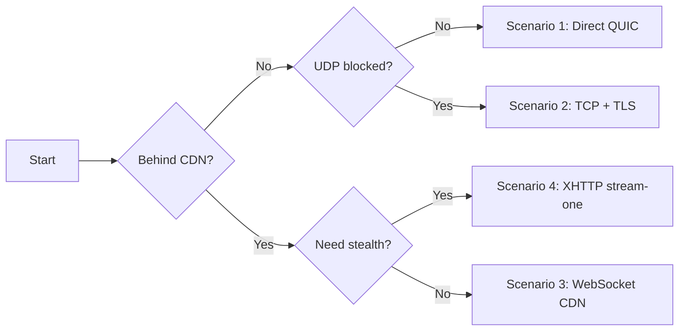

# Configuration Examples

Ready-to-use configuration templates for common deployment scenarios. Each example includes complete server and client configs with pros, cons, and recommended use cases.

Use this flowchart to find the right deployment scenario for your network:



## 1. Basic — Direct QUIC Connection

The simplest setup. Client connects directly to the server over QUIC (UDP).

**Best for:** Personal use on networks without UDP blocking or deep packet inspection.

### Server

```toml
listen_addr = "0.0.0.0:8443"
quic_listen_addr = "0.0.0.0:8443"

[tls]
cert_path = "prisma-cert.pem"
key_path = "prisma-key.pem"

[[authorized_clients]]
id = "YOUR-CLIENT-UUID"
auth_secret = "YOUR-AUTH-SECRET-HEX"
name = "my-device"

[logging]
level = "info"
format = "pretty"

[performance]
max_connections = 1024
connection_timeout_secs = 300

[padding]
min = 0
max = 256
```

### Client

```toml
socks5_listen_addr = "127.0.0.1:1080"
http_listen_addr = "127.0.0.1:8080"
server_addr = "YOUR-SERVER-IP:8443"
cipher_suite = "chacha20-poly1305"
transport = "quic"
skip_cert_verify = false
fingerprint = "chrome"
quic_version = "auto"

[identity]
client_id = "YOUR-CLIENT-UUID"
auth_secret = "YOUR-AUTH-SECRET-HEX"

[logging]
level = "info"
format = "pretty"
```

| Pros | Cons |
|------|------|
| Lowest latency (QUIC v2 multiplexed streams) | Server IP visible to network observers |
| Simplest configuration | UDP may be blocked on some networks |
| No domain or CDN required | No active probe resistance |
| Built-in TLS 1.3 + browser fingerprint mimicry | IP can be discovered and blocked |

---

## 2. TCP + TLS Camouflage — Censorship Evasion Without CDN

Wraps the connection in standard TLS over TCP with a decoy fallback site. Looks like a normal HTTPS connection to a website.

**Best for:** Networks that block UDP but don't use CDN-aware DPI.

### Server

```toml
listen_addr = "0.0.0.0:8443"
quic_listen_addr = "0.0.0.0:8443"

[tls]
cert_path = "/etc/letsencrypt/live/example.com/fullchain.pem"
key_path = "/etc/letsencrypt/live/example.com/privkey.pem"

[[authorized_clients]]
id = "YOUR-CLIENT-UUID"
auth_secret = "YOUR-AUTH-SECRET-HEX"
name = "my-device"

[logging]
level = "info"
format = "pretty"

[performance]
max_connections = 1024
connection_timeout_secs = 300

[padding]
min = 64
max = 256

[camouflage]
enabled = true
tls_on_tcp = true
fallback_addr = "example.com:443"
alpn_protocols = ["h2", "http/1.1"]
```

### Client

```toml
socks5_listen_addr = "127.0.0.1:1080"
http_listen_addr = "127.0.0.1:8080"
server_addr = "YOUR-SERVER-IP:8443"
cipher_suite = "chacha20-poly1305"
transport = "tcp"
skip_cert_verify = false
fingerprint = "chrome"
tls_on_tcp = true
tls_server_name = "example.com"
alpn_protocols = ["h2", "http/1.1"]

[identity]
client_id = "YOUR-CLIENT-UUID"
auth_secret = "YOUR-AUTH-SECRET-HEX"

[logging]
level = "info"
format = "pretty"
```

| Pros | Cons |
|------|------|
| Works on UDP-blocked networks | Server IP still visible (no CDN) |
| Active probers see decoy website | Requires a valid domain + TLS cert |
| TLS handshake looks normal | IP can still be blocked directly |
| No CDN dependency | Higher latency than QUIC |

---

## 3. Cloudflare + WebSocket — Reliable CDN Proxy

The most compatible CDN setup. Hides server IP behind Cloudflare and tunnels through WebSocket.

**Best for:** General-purpose censorship evasion. Works on Cloudflare free plan with zero extra settings.

### Server

```toml
listen_addr = "127.0.0.1:8443"
quic_listen_addr = "127.0.0.1:8443"

[tls]
cert_path = "prisma-cert.pem"
key_path = "prisma-key.pem"

[[authorized_clients]]
id = "YOUR-CLIENT-UUID"
auth_secret = "YOUR-AUTH-SECRET-HEX"
name = "my-device"

[logging]
level = "info"
format = "pretty"

[performance]
max_connections = 1024
connection_timeout_secs = 300

[padding]
min = 0
max = 256

[cdn]
enabled = true
listen_addr = "0.0.0.0:443"
ws_tunnel_path = "/ws-tunnel"
cover_upstream = "http://127.0.0.1:3000"
trusted_proxies = [
  "173.245.48.0/20", "103.21.244.0/22", "103.22.200.0/22",
  "103.31.5.0/22", "141.101.64.0/18", "108.162.192.0/18",
  "190.93.240.0/20", "188.114.96.0/20", "197.234.240.0/22",
  "198.41.128.0/17", "162.158.0.0/15", "104.16.0.0/13",
  "104.24.0.0/14", "172.64.0.0/13", "131.0.72.0/22"
]
response_server_header = "nginx"

[cdn.tls]
cert_path = "origin-cert.pem"
key_path = "origin-key.pem"

[management_api]
enabled = true
listen_addr = "0.0.0.0:9090"
auth_token = "YOUR-SECURE-TOKEN"
```

### Client

```toml
socks5_listen_addr = "127.0.0.1:1080"
http_listen_addr = "127.0.0.1:8080"
server_addr = "proxy.example.com:443"
cipher_suite = "chacha20-poly1305"
transport = "ws"

[ws]
url = "wss://proxy.example.com/ws-tunnel"

[identity]
client_id = "YOUR-CLIENT-UUID"
auth_secret = "YOUR-AUTH-SECRET-HEX"

[logging]
level = "info"
format = "pretty"
```

| Pros | Cons |
|------|------|
| Server IP hidden behind Cloudflare | Requires domain + Cloudflare account |
| WebSocket upgrade detectable by DPI | Cover site masks the service |
| Free Cloudflare plan works | Slightly higher latency (extra hop) |
| Most reliable CDN transport | WebSocket has 100s idle timeout |

---

## 4. Cloudflare + XHTTP stream-one — High Stealth CDN

Tunnels through HTTP/2 POST stream. No WebSocket upgrade header — harder to fingerprint than WebSocket.

**Best for:** Environments where WebSocket traffic is flagged or throttled.

### Server

```toml
listen_addr = "127.0.0.1:8443"
quic_listen_addr = "127.0.0.1:8443"

[tls]
cert_path = "prisma-cert.pem"
key_path = "prisma-key.pem"

[[authorized_clients]]
id = "YOUR-CLIENT-UUID"
auth_secret = "YOUR-AUTH-SECRET-HEX"
name = "my-device"

[logging]
level = "info"
format = "pretty"

[performance]
max_connections = 1024
connection_timeout_secs = 300

[cdn]
enabled = true
listen_addr = "0.0.0.0:443"
xhttp_stream_path = "/api/v1/stream"
xhttp_mode = "stream-one"
cover_upstream = "http://127.0.0.1:3000"
response_server_header = "nginx"
padding_header = true
trusted_proxies = [
  "173.245.48.0/20", "103.21.244.0/22", "103.22.200.0/22",
  "103.31.5.0/22", "141.101.64.0/18", "108.162.192.0/18",
  "190.93.240.0/20", "188.114.96.0/20", "197.234.240.0/22",
  "198.41.128.0/17", "162.158.0.0/15", "104.16.0.0/13",
  "104.24.0.0/14", "172.64.0.0/13", "131.0.72.0/22"
]

[cdn.tls]
cert_path = "origin-cert.pem"
key_path = "origin-key.pem"
```

### Client

```toml
socks5_listen_addr = "127.0.0.1:1080"
http_listen_addr = "127.0.0.1:8080"
server_addr = "proxy.example.com:443"
cipher_suite = "chacha20-poly1305"
transport = "xhttp"
user_agent = "Mozilla/5.0 (Windows NT 10.0; Win64; x64) AppleWebKit/537.36"

[xhttp]
mode = "stream-one"
stream_url = "https://proxy.example.com/api/v1/stream"

[identity]
client_id = "YOUR-CLIENT-UUID"
auth_secret = "YOUR-AUTH-SECRET-HEX"

[xmux]
max_connections_min = 1
max_connections_max = 4
max_lifetime_secs_min = 300
max_lifetime_secs_max = 600

[logging]
level = "info"
format = "pretty"
```

| Pros | Cons |
|------|------|
| No WebSocket upgrade header | Long-lived H2 POST is fingerprint-able |
| Lowest CDN latency | Binary `application/octet-stream` Content-Type |
| Standard HTTP/2 traffic | Single fixed URL path |
| XMUX randomizes connection lifecycle | No active probe resistance |

---

## 5. Cloudflare + XPorta — Maximum Stealth CDN

Traffic is indistinguishable from a normal SPA making REST API calls. Short-lived requests, JSON payloads, multiple randomized paths, cookie-based sessions. The most censorship-resistant transport.

**Best for:** Heavily censored environments with advanced DPI. When all other CDN transports are detected.

### Server

```toml
listen_addr = "127.0.0.1:8443"
quic_listen_addr = "127.0.0.1:8443"

[tls]
cert_path = "prisma-cert.pem"
key_path = "prisma-key.pem"

[[authorized_clients]]
id = "YOUR-CLIENT-UUID"
auth_secret = "YOUR-AUTH-SECRET-HEX"
name = "my-device"

[logging]
level = "info"
format = "pretty"

[performance]
max_connections = 1024
connection_timeout_secs = 300

[cdn]
enabled = true
listen_addr = "0.0.0.0:443"
cover_upstream = "http://127.0.0.1:3000"
response_server_header = "nginx"
trusted_proxies = [
  "173.245.48.0/20", "103.21.244.0/22", "103.22.200.0/22",
  "103.31.5.0/22", "141.101.64.0/18", "108.162.192.0/18",
  "190.93.240.0/20", "188.114.96.0/20", "197.234.240.0/22",
  "198.41.128.0/17", "162.158.0.0/15", "104.16.0.0/13",
  "104.24.0.0/14", "172.64.0.0/13", "131.0.72.0/22"
]

[cdn.tls]
cert_path = "origin-cert.pem"
key_path = "origin-key.pem"

[cdn.xporta]
enabled = true
session_path = "/api/auth"
data_paths = ["/api/v1/data", "/api/v1/sync", "/api/v1/update"]
poll_paths = ["/api/v1/notifications", "/api/v1/feed", "/api/v1/events"]
session_timeout_secs = 300
max_sessions_per_client = 8
cookie_name = "_sess"
encoding = "json"

[management_api]
enabled = true
listen_addr = "0.0.0.0:9090"
auth_token = "YOUR-SECURE-TOKEN"
```

### Client

```toml
socks5_listen_addr = "127.0.0.1:1080"
http_listen_addr = "127.0.0.1:8080"
server_addr = "proxy.example.com:443"
cipher_suite = "chacha20-poly1305"
transport = "xporta"

[identity]
client_id = "YOUR-CLIENT-UUID"
auth_secret = "YOUR-AUTH-SECRET-HEX"

[xporta]
base_url = "https://proxy.example.com"
session_path = "/api/auth"
data_paths = ["/api/v1/data", "/api/v1/sync", "/api/v1/update"]
poll_paths = ["/api/v1/notifications", "/api/v1/feed", "/api/v1/events"]
encoding = "json"
poll_concurrency = 3
upload_concurrency = 4
max_payload_size = 65536
poll_timeout_secs = 55

[logging]
level = "info"
format = "pretty"
```

| Pros | Cons |
|------|------|
| Indistinguishable from normal REST API traffic | ~37% overhead (JSON+base64 encoding) |
| Active probe resistant (401 JSON response) | Slightly higher latency (long-polling) |
| Multiple randomized URL paths | More complex configuration |
| Short-lived requests (no fingerprint-able long streams) | Requires Cloudflare + domain |
| Cookie-based sessions (standard HTTP) | Lower throughput than XHTTP binary |

:::tip
For higher throughput at the cost of slightly reduced stealth, set `encoding = "binary"` on both server and client. This reduces overhead from ~37% to ~0.5%.
:::

---

## 6. QUIC + Port Hopping + Salamander — Anti-Blocking Direct

Combines QUIC with port hopping (rotate UDP ports) and Salamander UDP obfuscation. Defeats port-based blocking and basic UDP fingerprinting without requiring a CDN.

**Best for:** Networks that block specific UDP ports but don't perform deep packet inspection on all ports.

### Server

```toml
listen_addr = "0.0.0.0:8443"
quic_listen_addr = "0.0.0.0:8443"

[tls]
cert_path = "prisma-cert.pem"
key_path = "prisma-key.pem"

[[authorized_clients]]
id = "YOUR-CLIENT-UUID"
auth_secret = "YOUR-AUTH-SECRET-HEX"
name = "my-device"

[logging]
level = "info"
format = "pretty"

[performance]
max_connections = 1024
connection_timeout_secs = 300

[padding]
min = 64
max = 512

[camouflage]
enabled = true
salamander_password = "YOUR-SHARED-OBFUSCATION-KEY"
alpn_protocols = ["h3"]

# Traffic shaping (anti-fingerprinting)
[traffic_shaping]
padding_mode = "bucket"
bucket_sizes = [128, 256, 512, 1024, 2048, 4096, 8192, 16384]
timing_jitter_ms = 5
chaff_interval_ms = 500

[congestion]
mode = "bbr"

[port_hopping]
enabled = true
base_port = 10000
port_range = 50000
interval_secs = 30
grace_period_secs = 10
```

### Client

```toml
socks5_listen_addr = "127.0.0.1:1080"
http_listen_addr = "127.0.0.1:8080"
server_addr = "YOUR-SERVER-IP:8443"
cipher_suite = "chacha20-poly1305"
transport = "quic"
skip_cert_verify = false
fingerprint = "chrome"
quic_version = "v2"
salamander_password = "YOUR-SHARED-OBFUSCATION-KEY"
alpn_protocols = ["h3"]
entropy_camouflage = true

[identity]
client_id = "YOUR-CLIENT-UUID"
auth_secret = "YOUR-AUTH-SECRET-HEX"

[traffic_shaping]
padding_mode = "bucket"

[congestion]
mode = "bbr"

[port_hopping]
enabled = true

[logging]
level = "info"
format = "pretty"
```

| Pros | Cons |
|------|------|
| Lowest latency (direct QUIC) | Server IP visible (no CDN) |
| Port rotation defeats port blocking | Requires many open UDP ports on server |
| Salamander obfuscates UDP payload | IP can still be blocked directly |
| No domain or CDN required | Doesn't help against DPI |

---

## 7. Full-Featured — Everything Enabled

Production deployment with all features: CDN transport (XPorta + WebSocket + XHTTP), port forwarding, management API, console, camouflage, and bandwidth controls.

**Best for:** Shared proxy server serving multiple clients with full observability.

### Server

```toml
listen_addr = "0.0.0.0:8443"
quic_listen_addr = "0.0.0.0:8443"
dns_upstream = "8.8.8.8:53"

[tls]
cert_path = "/etc/letsencrypt/live/example.com/fullchain.pem"
key_path = "/etc/letsencrypt/live/example.com/privkey.pem"

[[authorized_clients]]
id = "CLIENT-UUID-1"
auth_secret = "CLIENT-SECRET-1-HEX"
name = "laptop"
bandwidth_up = "100mbps"
bandwidth_down = "500mbps"
quota = "500GB"
quota_period = "monthly"

[[authorized_clients]]
id = "CLIENT-UUID-2"
auth_secret = "CLIENT-SECRET-2-HEX"
name = "phone"
bandwidth_up = "50mbps"
bandwidth_down = "200mbps"

[logging]
level = "info"
format = "json"

[performance]
max_connections = 2048
connection_timeout_secs = 600

[padding]
min = 32
max = 256

[port_forwarding]
enabled = true
port_range_start = 10000
port_range_end = 20000

[camouflage]
enabled = true
tls_on_tcp = true
fallback_addr = "example.com:443"
alpn_protocols = ["h2", "http/1.1"]
salamander_password = "YOUR-OBFUSCATION-KEY"

[traffic_shaping]
padding_mode = "random"
timing_jitter_ms = 3

[congestion]
mode = "bbr"

[port_hopping]
enabled = true
base_port = 20000
port_range = 40000
interval_secs = 60
grace_period_secs = 10

[cdn]
enabled = true
listen_addr = "0.0.0.0:443"
ws_tunnel_path = "/ws-tunnel"
grpc_tunnel_path = "/tunnel.PrismaTunnel"
xhttp_stream_path = "/api/v1/stream"
xhttp_upload_path = "/api/v1/upload"
xhttp_download_path = "/api/v1/pull"
xhttp_mode = "stream-one"
cover_upstream = "http://127.0.0.1:3000"
response_server_header = "nginx"
padding_header = true
expose_management_api = true
management_api_path = "/prisma-mgmt"
trusted_proxies = [
  "173.245.48.0/20", "103.21.244.0/22", "103.22.200.0/22",
  "103.31.5.0/22", "141.101.64.0/18", "108.162.192.0/18",
  "190.93.240.0/20", "188.114.96.0/20", "197.234.240.0/22",
  "198.41.128.0/17", "162.158.0.0/15", "104.16.0.0/13",
  "104.24.0.0/14", "172.64.0.0/13", "131.0.72.0/22"
]

[cdn.tls]
cert_path = "origin-cert.pem"
key_path = "origin-key.pem"

[cdn.xporta]
enabled = true
session_path = "/api/auth"
data_paths = ["/api/v1/data", "/api/v1/sync", "/api/v1/update"]
poll_paths = ["/api/v1/notifications", "/api/v1/feed", "/api/v1/events"]
session_timeout_secs = 300
max_sessions_per_client = 8
cookie_name = "_sess"
encoding = "json"

[management_api]
enabled = true
listen_addr = "0.0.0.0:9090"
auth_token = "YOUR-SECURE-TOKEN"
console_dir = "/opt/prisma/console"

# Static routing rules (persist across restarts)
[routing]
# geoip_path = "/etc/prisma/geoip.dat"

[[routing.rules]]
type = "ip-cidr"
value = "10.0.0.0/8"
action = "block"

[[routing.rules]]
type = "ip-cidr"
value = "172.16.0.0/12"
action = "block"

[[routing.rules]]
type = "domain-keyword"
value = "torrent"
action = "block"

[[routing.rules]]
type = "all"
action = "direct"
```

### Client (XPorta — maximum stealth)

```toml
socks5_listen_addr = "127.0.0.1:1080"
http_listen_addr = "127.0.0.1:8080"
server_addr = "proxy.example.com:443"
cipher_suite = "chacha20-poly1305"
transport = "xporta"
user_agent = "Mozilla/5.0 (Windows NT 10.0; Win64; x64) AppleWebKit/537.36"
fingerprint = "chrome"

[identity]
client_id = "CLIENT-UUID-1"
auth_secret = "CLIENT-SECRET-1-HEX"

[traffic_shaping]
padding_mode = "random"

[xporta]
base_url = "https://proxy.example.com"
session_path = "/api/auth"
data_paths = ["/api/v1/data", "/api/v1/sync", "/api/v1/update"]
poll_paths = ["/api/v1/notifications", "/api/v1/feed", "/api/v1/events"]
encoding = "json"
poll_concurrency = 3
upload_concurrency = 4
max_payload_size = 65536
poll_timeout_secs = 55

[[port_forwards]]
name = "my-web-app"
local_addr = "127.0.0.1:3000"
remote_port = 10080

[logging]
level = "info"
format = "pretty"
```

| Pros | Cons |
|------|------|
| Maximum flexibility — supports all transports | Complex configuration |
| Per-client bandwidth + quota controls | Higher resource usage |
| Full observability (console + API) | Requires domain + CDN + cover site |
| Active probe resistant (XPorta + cover site) | More attack surface to secure |
| Port forwarding for services behind NAT | — |

---

## 8. TUN Mode — System-Wide Proxy

Routes all system traffic through the proxy using a TUN virtual network device. No per-app SOCKS5 configuration needed.

**Best for:** Devices where you want all traffic to go through the proxy, including apps that don't support SOCKS5.

### Client

```toml
socks5_listen_addr = "127.0.0.1:1080"
server_addr = "YOUR-SERVER-IP:8443"
cipher_suite = "chacha20-poly1305"
transport = "quic"
skip_cert_verify = false
fingerprint = "chrome"
quic_version = "auto"

[identity]
client_id = "YOUR-CLIENT-UUID"
auth_secret = "YOUR-AUTH-SECRET-HEX"

[dns]
mode = "fake"
fake_ip_range = "198.18.0.0/15"
upstream = "8.8.8.8:53"
dns_listen_addr = "127.0.0.1:53"

[tun]
enabled = true
device_name = "prisma-tun0"
mtu = 1500
include_routes = ["0.0.0.0/0"]
# exclude_routes auto-excludes server IP
dns = "fake"

# GeoIP-based split routing
[routing]
geoip_path = "/etc/prisma/geoip.dat"

# Direct access for private/local networks (via GeoIP)
[[routing.rules]]
type = "geoip"
value = "private"
action = "direct"

# Direct access for CN IPs (bypass proxy for domestic traffic)
[[routing.rules]]
type = "geoip"
value = "cn"
action = "direct"

# Direct access for CN domains
[[routing.rules]]
type = "domain-suffix"
value = "cn"
action = "direct"

[[routing.rules]]
type = "domain-suffix"
value = "baidu.com"
action = "direct"

[[routing.rules]]
type = "domain-suffix"
value = "qq.com"
action = "direct"

# Block ads
[[routing.rules]]
type = "domain-keyword"
value = "ads"
action = "block"

# Everything else through proxy
[[routing.rules]]
type = "all"
action = "proxy"

[logging]
level = "info"
format = "pretty"
```

:::warning
TUN mode requires root/administrator privileges. On Linux, run with `sudo` or grant `CAP_NET_ADMIN` capability.
:::

| Pros | Cons |
|------|------|
| All system traffic proxied automatically | Requires root/admin privileges |
| No per-app SOCKS5 configuration | DNS leaks possible if misconfigured |
| Fake DNS prevents DNS leaks | Higher complexity |
| Routing rules for split tunneling | Platform-specific TUN support |

---

## Quick Comparison

| Example | Stealth | Latency | Complexity | CDN Required | Best For |
|---------|---------|---------|------------|-------------|----------|
| 1. Basic QUIC | Low | Lowest | Simple | No | Personal, unblocked networks |
| 2. TCP + Camouflage | Medium | Low | Medium | No | UDP-blocked, no DPI |
| 3. CF + WebSocket | Good | Medium | Medium | Yes | General censorship evasion |
| 4. CF + XHTTP | High | Low | Medium | Yes | WebSocket-flagged networks |
| 5. CF + XPorta | Highest | Medium | High | Yes | Advanced DPI environments |
| 6. QUIC + Port Hop | Medium | Lowest | Medium | No | Port-blocked networks |
| 7. Full-Featured | Highest | Medium | High | Yes | Shared server, full control |
| 8. TUN Mode | Varies | Varies | Medium | No | System-wide proxy |

:::tip Choosing a configuration
- **Start simple**: Use Example 1 (Basic QUIC) first. If it works, you're done.
- **UDP blocked?** Try Example 2 (TCP + Camouflage) or jump to Example 3+ (CDN).
- **Need to hide server IP?** Use any CDN example (3, 4, 5, or 7).
- **Advanced DPI?** Use Example 5 (XPorta) — it's the most resistant to traffic analysis.
- **All traffic?** Add TUN mode (Example 8) to any setup.
:::
