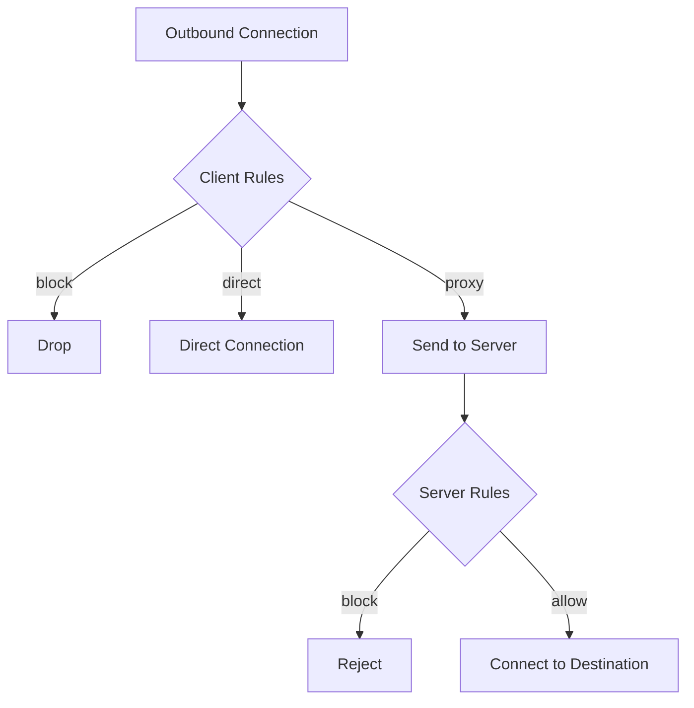
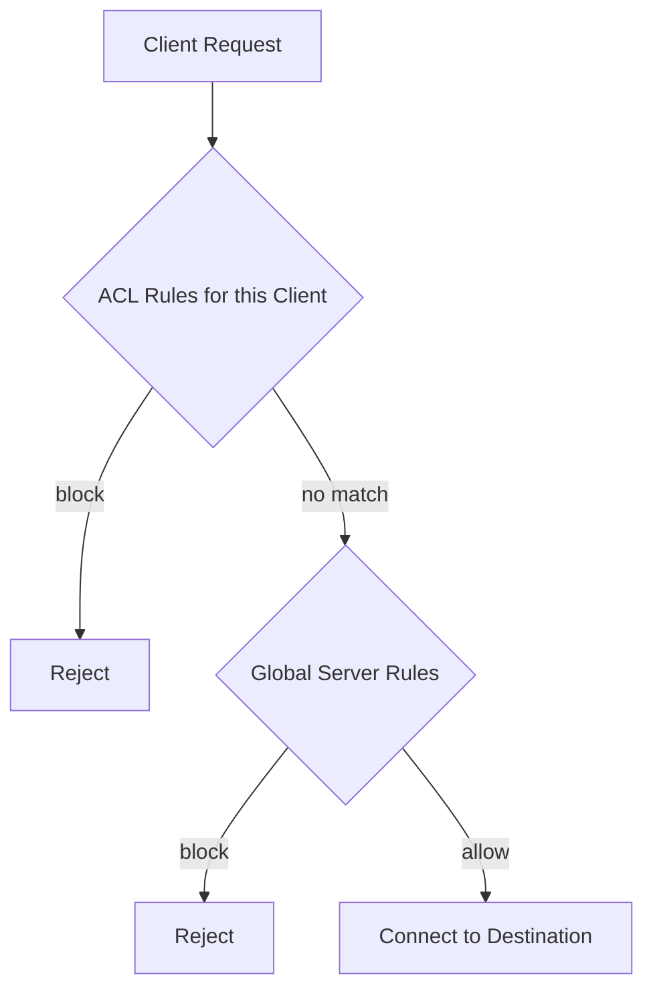

# Routing Rules

Prisma supports routing rules on both the **client** and the **server**, letting you control how traffic is handled at every layer.

## Client-Side Routing

Client routing rules decide how each outbound connection is handled **before** it reaches the server:

| Action | Behavior |
|--------|----------|
| `proxy` | Send through the PrismaVeil tunnel (default) |
| `direct` | Connect directly, bypassing the proxy |
| `block` | Drop the connection |

Rules are evaluated **top-to-bottom** — the first match wins. If no rule matches, traffic is proxied.

### Rule types

| Type | Value | Matches |
|------|-------|---------|
| `domain` | Exact domain (e.g. `example.com`) | Exact domain match (case-insensitive) |
| `domain-suffix` | Domain suffix (e.g. `google.com`) | Domain and all subdomains |
| `domain-keyword` | Keyword (e.g. `ads`) | Domain contains keyword |
| `ip-cidr` | CIDR (e.g. `192.168.0.0/16`) | IPv4 destinations in the range |
| `geoip` | Country code (e.g. `cn`, `private`) | IPs in the GeoIP database for that country |
| `port` | Port or range (e.g. `80` or `8000-9000`) | Destination port |
| `all` | — | All connections (catch-all) |

### Example client config

```toml
[routing]
geoip_path = "/etc/prisma/geoip.dat"

# Direct access for private networks
[[routing.rules]]
type = "geoip"
value = "private"
action = "direct"

# Direct access for CN IPs
[[routing.rules]]
type = "geoip"
value = "cn"
action = "direct"

# Block ads
[[routing.rules]]
type = "domain-keyword"
value = "ads"
action = "block"

# Everything else through proxy
[[routing.rules]]
type = "all"
action = "proxy"
```

### GeoIP integration

To use `geoip` rules, download a v2fly GeoIP database:

```bash
# Download the latest geoip.dat
curl -L -o /etc/prisma/geoip.dat \
  https://github.com/v2fly/geoip/releases/latest/download/geoip.dat
```

Set `geoip_path` in your `[routing]` section. Common country codes:

| Code | Description |
|------|-------------|
| `cn` | China |
| `us` | United States |
| `jp` | Japan |
| `private` | RFC1918 + loopback + link-local |

If `geoip_path` is not set or the file cannot be loaded, `geoip` rules are silently skipped (never match).

---

## Server-Side Routing

Server routing rules control which destinations clients can connect to through the proxy. They act as an **access control layer**.

| Action | Behavior |
|--------|----------|
| `Allow` | Permit the connection |
| `Block` | Reject the connection (client receives an error) |

If **no rule matches**, traffic is **allowed** by default.

### Static rules (config file)

Rules can be defined in the server config file under `[routing]`. These persist across restarts and are loaded with a high base priority (10000+) so dynamic rules can override them.

```toml
[routing]
[[routing.rules]]
type = "ip-cidr"
value = "10.0.0.0/8"
action = "block"

[[routing.rules]]
type = "ip-cidr"
value = "172.16.0.0/12"
action = "block"

[[routing.rules]]
type = "domain-keyword"
value = "torrent"
action = "block"

[[routing.rules]]
type = "all"
action = "direct"
```

Server-side rules use the same `type`/`value` syntax as client rules. Valid `action` values are `proxy`, `direct`, and `block` — the same as client-side rules.

### Dynamic rules (Management API)

Rules can also be managed at runtime via the [Management API](/docs/features/management-api) or the [Console](/docs/features/console). Dynamic rules have lower priority numbers and take precedence over static config rules.

```bash
# List rules
curl -H "Authorization: Bearer $TOKEN" http://127.0.0.1:9090/api/routes

# Create a rule
curl -X POST -H "Authorization: Bearer $TOKEN" \
  -H "Content-Type: application/json" \
  -d '{
    "name": "Block ads",
    "priority": 10,
    "condition": {"type": "DomainMatch", "value": "*.doubleclick.net"},
    "action": "Block",
    "enabled": true
  }' \
  http://127.0.0.1:9090/api/routes

# Delete a rule
curl -X DELETE -H "Authorization: Bearer $TOKEN" \
  http://127.0.0.1:9090/api/routes/<rule-id>
```

Via the Console, navigate to the **Routing** page to visually manage rules.

### Server rule conditions (Management API format)

| Type | Value | Matches |
|------|-------|---------|
| `DomainMatch` | Glob pattern (e.g. `*.google.com`) | Domain destinations matching the glob |
| `DomainExact` | Exact domain (e.g. `example.com`) | Exact domain match (case-insensitive) |
| `IpCidr` | CIDR notation (e.g. `192.168.0.0/16`) | IPv4 destinations in the CIDR range |
| `PortRange` | Two numbers (e.g. `[80, 443]`) | Destinations with port in the range |
| `All` | — | All traffic |

---

## How Routing Works



1. **Client** evaluates its routing rules first (domain, IP, GeoIP, port)
2. If the action is `proxy`, the connection is sent through the PrismaVeil tunnel
3. **Server** evaluates its routing rules on the incoming proxy request
4. If the server allows it, the outbound connection to the destination is established

## Proxy Groups (v1.5.0)

Proxy groups allow routing rules to target a **group of servers** instead of a single action. This enables advanced load balancing, automatic failover, and latency-based server selection — similar to Clash/Surge proxy group functionality.

### Group types

| Type | Behavior |
|------|----------|
| `Select` | Manual server selection (user picks in GUI or via API) |
| `AutoUrl` | Automatic selection based on URL test latency (tests a URL periodically and picks the fastest server) |
| `Fallback` | Uses the first available server; falls back to the next if the current one fails health checks |
| `LoadBalance` | Distributes connections across servers using consistent hashing (same domain goes to same server) |

### Configuration

```toml
[[proxy_groups]]
name = "auto-best"
type = "auto-url"
servers = ["hk-server", "jp-server", "us-server"]
url = "https://www.gstatic.com/generate_204"
interval_secs = 300
tolerance_ms = 50

[[proxy_groups]]
name = "fallback-group"
type = "fallback"
servers = ["hk-server", "jp-server"]
url = "https://www.gstatic.com/generate_204"
interval_secs = 300

[[proxy_groups]]
name = "load-balance"
type = "load-balance"
servers = ["us-server-1", "us-server-2", "us-server-3"]
strategy = "consistent-hashing"

[[proxy_groups]]
name = "manual-select"
type = "select"
servers = ["auto-best", "fallback-group", "hk-server", "direct"]
```

### Using groups in routing rules

Reference a proxy group by name in the `action` field:

```toml
[[routing.rules]]
type = "domain-suffix"
value = "google.com"
action = "auto-best"

[[routing.rules]]
type = "geoip"
value = "us"
action = "load-balance"

[[routing.rules]]
type = "all"
action = "manual-select"
```

---

## Rule Providers (Remote Rule Sets)

Rule providers allow loading routing rules from remote URLs. Rules are fetched periodically and cached locally. This is useful for subscribing to community-maintained rule sets (ad blocking, GeoIP bypass lists, streaming service rules, etc.).

### Configuration

```toml
[[routing.rule_providers]]
name = "ad-block"
type = "domain"
behavior = "domain"
url = "https://example.com/rules/ad-domains.txt"
interval_secs = 86400        # Refresh every 24 hours
path = "/etc/prisma/rules/ad-block.txt"  # Local cache path

[[routing.rule_providers]]
name = "cn-cidr"
type = "ipcidr"
behavior = "ipcidr"
url = "https://example.com/rules/cn-cidr.txt"
interval_secs = 604800       # Refresh weekly
path = "/etc/prisma/rules/cn-cidr.txt"
```

### Using rule providers in rules

```toml
[[routing.rules]]
type = "rule-set"
value = "ad-block"
action = "block"

[[routing.rules]]
type = "rule-set"
value = "cn-cidr"
action = "direct"
```

### Supported formats

| Format | Extension | Description |
|--------|-----------|-------------|
| Domain list | `.txt` | One domain per line (supports `full:`, `domain:`, `keyword:` prefixes) |
| IP-CIDR list | `.txt` | One CIDR per line |
| Clash-compatible YAML | `.yaml` | Clash rule-provider format (`payload:` array) |

---

## ACL — Per-Client Access Control (v1.5.0)

ACL rules restrict which destinations specific clients can access. They are evaluated **per-client** and take precedence over global routing rules. ACLs are managed via the [Management API](/docs/features/management-api) (`/api/acls` endpoints) or the Console.

### How ACL works



### ACL rule structure

```json
{
  "client_id": "uuid",
  "condition": {"type": "DomainMatch", "value": "*.torrent.*"},
  "action": "Block",
  "enabled": true,
  "priority": 10
}
```

### Management API

```bash
# List all ACLs
curl -H "Authorization: Bearer $TOKEN" http://127.0.0.1:9090/api/acls

# Create an ACL: block torrents for a specific client
curl -X POST -H "Authorization: Bearer $TOKEN" \
  -H "Content-Type: application/json" \
  -d '{
    "client_id": "client-uuid",
    "condition": {"type": "DomainMatch", "value": "*.torrent.*"},
    "action": "Block",
    "enabled": true
  }' \
  http://127.0.0.1:9090/api/acls

# Delete an ACL
curl -X DELETE -H "Authorization: Bearer $TOKEN" \
  http://127.0.0.1:9090/api/acls/<acl-id>
```

---

## Behavior Notes

- Domain matching only applies to connections with domain-type addresses. IP addresses are not reverse-resolved.
- `domain-suffix` with `google.com` matches `google.com`, `www.google.com`, `mail.google.com`, but NOT `notgoogle.com`.
- `IpCidr` currently supports IPv4 only.
- GeoIP rules require a v2fly-format `.dat` file. The database is loaded once at startup.
- Static server rules (from config) persist across restarts. Dynamic rules (from Management API) are cleared on restart.
- Proxy groups require at least one server to be defined. Groups can reference other groups (nesting is supported).
- Rule providers are fetched on startup and refreshed at the configured interval. If a fetch fails, the cached version is used.
- ACL rules are persisted by the management API and survive server restarts.
