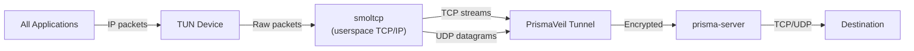

import Tabs from '@theme/Tabs';
import TabItem from '@theme/TabItem';

# TUN Mode

TUN mode captures all system traffic through a virtual network interface and routes it through the PrismaVeil tunnel. Unlike SOCKS5/HTTP proxy mode which requires per-application configuration, TUN mode works system-wide — every application on the machine is automatically proxied.

## How it works



1. A virtual network interface (TUN device) is created and the OS routing table is updated to route traffic through it
2. Raw IP packets from all applications arrive at the TUN device
3. A userspace TCP/IP stack ([smoltcp](https://github.com/smoltcp-rs/smoltcp)) processes the packets — extracting TCP streams and UDP datagrams
4. TCP connections are bridged to PrismaVeil `CMD_CONNECT` tunnels, UDP datagrams are relayed via `CMD_UDP_DATA`
5. DNS queries (port 53) are intercepted and handled according to the configured DNS mode

## Platform support

| Platform | Driver | Requirements |
|----------|--------|-------------|
| **Windows** | [Wintun](https://www.wintun.net/) | `wintun.dll` in PATH or working directory. Built into Windows 10+. Run as Administrator. |
| **Linux** | `/dev/net/tun` (ioctl) | `CAP_NET_ADMIN` capability or root. |
| **macOS** | `utun` kernel interface | Root access (`sudo`). |

## Configuration

Enable TUN mode in your client config:

```toml title="client.toml"
[tun]
enabled = true
device_name = "prisma-tun0"
mtu = 1500
include_routes = ["0.0.0.0/0"]
exclude_routes = []           # Server IP is auto-excluded
dns = "fake"                  # "fake" or "tunnel"
```

### Configuration reference

| Field | Type | Default | Description |
|-------|------|---------|-------------|
| `enabled` | bool | `false` | Enable TUN mode |
| `device_name` | string | `"prisma-tun0"` | TUN device name (Linux: arbitrary, macOS: must be `utunN`, Windows: adapter name) |
| `mtu` | u16 | `1500` | Maximum transmission unit (valid: 576–9000) |
| `include_routes` | string[] | `["0.0.0.0/0"]` | CIDR routes to capture through the tunnel |
| `exclude_routes` | string[] | `[]` | CIDR routes to exclude (server IP is always auto-excluded) |
| `dns` | string | `"fake"` | DNS mode for TUN: `"fake"` or `"tunnel"` |

## DNS modes

TUN mode intercepts all DNS queries (port 53 traffic) and handles them based on the configured mode:

### Fake DNS (`dns = "fake"`)

The recommended mode. Assigns virtual IPs from the `198.18.0.0/15` range to queried domains. When a connection is made to a fake IP, Prisma resolves it back to the original domain and sends the domain name through the tunnel. This provides:

- **Zero DNS leaks** — no real DNS queries leave the machine
- **Domain-based routing** — routing rules can match on domains, not just IPs
- **Faster resolution** — no network round-trip for DNS

### Tunnel DNS (`dns = "tunnel"`)

Forwards raw DNS queries through the PrismaVeil tunnel using `CMD_DNS_QUERY`. The server resolves the query using its configured upstream DNS server. This is useful when you need real DNS responses (e.g., for applications that validate DNS records).

## Quick start

### 1. Configure TUN mode

Add the TUN section to your existing client config:

```toml title="client.toml"
socks5_listen_addr = "127.0.0.1:1080"
server_addr = "your-server:8443"
transport = "quic"

[identity]
client_id = "your-client-id"
auth_secret = "your-auth-secret"

[tun]
enabled = true
dns = "fake"
```

### 2. Run with elevated privileges

<Tabs>
  <TabItem value="linux" label="Linux" default>

```bash
sudo prisma client -c client.toml
```

Or grant the binary `CAP_NET_ADMIN` to avoid running as root:

```bash
sudo setcap cap_net_admin+ep $(which prisma)
prisma client -c client.toml
```

  </TabItem>
  <TabItem value="macos" label="macOS">

```bash
sudo prisma client -c client.toml
```

  </TabItem>
  <TabItem value="windows" label="Windows">

Run PowerShell or Command Prompt as **Administrator**, then:

```powershell
prisma client -c client.toml
```

Ensure `wintun.dll` is in the same directory as `prisma.exe` or in your system PATH.

  </TabItem>
</Tabs>

### 3. Verify

All traffic now flows through the tunnel:

```bash
curl https://httpbin.org/ip
# Should show the server's IP, not your local IP
```

## Route configuration

### Proxy all traffic (default)

```toml
[tun]
enabled = true
include_routes = ["0.0.0.0/0"]
```

### Proxy specific subnets only

```toml
[tun]
enabled = true
include_routes = ["10.0.0.0/8", "172.16.0.0/12", "192.168.0.0/16"]
```

### Exclude specific destinations

```toml
[tun]
enabled = true
include_routes = ["0.0.0.0/0"]
exclude_routes = ["192.168.1.0/24", "10.0.0.0/8"]
```

:::tip
The server's IP address is always automatically excluded from TUN routes to prevent routing loops.
:::

## Combining with routing rules

TUN mode works with Prisma's [routing rules](/docs/features/routing-rules) engine. You can capture all traffic via TUN but selectively route it:

```toml title="client.toml"
[tun]
enabled = true
dns = "fake"

[[routing.rules]]
type = "domain-suffix"
value = "google.com"
action = "proxy"

[[routing.rules]]
type = "domain-suffix"
value = "local"
action = "direct"

[[routing.rules]]
type = "ip-cidr"
value = "192.168.0.0/16"
action = "direct"
```

## Architecture details

### TCP handling

TCP packets from the TUN device are processed by a [smoltcp](https://github.com/smoltcp-rs/smoltcp) userspace TCP/IP stack:

1. Raw SYN packets trigger socket creation in smoltcp
2. The TCP three-way handshake completes within smoltcp
3. Once established, the TCP stream is bridged to a PrismaVeil tunnel via `CMD_CONNECT`
4. Data flows bidirectionally: application ↔ smoltcp ↔ PrismaVeil ↔ server ↔ destination

The stack supports up to 64 concurrent TCP connections with 64KB send/receive buffers per socket.

### UDP handling

UDP datagrams are relayed through PrismaVeil's `CMD_UDP_DATA` command:

- **DNS (port 53)**: Intercepted and handled by the DNS resolver (fake or tunnel mode)
- **Other UDP**: Relayed via the PrismaUDP sub-protocol, supporting games, VoIP, and other UDP applications

### Performance tuning

| Parameter | Default | Recommendation |
|-----------|---------|---------------|
| `mtu` | 1500 | Use 1500 for most networks. Increase to 9000 for jumbo frames on local networks. |
| Wintun ring buffer | 4 MB | Hardcoded. Sufficient for high-throughput proxying. |
| smoltcp sockets | 64 max | Sufficient for most desktop usage. Heavy server workloads may need SOCKS5 mode instead. |

## Troubleshooting

### "Failed to load Wintun driver" (Windows)

Download `wintun.dll` from [wintun.net](https://www.wintun.net/) and place it in the same directory as `prisma.exe`.

### "Failed to open /dev/net/tun" (Linux)

Ensure you have the required permissions:

```bash
# Option 1: Run as root
sudo prisma client -c client.toml

# Option 2: Grant capability
sudo setcap cap_net_admin+ep $(which prisma)
```

### "Failed to connect utun socket" (macOS)

macOS requires root access for TUN device creation:

```bash
sudo prisma client -c client.toml
```

### Routing loops

If you lose network connectivity after enabling TUN mode, the server's IP may not be correctly excluded. Explicitly exclude it:

```toml
[tun]
enabled = true
exclude_routes = ["<server-ip>/32"]
```

### DNS not resolving

Ensure `dns` is set to `"fake"` or `"tunnel"`. With `dns = "fake"`, applications resolve domains to virtual IPs in the `198.18.0.0/15` range — this is expected behavior.

---

## What's New in v2.28

### OS Routing (Automatic)

TUN mode now automatically configures OS routing when activated:

- **Split-route trick**: Adds `0.0.0.0/1` + `128.0.0.0/1` routes through the TUN device, avoiding replacement of the system's default gateway
- **Server bypass**: The proxy server's IP is automatically excluded from TUN routes to prevent routing loops
- **RAII cleanup**: All routing changes are automatically reversed when disconnecting (the `TunRouteGuard` ensures cleanup even on crash)

### DNS Response Construction

DNS queries captured by TUN are now properly handled:

- **Fake DNS mode** (default): Assigns fake IPs from a reserved pool, constructs DNS A-record responses, and sends them back through TUN
- **Tunnel/Smart/Direct modes**: Resolves domains via configured upstream DNS, then returns the response through TUN
- DNS response packets include valid IPv4 headers with correct checksums

### UDP Relay

Non-DNS UDP traffic is now relayed through the encrypted tunnel (previously only logged). Each UDP datagram is sent through a tunnel connection with a 5-second response timeout.

### Platform Support

| Platform | Driver | Admin Required | Notes |
|----------|--------|---------------|-------|
| Windows | Wintun (bundled) | Yes | wintun.dll automatically placed next to exe |
| macOS | utun kernel | Yes (sudo) | Point-to-point interface with 10.0.85.1/10.0.85.254 |
| Linux | /dev/net/tun | CAP_NET_ADMIN | Standard kernel TUN driver |

### GUI Integration

In the desktop GUI, TUN mode is controlled via the **proxy mode toggles** on the Home page (not a separate settings toggle). Enabling Per-App mode automatically enables TUN. The GUI checks for administrator privileges before activating TUN.
