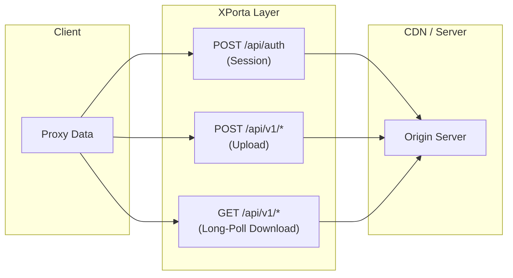

# XPorta Transport

XPorta is a next-generation CDN transport (v1.5.0) that makes proxy traffic indistinguishable from a normal single-page application making REST API calls. Instead of one infinite bidirectional stream (like XHTTP stream-one), proxy data is fragmented into many short-lived HTTP request/response pairs — exactly the pattern real web apps produce when calling backend APIs.

## Why XPorta

XHTTP stream-one works well, but a single long-lived HTTP/2 stream with `application/octet-stream` content is increasingly detectable. Censorship systems can flag the unusual stream lifetime, binary content type, and single fixed URL path. XPorta eliminates all of these fingerprints:

| Aspect | XHTTP stream-one | XPorta |
|--------|-------------------|--------|
| H2 stream pattern | 1 stream, lives forever | 3-8 concurrent short-lived streams |
| Request lifetime | Minutes to hours | Milliseconds to 55 seconds |
| Content-Type | Always application/octet-stream | JSON (default) or binary |
| URL paths | 1 fixed path | Multiple randomized paths |
| Active probe response | Binary stream (suspicious) | Realistic JSON 401 / cover site |
| DPI signature | Detectable: long POST + binary stream | Indistinguishable from normal API traffic |

## How it works

XPorta splits the proxy tunnel into three logical channels — session, upload, and download — each using standard HTTP semantics that any CDN passes through without issue.



### Session establishment

The client initiates a session by sending a POST to `session_path` (e.g., `/api/auth`) with a JSON body:

```json
{
  "v": 1,
  "t": 1710000000,
  "c": "a1b2c3d4e5f6...",
  "a": "hmac-sha256-hex",
  "p": "random-padding..."
}
```

| Field | Description |
|-------|-------------|
| `v` | Protocol version |
| `t` | Unix timestamp |
| `c` | Client ID (hex) |
| `a` | HMAC-SHA256 authentication tag |
| `p` | Random-length padding |

The server validates the authentication, creates a session, and responds with a `Set-Cookie` header containing a BLAKE3-keyed token. All subsequent requests include this cookie — no custom headers, no unusual authentication schemes.

### Upload (client-to-server)

The client sends POST requests to randomly chosen paths from `data_paths`. Each request carries one chunk of proxy data. Two encodings are supported:

**JSON encoding** (default):

```json
{
  "s": 42,
  "d": "base64-encoded-payload",
  "p": "random-padding..."
}
```

**Binary encoding**:

```
[sequence: 4 bytes LE][length: 4 bytes LE][payload][padding]
```

The server piggybacks any pending download data in the response body, reducing round trips.

### Download (server-to-client)

The client maintains `poll_concurrency` (default 3) pending GET requests across paths from `poll_paths`. The server holds each request open for up to 55 seconds (long polling). When data is available, the server responds immediately:

```json
{
  "items": [
    {"s": 10, "d": "base64-data"},
    {"s": 11, "d": "base64-data"}
  ],
  "p": "random-padding..."
}
```

If no data arrives within the timeout, the server returns an empty response and the client immediately sends a new poll.

### Sequence-based reassembly

Because HTTP/2 multiplexes requests over a single TCP connection, responses may arrive out of order. Each upload and download chunk carries a sequence number. The receiving side buffers out-of-order chunks and reassembles them in the correct sequence before passing data to the tunnel layer.

## Encoding modes

### JSON (default)

All payloads are base64-encoded inside JSON objects. Requests use `Content-Type: application/json`. This is the stealthiest mode — traffic is indistinguishable from a typical SPA making API calls. The trade-off is approximately 37% overhead from base64 encoding.

### Binary

Payloads are sent as raw bytes with `Content-Type: application/octet-stream`. Maximum throughput with roughly 0.5% overhead (only the 8-byte sequence/length header). Use this when stealth is less critical than performance.

### Auto

Small payloads (under a configurable threshold) use JSON encoding; large payloads switch to binary. This provides good stealth for typical browsing while avoiding excessive overhead for bulk transfers.

## Server configuration

```toml title="server.toml"
[cdn]
enabled = true
listen_addr = "0.0.0.0:443"

[cdn.xporta]
enabled = true
session_path = "/api/auth"
data_paths = ["/api/v1/data", "/api/v1/sync", "/api/v1/update"]
poll_paths = ["/api/v1/notifications", "/api/v1/feed", "/api/v1/events"]
session_timeout_secs = 300
max_sessions_per_client = 8
cookie_name = "_sess"
encoding = "json"

[cdn.tls]
cert_path = "origin-cert.pem"
key_path = "origin-key.pem"
```

| Parameter | Default | Description |
|-----------|---------|-------------|
| `session_path` | `/api/auth` | Endpoint for session creation |
| `data_paths` | — | List of upload endpoints (client randomly picks one per request) |
| `poll_paths` | — | List of long-poll download endpoints |
| `session_timeout_secs` | 300 | Idle session expiry (seconds) |
| `max_sessions_per_client` | 8 | Maximum concurrent sessions per client |
| `cookie_name` | `_sess` | Name of the session cookie |
| `encoding` | `json` | Default encoding: `json`, `binary`, or `auto` |

## Client configuration

```toml title="client.toml"
transport = "xporta"

[xporta]
base_url = "https://your-domain.com"
session_path = "/api/auth"
data_paths = ["/api/v1/data", "/api/v1/sync", "/api/v1/update"]
poll_paths = ["/api/v1/notifications", "/api/v1/feed", "/api/v1/events"]
encoding = "json"          # "json" | "binary" | "auto"
poll_concurrency = 3       # 1-8
upload_concurrency = 4     # 1-8
max_payload_size = 65536   # bytes
poll_timeout_secs = 55     # 10-90
extra_headers = [["X-App-Version", "2.10.0"]]
```

| Parameter | Default | Description |
|-----------|---------|-------------|
| `base_url` | — | Server URL (must include scheme) |
| `encoding` | `json` | Payload encoding mode |
| `poll_concurrency` | 3 | Number of concurrent long-poll GET requests (1-8) |
| `upload_concurrency` | 4 | Number of concurrent upload POST requests (1-8) |
| `max_payload_size` | 65536 | Maximum payload size in bytes per request |
| `poll_timeout_secs` | 55 | Long-poll timeout in seconds (10-90) |
| `extra_headers` | — | Additional HTTP headers for all requests |

## Active probe resistance

XPorta is the first PrismaVeil transport with built-in active probe resistance. When a censor or automated scanner connects to the server, the response depends on whether a valid session cookie is present:

**No valid cookie** — the server either reverse-proxies to a cover site (configured via `cover_upstream`) or returns a realistic JSON error:

```json
{"error": "unauthorized", "code": 401}
```

This is exactly what a real API would return to an unauthenticated request. There is no binary data, no protocol mismatch, and no connection-refused behavior that would distinguish the server from a normal web application.

**Valid cookie + invalid payload** — the server immediately terminates the session. This prevents attackers from replaying a captured cookie to probe for protocol behavior.

## Cloudflare compatibility

XPorta is specifically designed to work within Cloudflare's free-tier limitations:

| Constraint | Cloudflare Limit | XPorta Setting |
|------------|------------------|----------------|
| Request timeout | 100 seconds | 55-second poll timeout |
| Request body size | 100 MB | 64 KB payloads |
| WebSocket upgrade | Not required | Standard POST/GET only |
| Cookies | Passed through | Session cookie works transparently |
| HTTP/2 | Fully supported | Multiplexed short-lived streams |

No special Cloudflare configuration is needed — no WebSocket toggle, no gRPC enablement. XPorta uses only standard HTTP POST and GET requests that every CDN handles natively.

## Session Persistence

XPorta sessions are designed to be resilient across transient network disruptions. Several mechanisms ensure that proxy connections survive brief interruptions without dropping the user's traffic:

### Handler loop continuity

Each XPorta session runs a dedicated handler loop on the server. This loop does not terminate when an individual relay connection ends -- it continues to accept new upload and download requests on the same session cookie. A single session can serve multiple sequential proxy connections without re-authenticating.

### Idle timeout

Sessions remain alive for **60 seconds** after the last activity (upload, download, or poll request). During this window, the client can resume sending data without re-establishing the session. If no activity occurs within the idle timeout, the server cleans up the session and releases its resources.

### Instant download delivery

The server uses a poll-notify mechanism for the download path. When new data arrives for a session, all pending long-poll requests are immediately notified and return the data without waiting for the next poll cycle. This ensures minimal latency for server-to-client data delivery, even when the client is between poll requests.

### Practical implications

- **Page navigation** -- when a browser loads a new page, existing proxy connections may close. The XPorta session persists, so the next connection reuses the same session cookie.
- **Network switching** -- moving between Wi-Fi and cellular may briefly interrupt connectivity. The 60-second idle timeout provides a window for the client to reconnect.
- **CDN connection resets** -- if the CDN drops an HTTP/2 connection, the XPorta session on the origin server remains intact and accepts new requests.

## Comparison with other transports

| Feature | QUIC | TCP | WebSocket | gRPC | XHTTP | XPorta |
|---------|------|-----|-----------|------|-------|--------|
| Looks like normal HTTP | No | No | Upgrade header | grpc content-type | Yes | Yes |
| CDN-compatible | No | No | Yes | Partial | Yes | Yes |
| DPI resistance | Low | Low | Medium | Medium | High | Highest |
| Active probe resistant | No | No | No | No | No | Yes |
| Per-connection overhead | Low | Low | Medium | Medium | Low | Low |
| Multiple URL paths | No | No | No | No | No | Yes |
