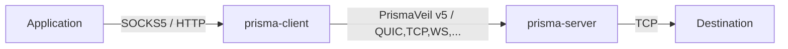
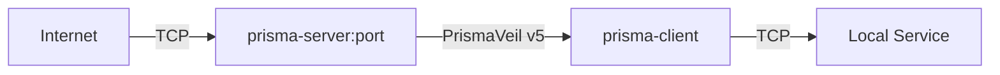
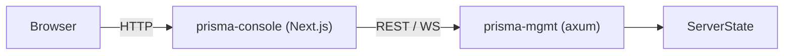

# Introduction

Prisma is a next-generation encrypted proxy infrastructure suite built in Rust. It implements the **PrismaVeil v5** wire protocol — combining modern cryptography (including post-quantum hybrid key exchange), eight transport options, and advanced anti-censorship features. Version **2.26.0** ships with a subscription system overhaul, improved server resilience, an upgraded connection map, GUI performance and stability improvements, and many more production-grade features.

## Features

### Protocol and Cryptography

- **PrismaVeil v5 protocol** — 1-RTT handshake, 0-RTT session resumption, X25519 + BLAKE3 + ChaCha20-Poly1305 / AES-256-GCM / Transport-Only cipher modes, header-authenticated encryption (AAD), connection migration, enhanced KDF
- **Post-quantum hybrid key exchange** — ML-KEM-768 (Kyber) combined with X25519 for forward-secure key agreement resistant to quantum computers. Negotiated automatically when both sides support it.
- **Modern cryptography** — X25519 ECDH, BLAKE3 KDF, ChaCha20-Poly1305 / AES-256-GCM AEAD
- **Anti-replay protection** via 1024-bit sliding-window nonce bitmap
- **Session ticket rotation** — automatic key ring rotation with configurable retention of expired keys for graceful forward secrecy

### Transports

- **8 transports** with auto-fallback:

| Transport | Description |
|-----------|-------------|
| **TCP** | TLS-encrypted TCP with PrismaTLS active-probing resistance |
| **QUIC** | QUIC v2 (RFC 9369) with Salamander UDP obfuscation and BBR/Brutal/Adaptive congestion control |
| **WebSocket** | WebSocket over TLS, CDN-compatible |
| **gRPC** | gRPC streaming over HTTP/2, CDN-compatible |
| **XHTTP** | Chunked HTTP transport for restrictive CDN environments |
| **XPorta** | Next-gen CDN transport indistinguishable from normal REST API traffic |
| **SSH** | Tunnels through standard SSH connections for maximum compatibility |
| **WireGuard** | Uses WireGuard protocol for kernel-level performance |

### Proxy and Routing

- **SOCKS5 proxy interface** (RFC 1928) for application compatibility
- **HTTP CONNECT proxy** for browsers and HTTP-aware clients
- **TUN mode** — system-wide proxy via virtual network interface (Windows/Linux/macOS)
- **Port forwarding / reverse proxy** — expose local services through the server (frp-style)
- **Routing rules engine** — domain/IP/port/GeoIP-based allow/block filtering, ACL files, rule providers
- **Proxy groups** — load balancing, failover, and URL-test-based auto-selection
- **GeoIP routing** — country and city-level smart routing via MaxMind MMDB (GeoLite2-City.mmdb), on both client and server
- **Smart DNS** — fake IP, tunnel, smart (GeoSite), and direct modes

### Subscription

- **Subscription management** — add, update, list, and test subscriptions with auto-update
- **Latency testing** — measure RTT to subscription servers or manually specified server lists

### Anti-Censorship

- **Traffic shaping** — bucket padding, chaff injection, timing jitter, frame coalescing
- **PrismaTLS** — active probing resistance with padding beacon auth, mask server pool, browser fingerprint mimicry
- **Entropy camouflage** — byte distribution shaping for DPI exemption
- **Salamander UDP obfuscation**, HTTP/3 masquerade, port hopping, TLS camouflage

### Performance

- **io_uring support** — zero-copy I/O on Linux 5.6+ for maximum relay throughput
- **Buffer pool** — pre-allocated, reusable frame buffers to eliminate allocation overhead on hot relay paths
- **XMUX** — connection multiplexing and pooling for CDN transports
- **Connection pool** — reuses transport connections across SOCKS5/HTTP requests
- **Zero-copy relay** — `FrameEncoder` with pre-allocated buffers and in-place encryption/decryption
- **PrismaUDP** — UDP relay with FEC Reed-Solomon forward error correction
- **Congestion control** — BBR, Brutal, and Adaptive modes for QUIC

### Operations and Management

- **Daemon CLI mode** — run server, client, and console as background daemons with PID files, log files, and `stop`/`status` subcommands
- **Hot config reload** — SIGHUP signal handler and automatic config file watcher for live configuration updates without restart
- **Graceful shutdown** — drain active connections before stopping
- **Config file watcher** — automatically detects config file changes and triggers hot-reload
- **Management API** — REST + WebSocket API for live monitoring and control
- **Web console** — real-time Next.js + shadcn/ui console with metrics, client management, and log streaming
- **Per-client bandwidth and quota limits** — upload/download rate limiting with configurable quotas
- **Per-client metrics** — track bandwidth, connection count, and usage per authorized client
- **Connection backpressure** via configurable max connection limits
- **Structured logging** (pretty or JSON) via `tracing` with broadcast support

### Platform and Integration

- **Mobile FFI** — C ABI shared library (`prisma-ffi`) for GUI and mobile app integration (Android/iOS)
- **Cross-platform** — Linux, macOS, Windows, FreeBSD, with platform-specific TUN, system proxy, and auto-update support

## Architecture

Prisma is organized into six crates plus a console and documentation site:

```
prisma/
├── crates/
│   ├── prisma-core/       # Shared library: crypto, protocol (PrismaVeil v5), config, DNS, routing,
│   │                      #   GeoIP, bandwidth, buffer pool, traffic shaping, types
│   ├── prisma-server/     # Proxy server: TCP/QUIC/WS/gRPC/XHTTP/XPorta/SSH/WireGuard
│   │                      #   listeners, relay (standard + io_uring), auth, camouflage, hot-reload
│   ├── prisma-client/     # Proxy client: SOCKS5/HTTP CONNECT/TUN inbound, transport selection,
│   │                      #   connection pool, proxy groups, DNS resolver, metrics
│   ├── prisma-mgmt/       # Management API: REST + WebSocket via axum, auth middleware,
│   │                      #   handlers for clients/connections/metrics/bandwidth/config/routes
│   ├── prisma-cli/        # CLI binary (clap 4): server/client/console runners with daemon mode,
│   │                      #   gen-key, gen-cert, init, validate, subscription, latency-test,
│   │                      #   management commands, shell completions
│   └── prisma-ffi/        # C FFI shared library: lifecycle, profiles, QR import/export,
│                          #   system proxy, auto-update, subscription management, stats poller
├── apps/
│   ├── prisma-gui/        # Desktop GUI (Tauri 2 + React + TypeScript)
│   └── prisma-console/    # Web console (Next.js + shadcn/ui)
├── docs/                  # Documentation site (Docusaurus)
├── tools/
│   └── prisma-mcp/        # MCP development server
└── scripts/               # Install scripts and benchmarks
```

### Data flow — outbound proxy

When used as an outbound proxy, applications connect to the local SOCKS5 or HTTP CONNECT interface. The client encrypts traffic with the PrismaVeil v5 protocol and sends it over one of eight transports to the server, which forwards it to the destination.



### Data flow — port forwarding (reverse proxy)

Port forwarding allows you to expose local services behind NAT/firewalls through the Prisma server. External connections arrive at the server and are relayed through the encrypted tunnel to the client's local service.



### Data flow — management & console

The management API provides live observability and control. The console communicates with the management API via a server-side proxy to keep the API token secure.



## What's New in 2.26.0

- **Subscription system overhaul** — invite redemption page (`/invite/[token]`), plan edit/update UI, expiry date picker for codes and invites, advanced permission fields (port forwarding, UDP, connections, destinations, quota period), auto-refresh queries, improved delete confirmations
- **Error handling** — HTTP status code checking (410/409/404) replaces fragile string matching in redeem page
- **CI fix** — `.npmrc` with `legacy-peer-deps` for react-simple-maps compatibility
- **GUI repository split** — desktop/mobile client migrated to [prisma-proxy/prisma-gui](https://github.com/prisma-proxy/prisma-gui) as a standalone repo with git submodule for core crates

## What's New in 2.25.0

- **Server resilience** — QUIC listener no longer crashes under systemd (`CAP_NET_BIND_SERVICE`); single listener failure is non-fatal (`join_all` replaces `select!`)
- **FFI connection status fix** — `ConnectionManager.status` changed from `i32` to `Arc<AtomicI32>` so the async task correctly transitions to CONNECTED (was stuck on CONNECTING)
- **Connection map upgrade** — replaced custom SVG with react-simple-maps + Natural Earth 50m TopoJSON, geoNaturalEarth1 projection, full dark mode support, HTML tooltip overlay, choropleth legend
- **GUI crash prevention** — ErrorBoundary around routes, catch-all 404 route, client cleanup on app exit (`prisma_destroy` on `RunEvent::Exit`), replaced all `.lock().unwrap()` with error handling
- **GUI performance** — batched `parseLogForConnection` into rAF, debounced `profileMetrics` and `connectionHistory` persist (5s), throttled tray updates (every 3 ticks), cached `getBoundingClientRect`, `localeCompare` replaced with simple string comparison in sort, single parent tick timer for LiveDuration
- **GUI polish** — theme-aware SpeedGraph colors, i18n for hardcoded English strings, exponential auto-reconnect backoff (1.5x, cap 60s), port validation (1-65535), canvas accessibility
- **GUI security** — path traversal validation in `download_file`, rule provider name validation, tray emit error logging

## What's New in 2.24.0

- **Subscription error propagation** — backend handlers now return real SQL/database error messages as structured JSON instead of opaque 500 errors, making debugging subscription creation failures straightforward
- **Connection map polish** — AnyChart-style connection map with improved zoom, pan, and city-level dot rendering
- **Routing rules root cause fix** — fixed TOML-to-JSON deserializer that caused routing rules to silently drop conditions

## What's New in 2.20.0

- **Update proxy/direct option** — auto-update can now route through proxy or direct connection
- **Routing test fix** — fixed false negatives in the route test endpoint for domain-suffix rules
- **Connections cleanup** — stale connection entries are now pruned on disconnect
- **Chart polish** — improved axis labels, tooltips, and dark-mode colors across all analytics charts
- **Map zoom** — connection map supports scroll-wheel zoom and pinch-to-zoom on mobile

## What's New in 2.19.0

- **Routing diagnostic logging** — verbose log output for each routing rule evaluation, enabled via `PRISMA_ROUTE_DEBUG=1`
- **Server GeoIP matching** — server-side routing rules now perform live MMDB lookups for GeoIP conditions
- **Serde round-trip tests** — comprehensive serialization/deserialization tests for all config structs
- **Markdown changelog** — machine-readable `CHANGELOG.md` generated from conventional commits
- **Async update install** — GUI auto-update downloads and installs asynchronously without blocking the UI
- **Windows MoveFileEx** — update binary replacement uses `MoveFileEx` with `MOVEFILE_DELAY_UNTIL_REBOOT` for locked files

## What's New in 2.18.0

- **Extended time ranges** — analytics charts support 1h, 6h, 12h, 24h, 7d, and 30d time windows
- **Top-10 traffic chart** — new chart showing the top 10 clients by bandwidth consumption
- **Zoom and pan** — all time-series charts support click-drag zoom and pan navigation
- **CSV export** — export analytics data to CSV from any chart view
- **Dark chart theme** — charts follow the system/app dark mode with proper contrast and grid colors

## What's New in 2.17.0

- **Enriched system tray** — tray menu now shows live upload/download speed, quick toggles for proxy modes, update availability, and recent connections
- **Per-app proxy page** — dedicated page for configuring per-application proxy rules with presets for common apps (browsers, terminals, development tools)

## What's New in 2.16.0

- **Consolidated settings** — unified settings page combining server, client, and console configuration
- **Complete config fields** — all transport-specific fields (PrismaTLS, CDN, SSH, WireGuard, Fallback) are now exposed in the GUI with validated forms
- **Polished forms** — improved form layouts, inline validation, and contextual help tooltips

## What's New in 2.15.0

- **GeoSite filter support** — auto-download GeoSite domain lists with category presets for routing rules
- **Routing GeoIP test** — server-side route test endpoint now performs actual MMDB lookup for GeoIP rules
- **Rule Match Breakdown** — analytics chart now shows matched rule names for all connections (Default, Bypass, or named rule)
- **Header controls** — notification, theme, and language controls moved to the app bar
- **Settings cleanup** — removed duplicate auto-backup field from settings page
- **Sidebar logo polish** — sidebar logo refined for both light and dark themes
- **Connection map visibility** — increased base country visibility on the choropleth connection map

## What's New in 2.14.0

- **Choropleth connection map** — redesigned connection map with city-level dots at lat/lon coordinates
- **City-level GeoIP data** — connection GeoIP now includes city name and coordinates from MMDB
- **Full country name display** — connection table shows full country names instead of ISO codes
- **Subscription plan system** — Free, Basic, and Pro plan presets with configurable limits
- **Permission controls** — fine-grained controls on codes/invites (port-forwarding, UDP, max connections, allowed destinations)
- **i18n expansion** — subscription, redeem, and settings pages fully internationalized (EN + ZH)
- **SQLite migration v2** — database schema migration for plans and permissions tables

## What's New in 2.13.0

- **React hydration fix** — fix hydration error on all console pages caused by client/server mismatch
- **GeoIP text badges** — replace emoji country flags with cross-platform text badges for consistent display across all operating systems
- **Routing rule matching fixes** — fix DomainKeyword matching and GeoIP skip logic in server-side routing
- **Server-side route test endpoint** — `POST /api/routes/test` to test a domain or IP against configured routing rules
- **Congestion mode "auto"** — `congestion.mode = "auto"` now maps to the adaptive congestion controller

## What's New in 2.12.0

- **SQLite database** — users, clients, routing rules, and subscriptions are now stored in a SQLite database (`data.sql`) with automatic migration from TOML config on first run
- **Subscription system** — redemption codes (`PRISMA-XXXX`) and invite links for streamlined client onboarding
- **Console settings tab** — admin-configurable settings: registration toggle, default role, session expiry, backup interval
- **Role-based dashboard** — client-role users see a simplified view with My Clients and Subscription pages only
- **SQLite-aware backups** — backup and restore now includes both TOML config and SQLite data

## What's New in 2.11.0

- **Cloudflare-style connection map** — redesigned live connection map with arc lines and server marker
- **Share dialog TOML overflow fix** — fix long TOML content overflowing the share dialog
- **Congestion "auto" mode** — support `congestion.mode = "auto"` in server and client config
- **Rule provider download mode** — GUI selector for rule provider download mode (Auto/Direct/Proxy)

## What's New in 2.10.0

- **Console setup wizard** — WordPress-style first-run setup at `/setup` that creates the initial admin user; no pre-configuration needed
- **Setup API** — `GET /api/setup/status` and `POST /api/setup/init` endpoints (no auth required) for programmatic first-run setup
- **Change password** — `PUT /api/auth/password` endpoint for users to change their own password
- **Registration gating** — self-registration is blocked until an admin user exists (enforced by setup flow)
- **Share config fix** — `public_address` field in `[server]` config used for shared client configs instead of `listen_addr` (0.0.0.0)
- **Routing redesign** — two-tab layout (Manual Rules + Templates), new rule types (DOMAIN, DOMAIN-SUFFIX, DOMAIN-KEYWORD, IP-CIDR, GEOIP, FINAL), new actions (PROXY/DIRECT/REJECT), new templates (Block Torrent/P2P, Block Gambling, Block Social Media)
- **Direct routing action** — `RuleAction::Direct` for bypassing the proxy on matched traffic
- **GUI: LAN server mode** — `allowLan` setting binds local proxy to 0.0.0.0 for LAN sharing
- **GUI: proxy mode polish** — persisted proxy modes, httpPort validation, tray state sync
- **GUI: macOS system proxy fix** — uses HTTP/HTTPS proxy settings instead of SOCKS5
- **GUI: "Copy Terminal Proxy"** — tray menu item copies platform-appropriate proxy export commands
- **GUI: connection virtualization** — efficient virtualized list rendering for 1000+ connections
- **GUI: status sync** — proper reconnection detection on page reload and app resume
- **React hydration fix** — deferred localStorage reads for SSR compatibility (fixes error #418)

## What's New in 2.9.0

- **CLI self-update** — `prisma update [--check] [--yes]` checks GitHub releases and self-replaces the binary
- **Per-connection GeoIP with city** — connections now include `country` and `city` fields using maxminddb (GeoLite2-City.mmdb) instead of v2fly geoip.dat
- **Owner-based client data scoping** — `owner` field on authorized clients; client-role users only see their owned clients and metrics
- **Client quota fix** — quota endpoint returns default zeros instead of 404 when quotas not configured

## What's New in 2.8.0

- **GeoIP analytics** — `GET /api/connections/geo` returns the country distribution of active connections; the console Overview page displays a live GeoIP pie chart
- **Per-client metrics API** — three new endpoints: `GET /api/metrics/clients`, `GET /api/metrics/clients/{id}`, `GET /api/metrics/clients/{id}/history`. Returns bytes, connection count, active connections, latency p50/p95/p99, and time-series history
- **Auto-backup** — `auto_backup_interval_mins` in `[management_api]` enables periodic background config snapshots (`0` = disabled)
- **QUIC hostname support** — client now resolves hostnames via async DNS for QUIC connections (fixes "invalid socket address syntax" on `hostname:port` addresses)
- **RouteAction aliases** — `reject`, `REJECT`, and `BLOCK` are accepted as aliases for the server-side `Block` routing action
- **Console improvements** — GeoIP pie chart on Overview; real-time CPU/memory area chart on System page; per-client metrics (active connections, bytes, latency p50/p95/p99) on Clients; metrics summary cards on Bandwidth; speed test trend chart + extended stats + 4 test servers; live traffic window capped at 60 s
- **GUI transport modes** — profile transport selector now includes XHTTP, XPorta, PrismaTLS, and WireGuard; QUIC-only settings (port hopping, entropy camouflage, SNI slicing) are hidden unless QUIC transport is selected

### Previous (1.5.0)

- **Connection pooling** — opt-in transport connection reuse via `connection_pool.enabled = true`
- **Cipher auto-selection** — `cipher_suite = "auto"` selects AES-256-GCM on AES-NI/NEON hardware, ChaCha20-Poly1305 otherwise
- **API surface reduction** — internal prisma-core functions hidden via `pub(crate)` (handshake codec, KDF, AAD builder)
- **Unwrap elimination** — replaced all `unwrap()` in codec, handshake, and xporta hot paths with `expect()` + reason

### Previous (1.4.0)

- v5 AAD relay activation, client permissions, transport fallback, PQ hybrid KEM
- Daemon mode, subscription management, hot config reload, buffer pooling
- Management API additions: `/api/clients/:id/permissions`, `/api/clients/:id/kick`, `/api/clients/:id/block`
