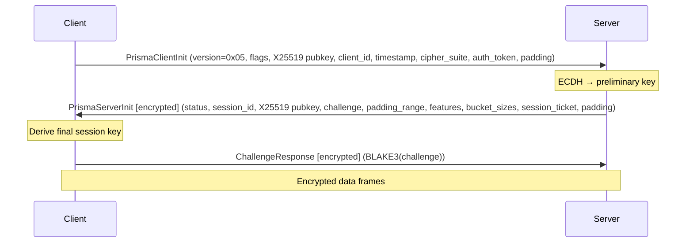
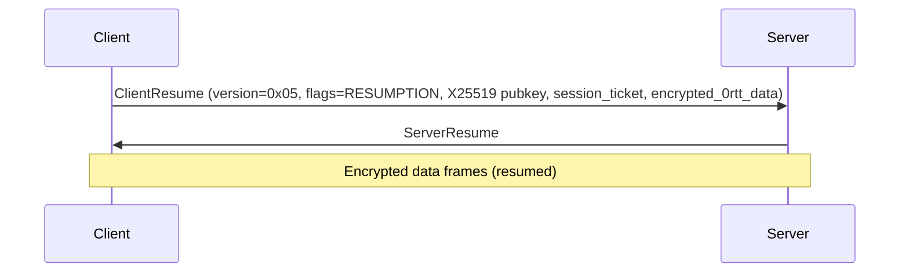

# PrismaVeil Protocol

PrismaVeil is the custom wire protocol used between the Prisma client and server. It provides authenticated key exchange, encrypted data transport, multiplexed stream management, UDP relay, and forward error correction.

## Protocol Versions

| Version | Handshake | Features |
|---------|-----------|----------|
| **v5 (0x05)** | **2-step (1 RTT)** | All v4 features plus: header-authenticated encryption (AAD) via BLAKE3-keyed 16-byte AAD bound to session context, connection migration (CMD_MIGRATION with 32-byte token + 16-byte session ID), zero-copy v5 frame encoding, enhanced anti-replay window tracking, enhanced KDF |
| **v4 (0x04)** | **2-step (1 RTT)** | 0-RTT resumption, PrismaUDP, FEC, DNS, speed test, congestion control, port hopping, Salamander v2, bucket padding, traffic shaping, PrismaTLS, PrismaFP, entropy camouflage (backward compatible — v4 clients still work with v5 servers using empty AAD) |

## PrismaVeil Handshake

The PrismaVeil handshake achieves 1 RTT by combining authentication into the initial key exchange:



### ClientInit

| Field | Size | Description |
|-------|------|-------------|
| `version` | 1 byte | `0x05` (or `0x04` for v4 clients) |
| `flags` | 1 byte | Bit 0: has_0rtt_data, Bit 1: resumption |
| `client_ephemeral_pub` | 32 bytes | X25519 ephemeral public key |
| `client_id` | 16 bytes | Client UUID |
| `timestamp` | 8 bytes (BE) | Unix timestamp in seconds |
| `cipher_suite` | 1 byte | `0x01` = ChaCha20-Poly1305, `0x02` = AES-256-GCM |
| `auth_token` | 32 bytes | HMAC-SHA256(auth_secret, client_id \|\| timestamp) |
| `padding` | variable | Random padding (0-256 bytes) |

### ServerInit (encrypted with preliminary key)

| Field | Size | Description |
|-------|------|-------------|
| `status` | 1 byte | Accept status code |
| `session_id` | 16 bytes | UUID for this session |
| `server_ephemeral_pub` | 32 bytes | X25519 ephemeral public key |
| `challenge` | 32 bytes | Random challenge for verification |
| `padding_min` | 2 bytes (LE) | Negotiated minimum per-frame padding |
| `padding_max` | 2 bytes (LE) | Negotiated maximum per-frame padding |
| `server_features` | 4 bytes (LE) | Bitmask of supported features |
| `bucket_count` | 2 bytes | Number of bucket sizes for traffic shaping |
| `bucket_sizes` | variable | Bucket size list (2 bytes each, `bucket_count` entries) |
| `session_ticket_len` | 2 bytes | Length of session ticket |
| `session_ticket` | variable | Opaque ticket for 0-RTT resumption |
| `padding` | variable | Random padding |

### Key Derivation (2-phase)

1. **Preliminary key** (for encrypting ServerInit): `BLAKE3("prisma-v3-preliminary", shared_secret || client_pub || server_pub || timestamp)`
2. **Final session key**: `BLAKE3("prisma-v3-session", shared_secret || client_pub || server_pub || challenge || timestamp)`

### 0-RTT Session Resumption

Subsequent connections can use session tickets to skip the full handshake:



Anti-replay protection: Server maintains a bloom filter of used session tickets.

### Server Feature Bitmask

| Bit | Feature | Description |
|-----|---------|-------------|
| 0x0001 | UDP_RELAY | PrismaUDP relay support |
| 0x0002 | FEC | Forward Error Correction |
| 0x0004 | PORT_HOPPING | Port hopping support |
| 0x0008 | SPEED_TEST | Bandwidth test support |
| 0x0010 | DNS_TUNNEL | Encrypted DNS queries |
| 0x0020 | BANDWIDTH_LIMIT | Per-client bandwidth limits |

### AcceptStatus Values

| Code | Name | Description |
|------|------|-------------|
| `0x00` | Ok | Authentication successful |
| `0x01` | AuthFailed | Invalid credentials |
| `0x02` | ServerBusy | Max connections reached |
| `0x03` | VersionMismatch | Unsupported protocol version |
| `0x04` | QuotaExceeded | Traffic quota exceeded |

## Encrypted Frame Wire Format

After the handshake, all data is exchanged as encrypted frames:

```
[nonce:12 bytes][ciphertext length:2 bytes BE][ciphertext + AEAD tag]
```

The nonce is transmitted with each frame. The ciphertext includes the AEAD authentication tag (16 bytes for both ChaCha20-Poly1305 and AES-256-GCM).

## Data Frame Plaintext Format

```
Unpadded:  [command:1][flags:2 LE][stream_id:4][payload:variable]
Padded:    [command:1][flags:2 LE][stream_id:4][payload_len:2][payload:variable][padding:variable]
Bucketed:  [command:1][flags:2 LE (FLAG_BUCKETED)][stream_id:4][payload_len:2][payload:variable][bucket_padding:variable]
```

## Command Types

| Code | Command | Direction | Payload |
|------|---------|-----------|---------|
| `0x01` | CONNECT | Client → Server | Destination address + port |
| `0x02` | DATA | Bidirectional | Raw data bytes |
| `0x03` | CLOSE | Bidirectional | None |
| `0x04` | PING | Bidirectional | Sequence number (4 bytes) |
| `0x05` | PONG | Bidirectional | Sequence number (4 bytes) |
| `0x06` | REGISTER_FORWARD | Client → Server | Remote port (2 bytes) + name |
| `0x07` | FORWARD_READY | Server → Client | Remote port (2 bytes) + success (1 byte) |
| `0x08` | FORWARD_CONNECT | Server → Client | Remote port (2 bytes) |
| `0x09` | UDP_ASSOCIATE | Client → Server | Bind address + port (PrismaUDP) |
| `0x0A` | UDP_DATA | Bidirectional | UDP datagram with addressing (PrismaUDP) |
| `0x0B` | SPEED_TEST | Bidirectional | Direction (1 byte) + duration (1 byte) + data |
| `0x0C` | DNS_QUERY | Client → Server | Query ID (2 bytes) + raw DNS query |
| `0x0D` | DNS_RESPONSE | Server → Client | Query ID (2 bytes) + raw DNS response |
| `0x0E` | CHALLENGE_RESP | Client → Server | BLAKE3 hash (32 bytes) |
| `0x0F` | MIGRATION | Bidirectional | Migration token (32 bytes) + session ID (16 bytes) — seamless connection handoff (v5 only) |

## Flag Bits (2 bytes, little-endian)

| Bit | Name | Description |
|-----|------|-------------|
| 0x0001 | PADDED | Frame contains per-frame padding |
| 0x0002 | FEC | Forward Error Correction parity data |
| 0x0004 | PRIORITY | High priority (games, VoIP) |
| 0x0008 | DATAGRAM | Unreliable delivery hint |
| 0x0010 | COMPRESSED | zstd compressed payload |
| 0x0020 | 0RTT | Part of 0-RTT data |
| 0x0040 | BUCKETED | Frame padded to a bucket boundary |
| 0x0080 | CHAFF | Dummy frame (discard payload) |

## PrismaUDP

PrismaUDP is a sub-protocol for relaying UDP traffic (games, VoIP, DNS) through the encrypted tunnel.

### UDP_ASSOCIATE

Client sends to request a UDP relay session:

```
[bind_addr_type:1][bind_addr:var][bind_port:2]
```

Server allocates a UDP socket and responds with FORWARD_READY.

### UDP_DATA

Bidirectional datagram relay:

```
[assoc_id:4][frag:1][addr_type:1][dest_addr:var][dest_port:2][payload:var]
```

### FEC (Forward Error Correction)

Optional Reed-Solomon erasure coding for UDP flows:

- Configurable: e.g., 10 data shards + 3 parity shards (30% overhead)
- FEC-enabled datagrams use FLAG_FEC and prepend a 4-byte FEC header:

```
[fec_group:2 LE][fec_index:1][fec_total:1][payload:var]
```

Recovery: If any `data_shards` packets in a group are received, all original data can be reconstructed.

### Transport

- **Over QUIC**: Uses QUIC DATAGRAM extension (RFC 9221) for unreliable, low-latency delivery
- **Over TCP/WS/gRPC/XHTTP**: Uses CMD_UDP_DATA as reliable frames (higher latency fallback)

## Congestion Control

Three configurable modes:

| Mode | Description |
|------|-------------|
| **Brutal** | Fixed send rate regardless of packet loss (Hysteria2-style). Best for throttled networks. |
| **BBR** | Google BBRv2 — probes bandwidth and RTT. Good for normal networks. |
| **Adaptive** | Starts with BBR, detects intentional throttling, gradually increases aggressiveness. |

## Anti-Detection Features

### Salamander UDP Obfuscation

Strips QUIC headers and XOR-obfuscates all UDP packets with a BLAKE3-derived keystream. Traffic appears as random bytes on the wire. In v4, Salamander uses a per-packet nonce (non-deterministic) to prevent correlation attacks, and prepends an ASCII prefix for GFW entropy analysis (Ex2) exemption.

### HTTP/3 Masquerade

QUIC server responds to browsers with a real website. PrismaVeil clients are distinguished by their initial auth stream.

### Port Hopping

Server binds multiple UDP ports. Client rotates ports on a deterministic HMAC-based schedule:

```
current_port = base_port + HMAC-SHA256(shared_secret, epoch)[0..2] % port_range
```

### Per-Frame Padding

Random padding added to every data frame within the negotiated range, preventing traffic analysis based on packet sizes.

## Protocol Constants

| Constant | Value | Description |
|----------|-------|-------------|
| `PRISMA_PROTOCOL_VERSION` | `0x05` | Current protocol version |
| `MAX_FRAME_SIZE` | 32768 | Maximum frame size in bytes |
| `NONCE_SIZE` | 12 | Nonce size in bytes |
| `MAX_PADDING_SIZE` | 256 | Maximum padding size in bytes |
| `PRISMA_QUIC_ALPN` | `"h3"` | QUIC ALPN protocol string |
| `SESSION_TICKET_KEY_SIZE` | 32 | Ticket encryption key size |
| `SESSION_TICKET_MAX_AGE_SECS` | 86400 | Session ticket lifetime (24h) |

