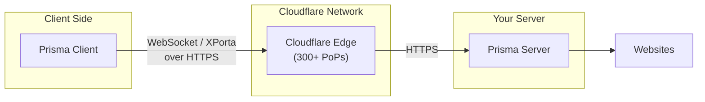
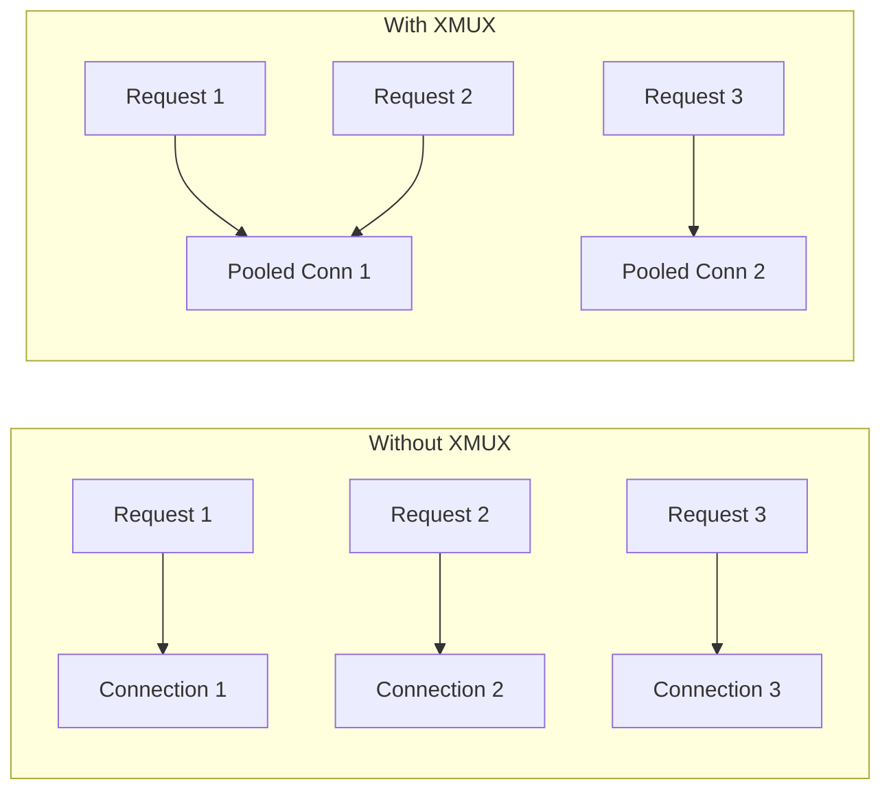
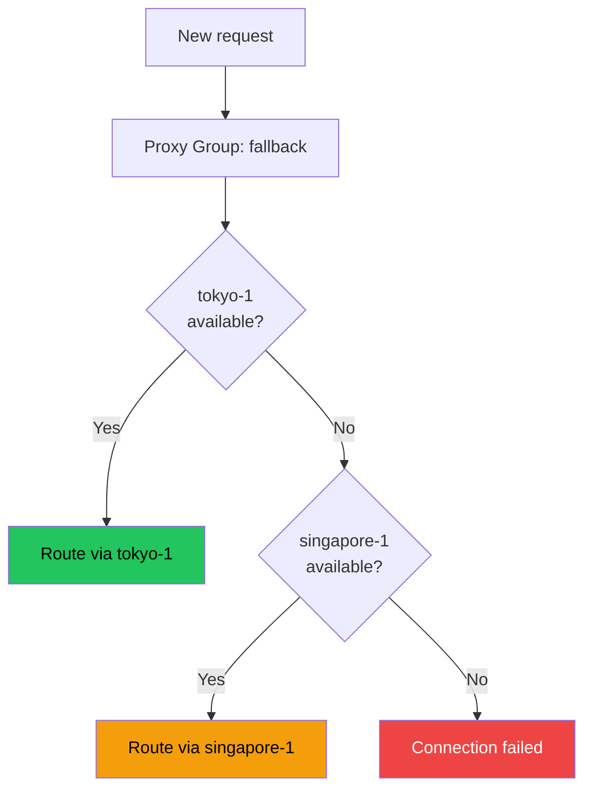

# Going Further

Congratulations -- you have a working Prisma setup! Each section below is independent; pick what you need.

## Running as a system service

```ini title="/etc/systemd/system/prisma-server.service"
[Unit]
Description=Prisma Proxy Server
After=network-online.target
Wants=network-online.target

[Service]
ExecStart=/usr/local/bin/prisma server -c /etc/prisma/server.toml
Restart=on-failure
RestartSec=5
LimitNOFILE=65536

[Install]
WantedBy=multi-user.target
```

```bash
sudo systemctl daemon-reload
sudo systemctl enable --now prisma-server
```

## Cloudflare CDN deployment



1. Add domain to Cloudflare, create A record with proxy enabled
2. Get Origin Certificate from Cloudflare dashboard
3. Server: `listen_addr = "0.0.0.0:443"`, use Origin cert
4. Client: `transport = "ws"` or `"xporta"`, `skip_cert_verify = false`

## XMUX connection pooling



```toml
# The presence of [xmux] enables multiplexing -- no separate toggle needed
[xmux]
max_connections_min = 1
max_connections_max = 4
max_concurrency_min = 8
max_concurrency_max = 128
```

## Routing rules (split tunneling)

```toml
[[routing.rules]]
type = "ip-cidr"
value = "192.168.0.0/16"
action = "direct"

[[routing.rules]]
type = "domain-keyword"
value = "ads"
action = "block"

[[routing.rules]]
type = "all"
action = "proxy"
```

### GeoIP routing

```toml
[routing]
geoip_path = "/etc/prisma/geoip.dat"

[[routing.rules]]
type = "geoip"
value = "private"
action = "direct"
```

## Proxy group failover



## Rule providers

```toml
[[rule_providers]]
name = "ad-block"
type = "domain"
url = "https://example.com/rules/ad-domains.txt"
interval_hours = 24
action = "block"
```

## io_uring performance

On Linux 5.11+, Prisma auto-detects and uses io_uring for zero-copy I/O. No config needed.

```toml
[performance]
max_connections = 4096

[congestion]
mode = "bbr"
```

## Monitoring with management API

```bash
curl http://127.0.0.1:9090/api/status -H "Authorization: Bearer TOKEN"
curl http://127.0.0.1:9090/api/clients -H "Authorization: Bearer TOKEN"
```

## Security best practices

1. Always use `prisma gen-key` for credentials
2. Use Let's Encrypt certificates for production
3. Bind management API to `127.0.0.1`
4. Use unique credentials per device
5. Configure `ticket_rotation_hours` for forward secrecy
6. Monitor logs: `sudo journalctl -u prisma-server -f`

## Congratulations!

You have completed the Prisma Guide. Further reading:

- [Server Configuration Reference](/docs/configuration/server)
- [Client Configuration Reference](/docs/configuration/client)
- [Configuration Examples](/docs/deployment/config-examples)
- [PrismaVeil Protocol](/docs/security/prismaveil-protocol)
- [Management API](/docs/features/management-api)
