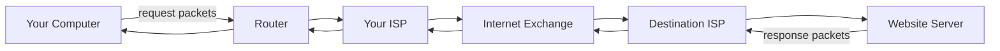
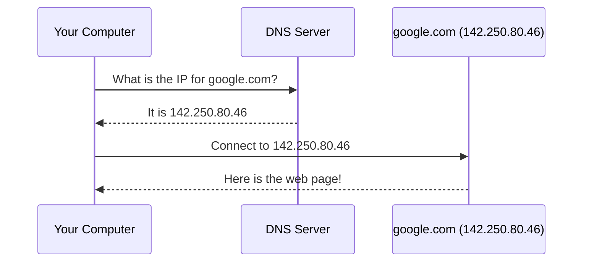
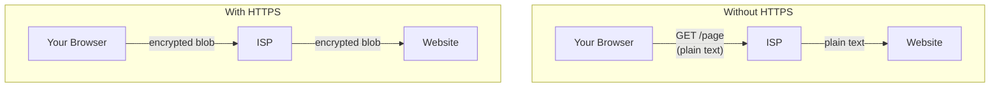
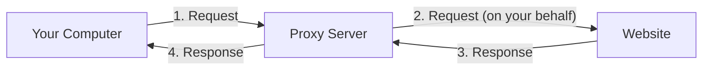
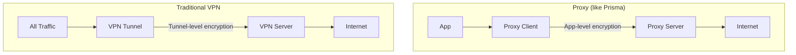
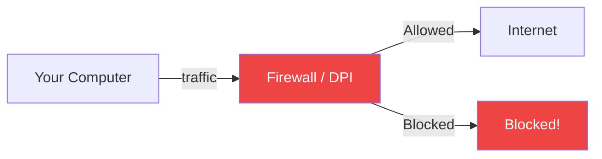
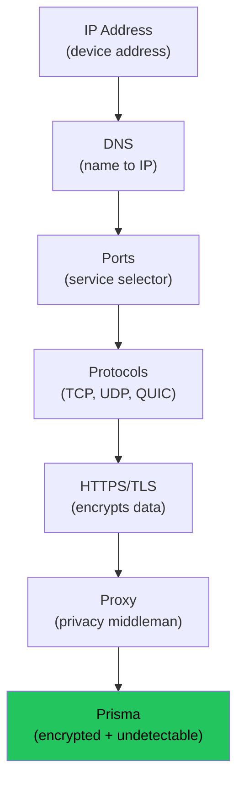

# Understanding the Basics

Before we set up Prisma, let's build a mental model of how the internet works. Every concept introduced here will reappear later when we configure Prisma, so a solid foundation makes everything easier.

## How the internet works

The internet is a global network of computers that communicate by passing small chunks of data called **packets** between each other.



> **Analogy:** The internet works like the postal system. Your computer is your home. Websites live in office buildings (servers). When you want to see a website, you send a letter (request) and they send a package back (response). Routers are like post offices along the way.

Every device on this network needs a unique address so packets know where to go. That is where IP addresses come in.

## IP addresses and domain names

An **IP address** is a numeric label assigned to every device on the internet -- like a street address for your computer.

| Type | Example | Who can see it |
|------|---------|---------------|
| **Public IP** | `203.0.113.45` | Every website you visit |
| **Private IP** | `192.168.1.100` | Only devices on your local network |

Nobody wants to remember numbers, so we have **domain names** -- human-friendly aliases like `google.com` or `github.com`.

**DNS** (Domain Name System) translates domain names into IP addresses, like a phone book:



> **Key takeaway:** Every time you type a URL, a DNS lookup happens behind the scenes. This lookup is normally unencrypted, which means your ISP can see every domain you visit -- even if the website itself uses HTTPS.

## Ports and protocols

A single server can run many services at once. **Ports** distinguish between them -- think of the IP address as a building address and the port as the apartment number.

| Port | Protocol | Purpose |
|------|----------|---------|
| 80 | HTTP | Websites (unencrypted) |
| 443 | HTTPS | Websites (encrypted) |
| 22 | SSH | Remote server access |
| 53 | DNS | Domain name resolution |
| 1080 | SOCKS5 | Proxy (used by Prisma client) |
| 8443 | Custom | Prisma server default |

A **protocol** is a set of rules computers follow to communicate. Two important ones:

- **TCP** -- guarantees that every byte arrives in order (like registered mail)
- **UDP** -- faster but no delivery guarantee (like tossing a note across the room)

A full network address looks like: `203.0.113.45:443` (IP address **:** port number).

## HTTP, HTTPS, and TLS

**HTTP** (HyperText Transfer Protocol) is how browsers fetch web pages. **HTTPS** adds encryption via **TLS** (Transport Layer Security) -- the padlock icon in your browser's address bar.



:::warning HTTPS is not enough
Even with HTTPS, your ISP can still see **which domains** you visit (via DNS queries and the TLS Server Name Indication field). They just cannot see what you do on those sites. A proxy like Prisma hides even the domain names.
:::

## What is encryption?

**Encryption** scrambles data so that only someone with the correct **key** can read it.

```
Original:    "Hello, how are you?"
Encrypted:   "7f3a9b2c1d8e4f6a0b5c..."
Decrypted:   "Hello, how are you?"
```

Prisma uses the same encryption algorithms trusted by banks, governments, and messaging apps like Signal:

| Algorithm | Best for | Key size |
|-----------|----------|----------|
| **ChaCha20-Poly1305** | Mobile, ARM, devices without hardware AES | 256-bit |
| **AES-256-GCM** | Desktop CPUs with hardware AES instructions | 256-bit |

Both are considered unbreakable with current (and foreseeable) technology.

## What is a proxy?

A **proxy** is a middleman between your computer and the internet. Instead of connecting directly to a website, your computer connects to the proxy, and the proxy connects to the website on your behalf.



Why use a proxy?

1. **Privacy** -- the website sees the proxy's IP address, not yours
2. **Access** -- if a website is blocked on your network, the proxy can reach it
3. **Security** -- an encrypted proxy (like Prisma) protects your data in transit

> **Analogy:** A proxy is like asking a friend to pick up a package for you. The store sees your friend, not you. And if your friend carries the package in a locked bag, nobody can see what is inside during the trip.

## Proxy vs. VPN -- what is the difference?



| Feature | Proxy (Prisma) | Traditional VPN |
|---------|---------------|----------------|
| Coverage | Per-app or system-wide (TUN mode) | Usually all traffic |
| Encryption | Application layer (PrismaVeil) | Tunnel layer (IPsec/WG) |
| Speed | Generally faster | Can be slower |
| Detection resistance | Very high (8 transports, anti-DPI) | Low (easily fingerprinted) |
| Transport flexibility | 8 options | Usually 1 |
| CDN support | Full (WS, gRPC, XHTTP, XPorta) | Rare |

Prisma is technically a proxy, but with TUN mode it captures all system traffic just like a VPN -- with the added benefit that its traffic is **much harder to detect and block**.

## Firewalls and Deep Packet Inspection (DPI)

A **firewall** monitors and controls network traffic. **DPI** (Deep Packet Inspection) goes further -- it inspects packet contents to classify and filter traffic.



Networks use DPI to:

- Block VPN and proxy protocols by recognizing their traffic patterns
- Throttle (slow down) streaming or file-sharing traffic
- Censor specific websites or categories

**This is where Prisma excels.** Prisma is designed to make its traffic indistinguishable from normal HTTPS browsing. Firewalls and DPI systems see only what appears to be ordinary web traffic.

| DPI technique | What it detects | How Prisma defeats it |
|--------------|----------------|----------------------|
| Protocol signature matching | Known VPN/proxy headers | PrismaVeil has no recognizable signatures |
| Packet size analysis | Fixed-size encrypted frames | Random padding on every frame |
| Timing correlation | Regular keepalive intervals | Timing jitter randomizes intervals |
| Entropy analysis | "Too random" encrypted streams | Entropy camouflage shapes distribution |
| Active probing | Sending test connections to suspected proxies | Camouflage mode responds as a real website |

## Putting it all together



Now you understand all the building blocks:

1. **IP addresses** identify devices on the internet
2. **Domain names** are human-friendly aliases resolved by **DNS**
3. **Ports** select specific services on a server
4. **Protocols** (TCP, UDP) define how data is transmitted
5. **HTTPS/TLS** encrypts web traffic, but your ISP still sees which domains you visit
6. A **proxy** acts as a privacy middleman
7. **Encryption** makes data unreadable without the key
8. **Firewalls and DPI** try to inspect and block proxy traffic
9. **Prisma** combines all defenses -- encryption, multiple transports, anti-detection -- into one tool

## Glossary

| Term | Definition |
|------|-----------|
| **IP address** | Unique numeric address of a device on the internet |
| **Domain name** | Human-friendly name for a website (e.g. `google.com`) |
| **DNS** | Service that translates domain names to IP addresses |
| **Port** | Number identifying a specific service on a server |
| **Protocol** | Rules for how computers communicate (TCP, UDP, QUIC) |
| **TLS** | Transport Layer Security -- encrypts connections |
| **Proxy** | Server that relays requests on your behalf |
| **DPI** | Deep Packet Inspection -- analyzing packet contents |
| **Firewall** | System that monitors and filters network traffic |
| **VPN** | Virtual Private Network -- tunnels all traffic |
| **SOCKS5** | General-purpose proxy protocol |
| **PrismaVeil** | Prisma's custom encrypted proxy protocol (v5) |

## Next step

Now that you understand the basics, let's learn [How Prisma Works](./how-prisma-works.md) -- the architecture, protocol, transport options, and anti-detection features that make it different from other tools.
