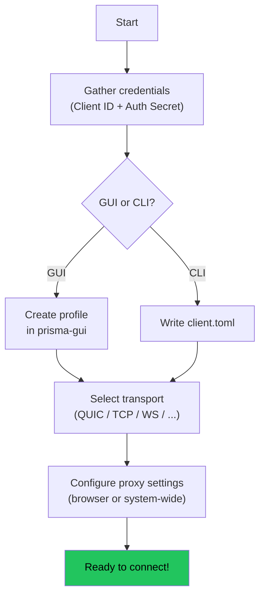
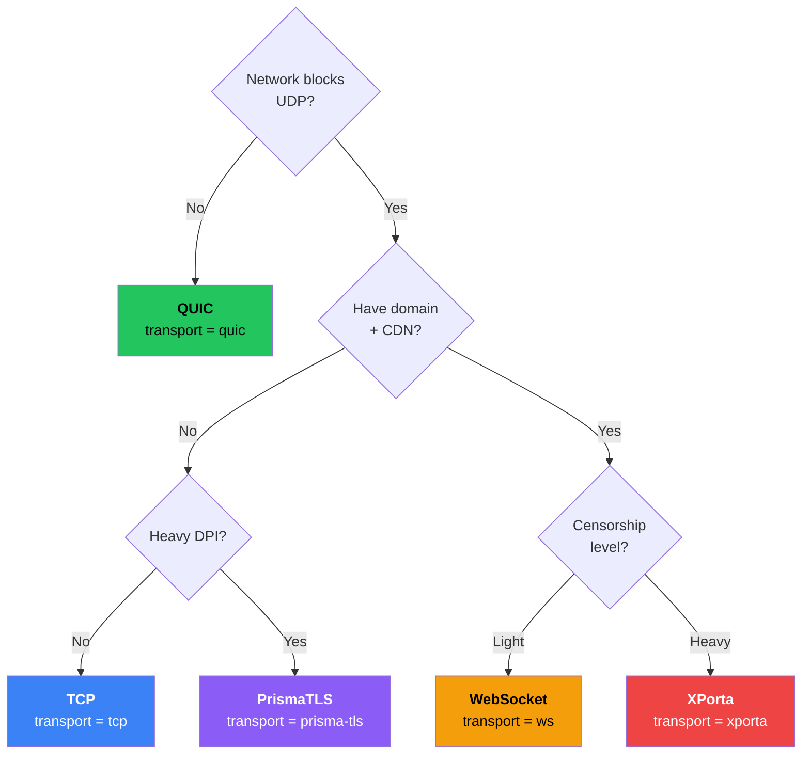
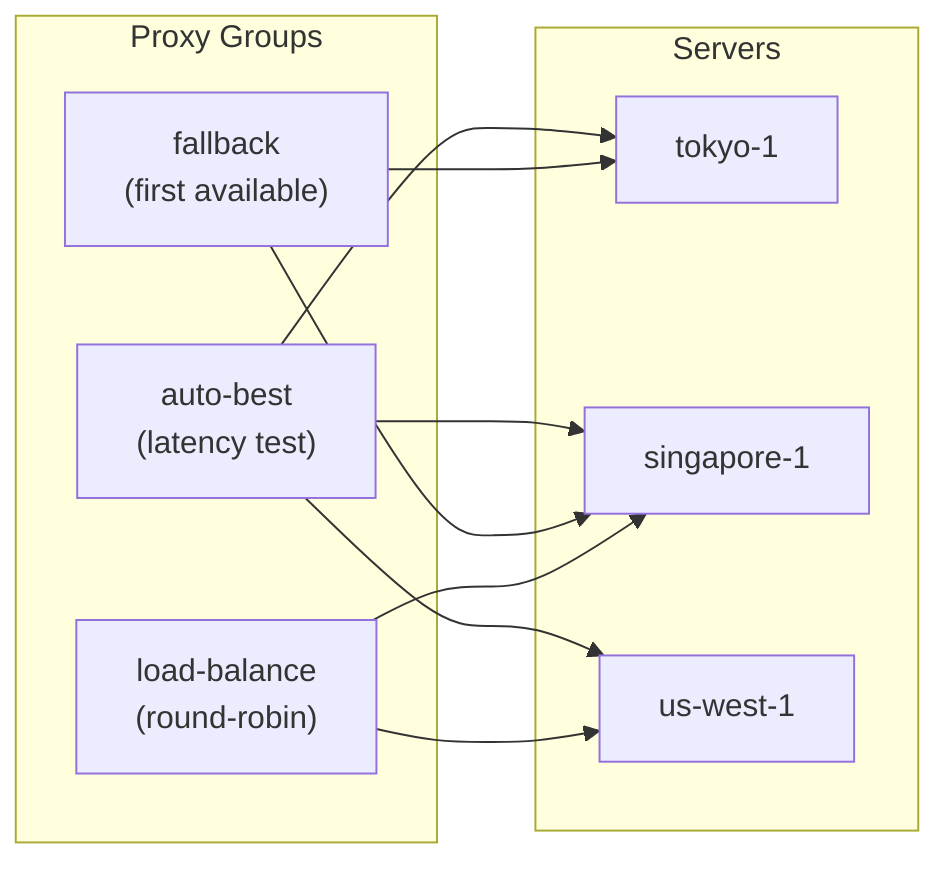

# Configuring the Client

In this chapter you will configure the Prisma client to connect to your server.

## Client config flow



## Option 1: prisma-gui

1. Open prisma-gui, click **New Profile**
2. Fill in: Server Address, Client ID, Auth Secret, Transport (QUIC), Cipher Suite
3. Enable **Skip Certificate Verify** for self-signed certs
4. Save and Connect

## Option 2: CLI configuration

```toml title="client.toml"
socks5_listen_addr = "127.0.0.1:1080"
http_listen_addr = "127.0.0.1:8080"
server_addr = "YOUR-SERVER-IP:8443"
cipher_suite = "chacha20-poly1305"
transport = "quic"
skip_cert_verify = true

[identity]
client_id = "YOUR-CLIENT-ID"
auth_secret = "YOUR-AUTH-SECRET"

[logging]
level = "info"
format = "pretty"
```

## Transport selection guide



| Situation | Transport | Config |
|-----------|-----------|--------|
| Normal network | QUIC | `transport = "quic"` |
| UDP blocked | TCP | `transport = "tcp"` |
| Hide IP (CDN) | WebSocket | `transport = "ws"` |
| Enterprise (CDN) | gRPC | `transport = "grpc"` |
| HTTP/2 stealth | XHTTP | `transport = "xhttp"` |
| Maximum stealth | XPorta | `transport = "xporta"` |
| Never blocked | SSH | `transport = "ssh"` |
| Kernel perf | WireGuard | `transport = "wireguard"` |

## Subscription management

Import servers from subscription URLs (Prisma, Clash YAML):

```toml
[[subscriptions]]
url = "https://example.com/sub/token"
name = "My Provider"
auto_update = true
update_interval_hours = 24
```

## Proxy groups



```toml
[[proxy_groups]]
name = "auto-best"
type = "auto-url"
servers = ["tokyo-1", "singapore-1"]
test_url = "https://www.google.com/generate_204"
test_interval_secs = 300
```

## Port forwarding

```toml
[[port_forwards]]
name = "web-app"
local_addr = "127.0.0.1:3000"
remote_port = 3000
```

## DNS and TUN mode

```toml
[dns]
mode = "tunnel"    # DNS goes through the proxy tunnel

[tun]
enabled = true     # Capture all system traffic
```

## Browser/system proxy setup

**Firefox:** Settings > Network > SOCKS5 Host `127.0.0.1:1080`

**Chrome:** Use SwitchyOmega extension with SOCKS5 `127.0.0.1:1080`

**System-wide:** Set SOCKS proxy to `127.0.0.1:1080` in OS network settings

## Next step

Everything configured! Head to [Your First Connection](./first-connection.md).
