# Configuring the Server

In this chapter you will create the server configuration file. Every setting is explained line by line.

## Server config overview

```mermaid
graph TD
    ROOT["server.toml"] --> LISTEN["listen_addr / quic_listen_addr\n(network binding)"]
    ROOT --> TLS["[tls]\ncert_path, key_path"]
    ROOT --> AUTH["[[authorized_clients]]\nid, auth_secret, name, ACLs"]
    ROOT --> LOG["[logging]\nlevel, format"]
    ROOT --> PERF["[performance]\nmax_connections, timeout"]
    ROOT --> PAD["[padding]\nmin, max"]
    ROOT --> MGMT["[management_api]\nlisten_addr, auth_token"]
    ROOT --> PF["[port_forwarding]\nenabled, allowed_ports"]
    ROOT --> CAM["[camouflage]\nserve_dir, fallback_domain"]
    ROOT --> SSHT["[ssh_transport]\nlisten_addr, host_key_path"]
    ROOT --> WG["[wireguard_transport]\nlisten_addr, private_key"]
    ROOT --> WATCH["config_watch\n(hot reload)"]
    ROOT --> TICKET["ticket_rotation_hours\n(forward secrecy)"]
```



## Step 1: Generate credentials

```bash
prisma gen-key
```

Output:
```
Client ID:   a1b2c3d4-e5f6-7890-abcd-ef1234567890
Auth Secret: 4f8a2b1c9d3e7f6a0b5c8d2e1f4a7b3c9d0e6f2a8b4c1d7e3f9a5b0c6d2e8f
```

:::warning Save these values!
Copy both. You need them for server and client config. The auth_secret is 64 hex characters -- use copy-paste.
:::

## Step 2: Generate TLS certificate

```bash
sudo mkdir -p /etc/prisma
prisma gen-cert --output /etc/prisma --cn prisma-server
```

## Step 3: Write the server config

```bash
sudo nano /etc/prisma/server.toml
```

```toml title="server.toml"
# Prisma Server Configuration
listen_addr = "0.0.0.0:8443"
quic_listen_addr = "0.0.0.0:8443"

[tls]
cert_path = "/etc/prisma/prisma-cert.pem"
key_path = "/etc/prisma/prisma-key.pem"

[[authorized_clients]]
id = "PASTE-YOUR-CLIENT-ID-HERE"
auth_secret = "PASTE-YOUR-AUTH-SECRET-HERE"
name = "my-first-client"

[logging]
level = "info"
format = "pretty"

[performance]
max_connections = 1024
connection_timeout_secs = 300

[padding]
min = 0
max = 256
```

Replace `PASTE-YOUR-CLIENT-ID-HERE` and `PASTE-YOUR-AUTH-SECRET-HERE` with the values from Step 1.

## Step 4: Validate

```bash
prisma validate -c /etc/prisma/server.toml
```

## Step 5: Test run

```bash
prisma server -c /etc/prisma/server.toml
```

You should see `Server ready!`. Press Ctrl+C to stop.

## Advanced server options

### SSH transport

```toml
[ssh_transport]
enabled = true
listen_addr = "0.0.0.0:22222"
host_key_path = "/etc/prisma/ssh_host_key"
fake_shell = true
```

### WireGuard transport

```toml
[wireguard_transport]
enabled = true
listen_addr = "0.0.0.0:51820"
private_key = "YOUR-WG-PRIVATE-KEY"
```

### Per-client ACLs

```toml
[[authorized_clients]]
id = "client-uuid"
auth_secret = "client-secret"
name = "restricted-user"

[[authorized_clients.acl]]
type = "domain-suffix"
value = "example.com"
policy = "allow"

[[authorized_clients.acl]]
type = "all"
policy = "deny"
```

### Port forwarding

```toml
[port_forwarding]
enabled = true
allowed_ports = [3000, 8080, 8443]
max_forwards_per_client = 5
```

### Camouflage mode

```toml
[camouflage]
serve_dir = "/var/www/html"
fallback_domain = "www.nginx.com"
```

### Config hot reload

```toml
config_watch = true
```

### Management API

```toml
[management_api]
enabled = true
listen_addr = "127.0.0.1:9090"
auth_token = "your-secure-random-token"
```

## TLS with Let's Encrypt

```bash
sudo apt install certbot -y
sudo certbot certonly --standalone -d proxy.yourdomain.com
```

```toml
[tls]
cert_path = "/etc/letsencrypt/live/proxy.yourdomain.com/fullchain.pem"
key_path = "/etc/letsencrypt/live/proxy.yourdomain.com/privkey.pem"
```

## Next step

The server is configured! Head to [Installing the Client](./install-client.md).
