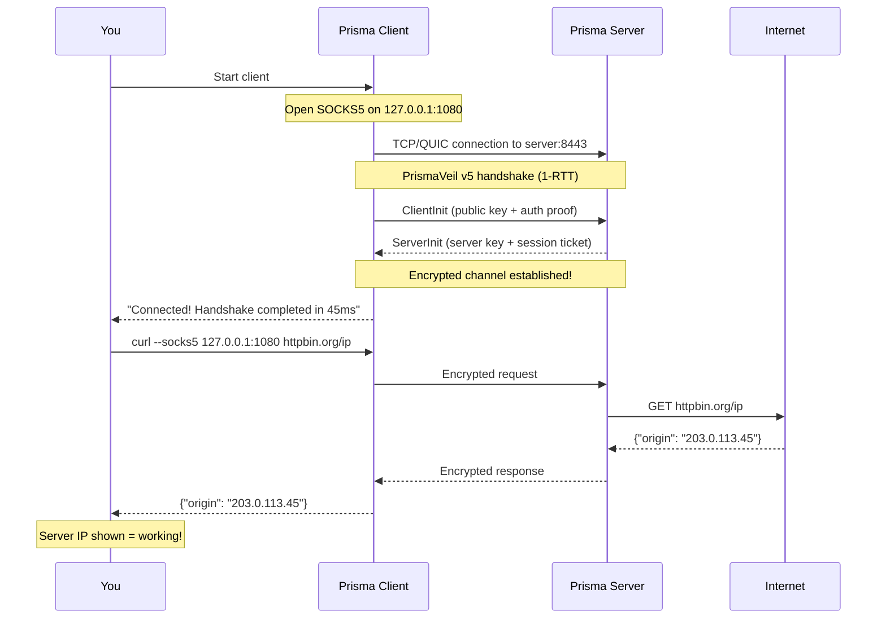
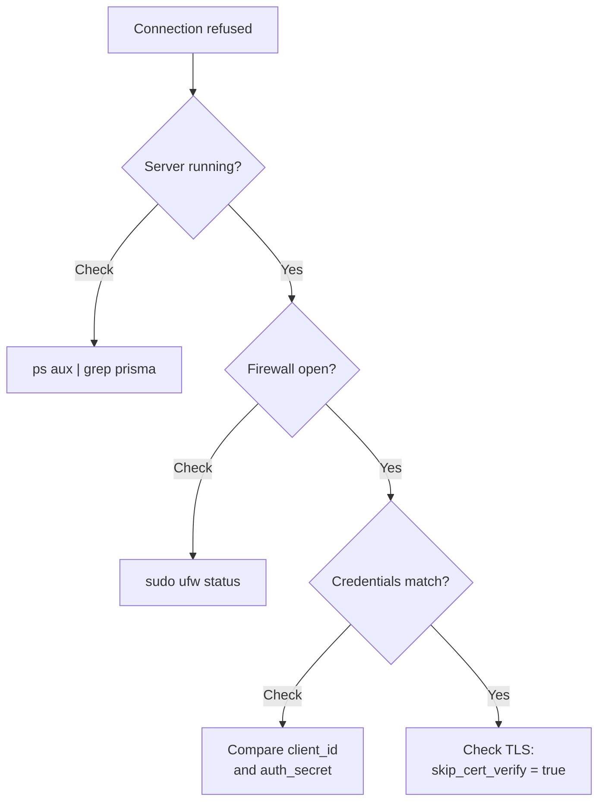

# Your First Connection

This is the moment everything comes together.

## Pre-flight checklist

- [ ] Server: Prisma installed and `server.toml` configured
- [ ] Server: Firewall port 8443 open (TCP + UDP)
- [ ] Client: Prisma installed and configured
- [ ] Client: Credentials match server config exactly

## What happens when you connect



## Step 1: Start the server

```bash
prisma server -c /etc/prisma/server.toml
```

Look for: `Server ready!`

## Step 2: Start the client

**CLI:**
```bash
prisma client -c ~/client.toml
```

Look for: `Connected! Handshake completed`

**GUI:** Select profile, click Connect, wait for green status.

## Step 3: Verify

```bash
curl --socks5 127.0.0.1:1080 https://httpbin.org/ip
```

The IP should be your **server's IP**. Visit https://www.dnsleaktest.com for a DNS leak test.

## Troubleshooting



| Problem | Solution |
|---------|---------|
| Connection refused | Check server is running, firewall ports open |
| Authentication failed | Credentials must match exactly |
| TLS handshake failed | Set `skip_cert_verify = true` for self-signed certs |
| Address already in use | Change port or stop conflicting program |
| Very slow | Try different transport (QUIC vs TCP) |

## Success!


## Next step

Your setup works! Head to [Going Further](./advanced-setup.md) for system services, routing, CDN, and performance tuning.
