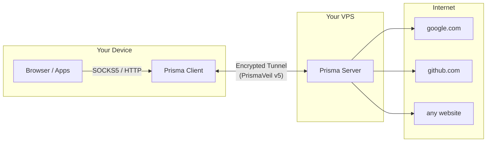
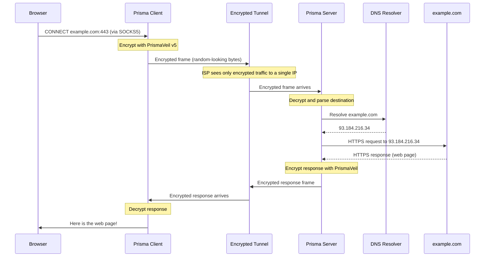
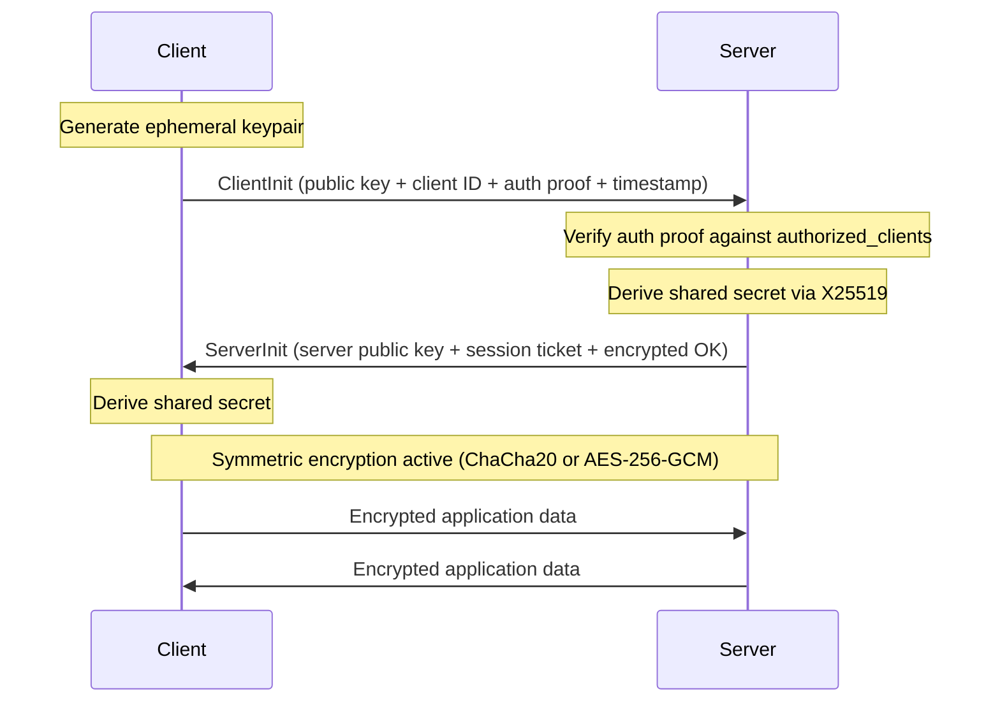
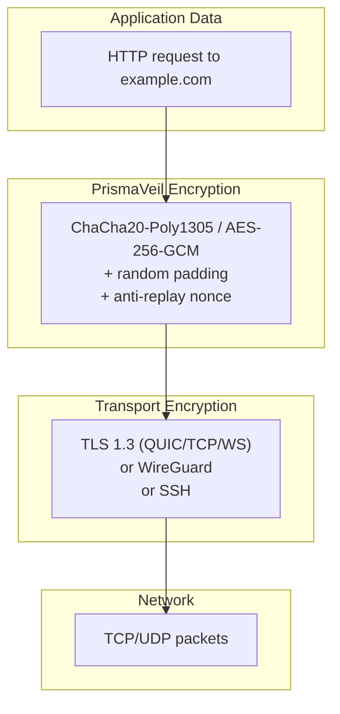
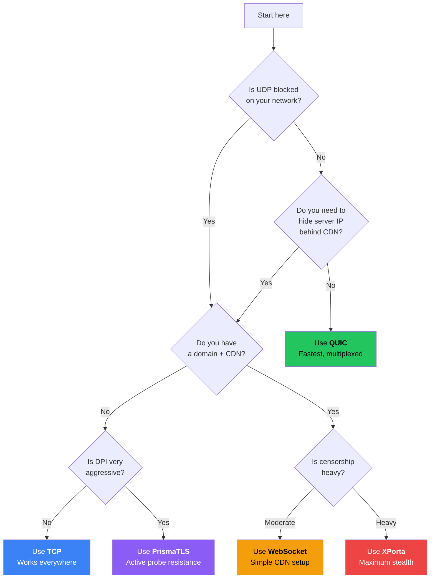
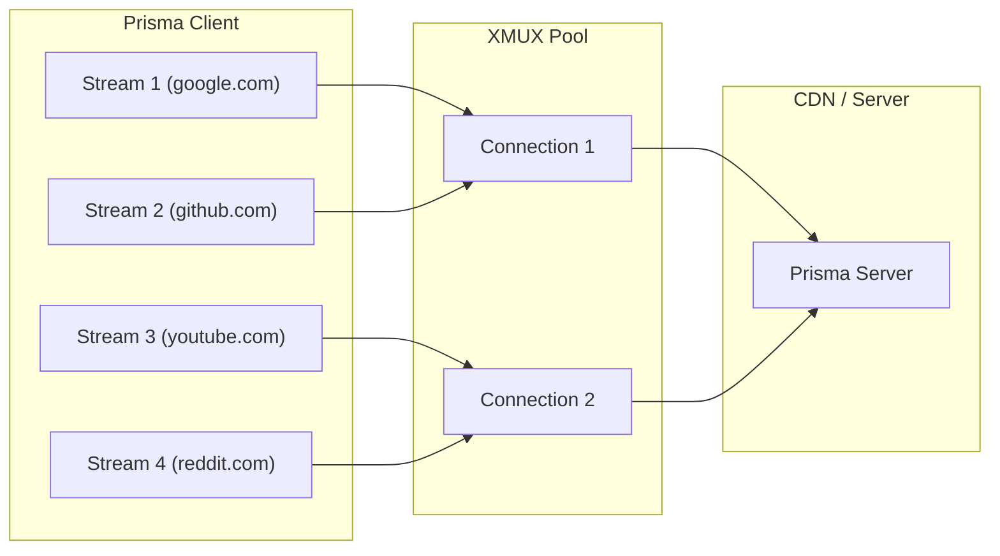
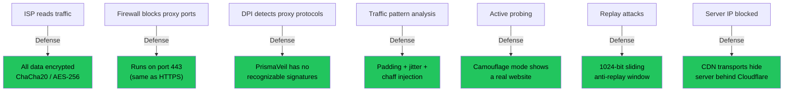

# How Prisma Works

Now that you understand the fundamentals, let's dive into Prisma's architecture. This chapter explains what happens behind the scenes when you browse through Prisma, how the PrismaVeil v5 protocol keeps your data safe, and how to choose among the eight available transports.

## The big picture: Client and Server

Prisma has two main components:

1. **Prisma Client** -- runs on your device (computer, phone, tablet). It accepts your internet traffic and encrypts it.
2. **Prisma Server** -- runs on a remote VPS you control. It decrypts the traffic and forwards it to the destination.

> **Analogy:** Imagine you are in a building where a security guard inspects every package. Prisma builds a **secret underground tunnel** from your desk to a trusted friend's office outside the building. You pass your packages through the tunnel, your friend sends them onward normally, and the guard never sees a thing.

## Complete connection flow

Here is exactly what happens when you open `https://example.com` in your browser while using Prisma:

**What your ISP sees:**

| Without Prisma | With Prisma |
|---------------|------------|
| DNS query for `example.com` | None (DNS goes through tunnel) |
| TLS connection to `93.184.216.34` | Encrypted data to your VPS IP |
| SNI header showing `example.com` | No SNI visible |
| ~2.3 MB transferred from example.com | ~2.3 MB of opaque data |

## The PrismaVeil v5 protocol

PrismaVeil is Prisma's custom encryption protocol, currently at version 5. It is designed to be simultaneously **secure**, **fast**, and **undetectable**.

### Handshake process

The handshake establishes a shared encryption key between client and server in a single round trip (1-RTT):

On subsequent connections, Prisma can use **0-RTT resumption** with the session ticket, skipping the handshake entirely and sending data immediately.

### Encryption layers

Prisma applies encryption at multiple layers:

This means your data is encrypted **twice** -- once by PrismaVeil and once by the transport layer. Even if one layer were somehow compromised, the other still protects you.

### Anti-replay protection

Every encrypted frame carries a unique nonce. The server maintains a **1024-bit sliding window** bitmap that tracks which nonces have been seen. If an attacker records your traffic and replays it, the server detects the duplicate nonce and drops the frame.

### Anti-detection features

| Technique | What it does | Why it matters |
|-----------|-------------|---------------|
| **Random padding** | Adds 0--256 random bytes per frame | Packet sizes become unpredictable |
| **Timing jitter** | Adds tiny random delays between frames | Prevents timing-based traffic correlation |
| **Chaff injection** | Sends fake decoy packets | Confuses volumetric traffic analysis |
| **Entropy camouflage** | Shapes byte distribution to match normal TLS | Defeats entropy-based DPI classifiers |
| **Camouflage mode** | Server shows a real website to non-Prisma visitors | Active probers see a legitimate website |
| **PrismaTLS** | Custom TLS fingerprint randomization | Prevents JA3/JA4 fingerprinting |

## Transport types

A **transport** is how encrypted data travels between client and server. Prisma supports eight transports, each with different trade-offs:

### Transport comparison table

| Transport | Protocol | CDN-compatible | Stealth level | Speed | Best for |
|-----------|----------|---------------|---------------|-------|----------|
| **QUIC** | UDP | No | Medium | Fastest | Default choice |
| **TCP** | TCP | No | Medium | Fast | When UDP is blocked |
| **WebSocket** | TCP (HTTP upgrade) | Yes | Medium-High | Good | Simple CDN setups |
| **gRPC** | TCP (HTTP/2) | Yes | High | Good | Enterprise networks |
| **XHTTP** | TCP (HTTP/2 POST) | Yes | High | Good | No upgrade headers |
| **XPorta** | TCP (REST API) | Yes | Highest | Moderate | Maximum stealth |
| **SSH** | TCP | No | Medium | Good | Almost never blocked |
| **WireGuard** | UDP | No | Low | Fastest | Kernel-level performance |

### Transport decision tree

Use this flowchart to pick the right transport for your situation:

:::tip Start simple
Begin with **QUIC**. If it does not work, try **TCP**. If you need CDN protection, use **WebSocket**. Only upgrade to **XPorta** or **PrismaTLS** when other transports are being actively blocked.
:::

## XMUX multiplexing

For CDN-based transports (WebSocket, gRPC, XHTTP, XPorta), establishing a new TLS connection for every request is expensive. **XMUX** multiplexes many proxy streams over a small pool of transport connections:

This dramatically reduces handshake overhead and connection count, which also makes your traffic look more like a normal browser (which reuses connections).

## Why Prisma is hard to detect

## Prisma vs. other tools

| Feature | Traditional VPN | Simple Proxy | Prisma |
|---------|---------------|-------------|--------|
| Encryption | Yes | Sometimes | Always (double layer) |
| Hard to detect | No (easily identified) | Somewhat | Yes (multi-layer anti-detection) |
| Multiple transports | 1--2 | 1--2 | 8 with auto-fallback |
| CDN support | Rare | Some | Full (WS, gRPC, XHTTP, XPorta) |
| Traffic shaping | No | No | Padding, jitter, chaff |
| Active probe resistance | No | Some | Camouflage + PrismaTLS |
| System-wide (TUN) | Yes | Rare | Yes |
| Post-quantum ready | Rare | No | Hybrid key exchange |
| Performance | Moderate | Fast | Fast (Rust, io_uring, zero-copy) |

## Next step

Now that you understand how Prisma works, let's get ready to set it up. Head to [Preparation](./prepare.md) to learn what you need and how to prepare your server.
