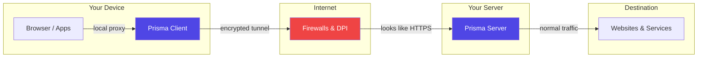

# Beginner's Guide

Welcome to the Prisma Beginner's Guide -- a comprehensive, step-by-step walkthrough that takes you from zero to a fully working encrypted proxy setup. No prior experience with networking, servers, or the command line is required.

## What you will learn

By the end of this guide you will understand how internet privacy works, how Prisma protects your traffic, and how to deploy and operate your own Prisma infrastructure.

```mermaid
flowchart LR
    A["<b>Basics</b>\nInternet fundamentals\n~15 min"] --> B["<b>How Prisma Works</b>\nArchitecture & protocol\n~20 min"]
    B --> C["<b>Preparation</b>\nGet a server ready\n~15 min"]
    C --> D["<b>Install Server</b>\nBinary, Docker, source\n~10 min"]
    D --> E["<b>Configure Server</b>\nTOML, certs, auth\n~20 min"]
    E --> F["<b>Install Client</b>\nGUI, CLI, mobile\n~10 min"]
    F --> G["<b>Configure Client</b>\nTransport, proxy groups\n~20 min"]
    G --> H["<b>First Connection</b>\nConnect & verify\n~10 min"]
    H --> I["<b>Advanced Setup</b>\nCDN, routing, perf\n~25 min"]

    style A fill:#4f46e5,color:#fff
    style B fill:#4f46e5,color:#fff
    style C fill:#4f46e5,color:#fff
    style D fill:#4f46e5,color:#fff
    style E fill:#4f46e5,color:#fff
    style F fill:#4f46e5,color:#fff
    style G fill:#4f46e5,color:#fff
    style H fill:#22c55e,color:#000
    style I fill:#f59e0b,color:#000
```

## Chapter overview

| # | Chapter | What you will learn | Time |
|---|---------|-------------------|------|
| 1 | [Understanding the Basics](./basics.md) | How the internet works, what proxies and encryption are | ~15 min |
| 2 | [How Prisma Works](./how-prisma-works.md) | Client/server architecture, PrismaVeil v5 protocol, 8 transports, anti-detection | ~20 min |
| 3 | [Preparation](./prepare.md) | Getting a VPS, SSH access, domain & TLS considerations, firewall planning | ~15 min |
| 4 | [Installing the Server](./install-server.md) | One-line script, Docker, direct download, build from source, daemon mode | ~10 min |
| 5 | [Configuring the Server](./configure-server.md) | TOML crash course, credentials, TLS, authorized clients, advanced options | ~20 min |
| 6 | [Installing the Client](./install-client.md) | Desktop GUI (Tauri), CLI, Android app (Kotlin/JNI), iOS app (Swift/xcframework) | ~10 min |
| 7 | [Configuring the Client](./configure-client.md) | Transport selection, subscriptions, proxy groups, port forwarding, DNS, TUN mode | ~20 min |
| 8 | [Your First Connection](./first-connection.md) | Starting both ends, verifying with curl, DNS leak test, troubleshooting | ~10 min |
| 9 | [Going Further](./advanced-setup.md) | CDN deployment, XMUX pooling, io_uring tuning, rule providers, monitoring | ~25 min |

**Total estimated time: ~2.5 hours** (you can split it across multiple sessions).

## Prerequisites

You only need two things to get started:

1. **A computer or phone** -- Windows, macOS, Linux, Android, or iOS
2. **An internet connection**

That is it. Everything else -- servers, certificates, credentials -- is explained as we go.

:::tip No experience needed
This guide assumes **zero** prior knowledge about networking, servers, or the command line. Every concept is explained from the ground up with analogies and diagrams. If something is unclear, it is our fault, not yours.
:::

## How to use this guide

- **Read in order** -- each chapter builds on the previous one
- **Do not skip the basics** -- even if you are tempted, the [basics chapter](./basics.md) will help you understand everything that follows
- **Try things out** -- the best way to learn is by doing; follow along with the examples
- **Do not worry about mistakes** -- nothing in this guide can break your computer; if something goes wrong, you can always start over

## Prisma at a glance

Prisma (v2.32.0) is a next-generation encrypted proxy built in Rust. It creates an encrypted tunnel between your device and a server you control, making your internet traffic private and resistant to detection.

Key capabilities:

- **8 transport types** -- QUIC, TCP, WebSocket, gRPC, XHTTP, XPorta, SSH, WireGuard
- **PrismaVeil v5 protocol** -- 1-RTT handshake, 0-RTT resumption, ChaCha20-Poly1305 / AES-256-GCM, 1024-bit anti-replay
- **Anti-detection** -- padding, timing jitter, chaff injection, entropy camouflage, active probe resistance
- **Cross-platform** -- Windows, macOS, Linux, Android, iOS, FreeBSD
- **Post-quantum ready** -- hybrid key exchange for forward security

Ready? Let's begin with [Understanding the Basics](./basics.md).
