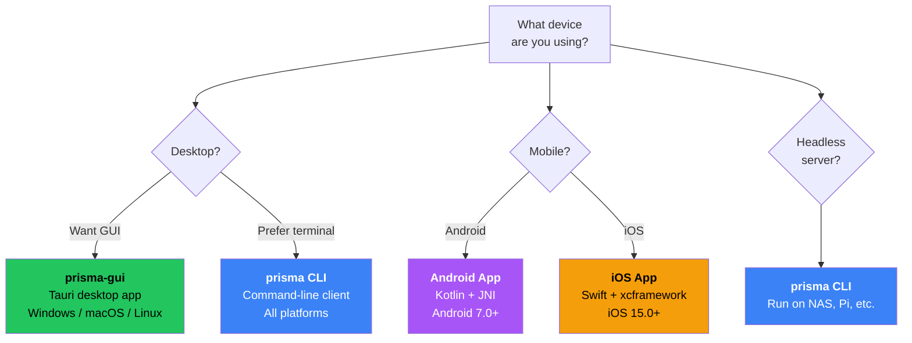

# Installing the Client

In this chapter you will install the Prisma client on your local device.

## Choose your client



| Client | Best for | Platforms |
|--------|----------|-----------|
| **prisma-gui** | Most users -- visual interface | Windows, macOS, Linux |
| **prisma CLI** | Power users, servers, automation | Windows, macOS, Linux, FreeBSD |
| **Android App** | Android phones and tablets | Android 7.0+ |
| **iOS App** | iPhones and iPads | iOS 15.0+ |

## Option 1: prisma-gui (Desktop App)

### Desktop GUI

Download the latest release from [prisma-gui releases](https://github.com/prisma-proxy/prisma-gui/releases):

| Platform | Installer | Portable |
|----------|-----------|----------|
| Windows x64 | `.exe` setup or `.msi` | Standalone `.exe` |
| macOS Universal | `.dmg` (Intel + Apple Silicon) | — |
| Linux x64 | `.AppImage`, `.deb`, `.rpm` | Standalone binary |

> **TUN mode note**: On Windows, the GUI bundles `wintun.dll` automatically. On macOS/Linux, run with elevated privileges for TUN support.

## Option 2: prisma CLI

**Linux / macOS:**
```bash
curl -fsSL https://raw.githubusercontent.com/prisma-proxy/prisma/master/scripts/install.sh | bash
```

**Windows (PowerShell):**
```powershell
irm https://raw.githubusercontent.com/prisma-proxy/prisma/master/scripts/install.ps1 | iex
```

## Option 3: Android App

Download `prisma-android.apk` from [GitHub Releases](https://github.com/prisma-proxy/prisma/releases/latest). Features: all 8 transports, per-app proxy, TUN mode, subscription import, QR code.

## Option 4: iOS App

Download from [GitHub Releases](https://github.com/prisma-proxy/prisma/releases/latest) or TestFlight. Features: TUN mode via Network Extension, all transports, subscription management.

## Verify

```bash
prisma --version
# Expected: prisma 2.1.4
```

## Next step

The client is installed! Head to [Configuring the Client](./configure-client.md).
