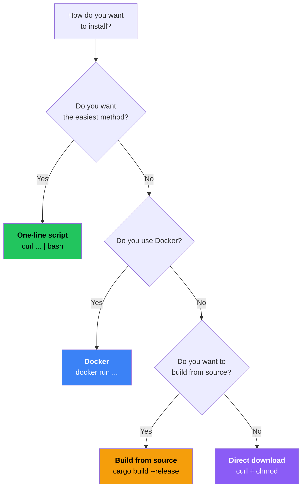

# Installing the Server

In this chapter you will install Prisma on your remote server (VPS). We cover the easiest method first, then show alternatives.

## Choosing an installation method



## Method 1: One-line install script (Recommended)

```bash
curl -fsSL https://raw.githubusercontent.com/prisma-proxy/prisma/master/scripts/install.sh | bash
```

### Install + setup (even easier)

```bash
curl -fsSL https://raw.githubusercontent.com/prisma-proxy/prisma/master/scripts/install.sh | bash -s -- --setup
```

This creates: `server.toml`, `client.toml`, `.prisma-credentials`, `prisma-cert.pem`, `prisma-key.pem`.

:::tip Recommended for beginners
Using `--setup` generates everything; you only need to make a few edits.
:::

## Method 2: Docker

```bash
docker run -d \
  --name prisma-server \
  --restart unless-stopped \
  -v /etc/prisma:/config \
  -p 8443:8443/tcp \
  -p 8443:8443/udp \
  ghcr.io/yamimega/prisma server -c /config/server.toml
```

## Method 3: Download binary directly

```bash
# x86_64
curl -fsSL https://github.com/prisma-proxy/prisma/releases/latest/download/prisma-linux-amd64 \
  -o /usr/local/bin/prisma && chmod +x /usr/local/bin/prisma

# ARM64
curl -fsSL https://github.com/prisma-proxy/prisma/releases/latest/download/prisma-linux-arm64 \
  -o /usr/local/bin/prisma && chmod +x /usr/local/bin/prisma
```

## Method 4: Build from source

```bash
curl --proto '=https' --tlsv1.2 -sSf https://sh.rustup.rs | sh
source ~/.cargo/env
git clone https://github.com/prisma-proxy/prisma.git && cd prisma
cargo build --release
sudo cp target/release/prisma /usr/local/bin/
```

## Verify installation

```bash
prisma --version
# Expected: prisma 2.1.4
```

## Daemon mode

```bash
prisma server -c /etc/prisma/server.toml --daemon
prisma server --stop
```

## Systemd service file

```bash
sudo nano /etc/systemd/system/prisma-server.service
```

```ini title="prisma-server.service"
[Unit]
Description=Prisma Proxy Server
After=network-online.target
Wants=network-online.target

[Service]
ExecStart=/usr/local/bin/prisma server -c /etc/prisma/server.toml
Restart=on-failure
RestartSec=5
User=root
LimitNOFILE=65536

[Install]
WantedBy=multi-user.target
```

```bash
sudo systemctl daemon-reload
sudo systemctl enable --now prisma-server
```

## Opening firewall ports

```bash
sudo ufw allow 8443/tcp
sudo ufw allow 8443/udp
sudo ufw status
```

:::warning Cloud provider firewalls
Open ports in **both** the server's local firewall **and** the cloud provider's firewall.
:::

## Troubleshooting

| Problem | Solution |
|---------|---------|
| `command not found` | Full path: `/usr/local/bin/prisma --version` |
| `Permission denied` | `sudo chmod +x /usr/local/bin/prisma` |
| `cannot execute binary file` | Wrong architecture. Check `uname -m` |

## Next step

Prisma is installed! Head to [Configuring the Server](./configure-server.md).
