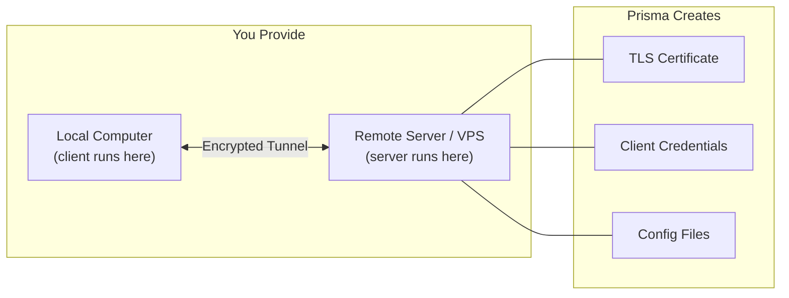
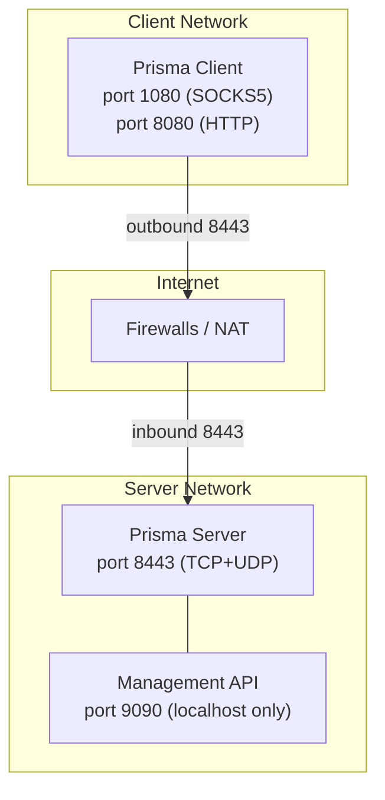

# Preparation

Before installing Prisma, let's make sure you have everything you need. This chapter covers server requirements, deployment architecture options, domain and TLS considerations, and terminal basics.

## Deployment architecture options

Prisma supports several deployment topologies. Choose the one that fits your threat model:

```mermaid
graph TD
    subgraph "Option A: Direct Connection"
        A1["Client"] -->|"QUIC/TCP"| A2["Prisma Server\n(your VPS)"]
        A2 --> A3["Internet"]
    end

    subgraph "Option B: CDN Relay"
        B1["Client"] -->|"WebSocket/XHTTP"| B2["Cloudflare CDN"]
        B2 -->|"HTTPS"| B3["Prisma Server"]
        B3 --> B4["Internet"]
    end

    subgraph "Option C: Multi-Hop Relay"
        C1["Client"] -->|"QUIC"| C2["Entry Server"]
        C2 -->|"TCP"| C3["Exit Server"]
        C3 --> C4["Internet"]
    end

    style A2 fill:#3b82f6,color:#fff
    style B2 fill:#f59e0b,color:#000
    style B3 fill:#3b82f6,color:#fff
    style C2 fill:#3b82f6,color:#fff
    style C3 fill:#3b82f6,color:#fff
```



| Architecture | Stealth | Speed | Complexity | When to use |
|-------------|---------|-------|-----------|------------|
| **Direct** | Medium | Fastest | Simplest | Low-censorship environments |
| **CDN relay** | High | Good | Moderate | Server IP must be hidden |
| **Multi-hop** | Highest | Slower | Complex | Maximum anonymity needed |

For most users, **direct connection** is the best starting point. You can always add CDN later.

## What you need



### 1. A local computer (client side)

This is the device you use every day. Prisma supports:

| Platform | Client options |
|----------|---------------|
| Windows 10/11 | prisma-gui (Tauri), CLI |
| macOS | prisma-gui (Tauri), CLI |
| Linux | prisma-gui (Tauri), CLI, .deb, .AppImage |
| Android 7.0+ | Native app (Kotlin + JNI) |
| iOS 15.0+ | Native app (Swift + xcframework) |
| FreeBSD | CLI only |

### 2. A remote server (VPS)

A VPS (Virtual Private Server) is a rented computer in a data center. Prisma's requirements are minimal:

| Resource | Minimum | Recommended |
|----------|---------|-------------|
| CPU | 1 core | 2 cores |
| RAM | 256 MB | 512 MB |
| Storage | 100 MB | 1 GB |
| Bandwidth | 500 GB/month | 1 TB/month |
| OS | Any modern Linux | Ubuntu 24.04 LTS |

:::tip Prisma is lightweight
Prisma is written in Rust and extremely efficient. A $3--5/month VPS with 512 MB RAM can comfortably handle dozens of concurrent connections.
:::

## Network topology and firewall planning

Before installing, plan your network configuration:



**Ports to open on the server:**

| Port | Protocol | Purpose | Required? |
|------|----------|---------|-----------|
| 8443 | TCP | TCP, WebSocket, gRPC, XHTTP, XPorta transports | Yes |
| 8443 | UDP | QUIC transport | Yes (if using QUIC) |
| 22 | TCP | SSH access to your server | Yes |
| 80 | TCP | Let's Encrypt HTTP challenge | Only for Let's Encrypt |
| 443 | TCP | Alternative listen port (looks like HTTPS) | Optional |

## Connecting to your server via SSH

SSH (Secure Shell) lets you control your server remotely through a secure encrypted terminal session.

Open your terminal and run:

```bash
ssh root@YOUR-SERVER-IP
```

The first time you connect, type `yes` to accept the server fingerprint, then enter your password. You should see:

```
root@my-server:~#
```

:::warning Security tip
After initial setup, consider switching to **SSH key authentication** and disabling password login for improved security.
:::

## Terminal basics

| Command | What it does | Example |
|---------|-------------|---------|
| `ls` | List files | `ls /etc/prisma/` |
| `cd` | Change directory | `cd /etc/prisma` |
| `cat` | Display file contents | `cat server.toml` |
| `nano` | Edit a file (Ctrl+O save, Ctrl+X exit) | `nano server.toml` |
| `mkdir -p` | Create a directory | `mkdir -p /etc/prisma` |
| `sudo` | Run as administrator | `sudo nano /etc/prisma/server.toml` |
| `systemctl` | Manage system services | `sudo systemctl status prisma-server` |
| `ufw` | Manage firewall rules | `sudo ufw allow 8443/tcp` |

### Understanding file paths

```
/etc/prisma/server.toml
│   │       │
│   │       └── file name
│   └────────── "prisma" folder
└────────────── "etc" folder (system config)
```

## Update your server

```bash
sudo apt update && sudo apt upgrade -y
```

## Next step

Your server is ready! Let's install Prisma on it. Head to [Installing the Server](./install-server.md).
