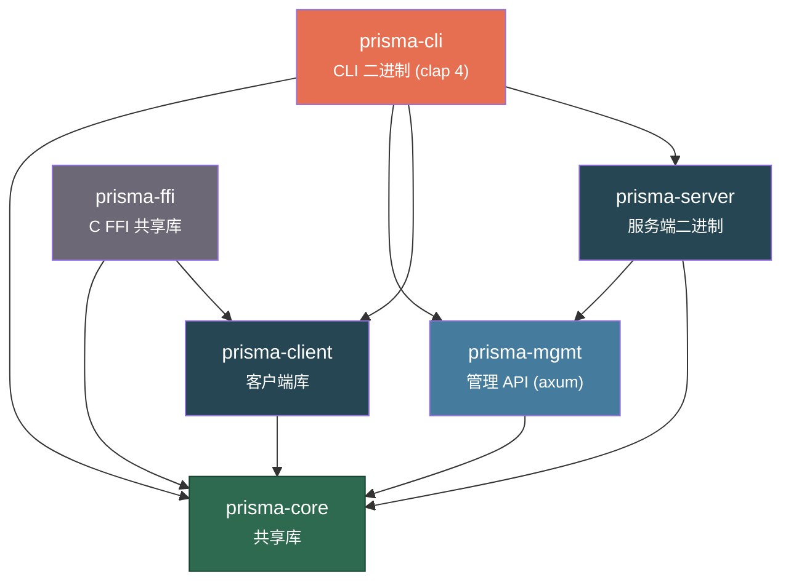
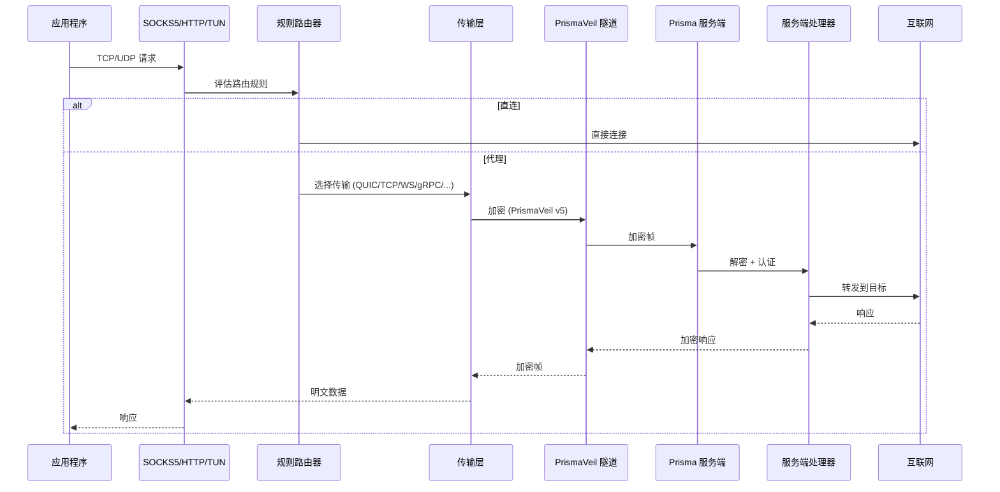

# 开发者文档

Prisma 代理系统的全面内部参考文档 -- 架构、模块 API、线路协议、配置字段、CLI 命令、管理端点、FFI 函数及扩展指南。

**工作区版本：** v1.3.0 | **协议：** PrismaVeil v5 | **Rust 版本：** 2021

---

## 工作区架构

Prisma 工作区由六个 crate 组成，具有明确的依赖边界：



| Crate | 角色 |
|-------|------|
| **prisma-core** | 共享库：加密、协议 (PrismaVeil v5)、配置、类型、带宽、DNS、路由、多路复用、ACL、代理组、订阅、导入 |
| **prisma-server** | 服务端二进制：监听器 (TCP/QUIC/WS/gRPC/XHTTP/XPorta/SSH/WireGuard/CDN)、中继、认证、伪装、热重载 |
| **prisma-client** | 客户端库：SOCKS5/HTTP 入站、传输选择、TUN、连接池、DNS 解析/服务器、PAC、端口转发 |
| **prisma-cli** | CLI 二进制 (clap 4)：服务端/客户端运行器、管理命令、守护进程模式、Web 控制台、诊断 |
| **prisma-mgmt** | 管理 API (axum)：REST + WebSocket 端点、认证中间件、Prometheus 导出 |
| **prisma-ffi** | C FFI 共享库：生命周期管理、配置文件、QR 码、系统代理、自动更新、分应用代理、代理组 |

---

## 数据流

从应用程序通过客户端到服务端再到互联网的端到端数据流：



---

## 构建说明

```bash
# 构建所有 crate
cargo build --workspace

# Release 模式构建
cargo build --workspace --release

# 运行所有测试
cargo test --workspace

# 使用 clippy 检查
cargo clippy --workspace --all-targets

# 格式检查
cargo fmt --all -- --check

# 运行服务端
cargo run -p prisma-cli -- server -c server.toml

# 运行客户端
cargo run -p prisma-cli -- client -c client.toml

# 生成配置文件
cargo run -p prisma-cli -- init
```

所有工作区依赖在根目录 `Cargo.toml` 的 `[workspace.dependencies]` 下声明。各 crate 使用 `dep.workspace = true` 引用。

---

## 子页面

| 页面 | 内容 |
|------|------|
| [prisma-core](./prisma-core) | 共享库参考：每个公共模块、类型和函数 |
| [prisma-server](./prisma-server) | 服务端二进制参考：监听器、处理管道、中继、重载 |
| [prisma-client](./prisma-client) | 客户端库参考：代理流程、传输、TUN、DNS、连接池 |
| [prisma-mgmt](./prisma-mgmt) | 管理 API 参考：每个 REST 端点、WebSocket、认证 |
| [prisma-ffi](./prisma-ffi) | FFI 参考：每个导出的 C 函数、错误码、移动端生命周期 |
| [prisma-cli](./prisma-cli) | CLI 参考：每个命令、标志、默认值和示例 |
| [protocol](./protocol) | 线路协议参考：PrismaVeil v5 握手、帧格式、命令 |
| [contributing](./contributing) | 贡献指南：添加传输、命令、端点、测试、模糊测试 |
