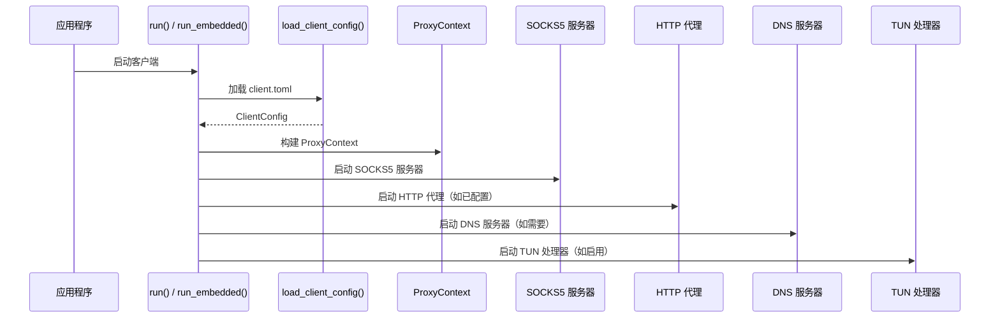
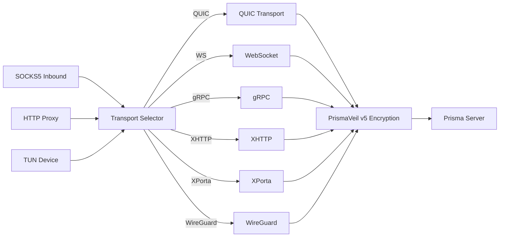

# prisma-client 参考

`prisma-client` 是客户端库 crate。提供 SOCKS5 和 HTTP 代理入站处理器、传输选择、TUN 模式、连接池、DNS 解析、PAC 生成、端口转发和延迟测试。

**路径：** `crates/prisma-client/src/`

---

## 客户端启动和连接流程



---

## 模块列表

| 模块 | 用途 |
|------|------|
| `client` | `PrismaClient` -- 管理所有子系统的顶层客户端结构 |
| `connector` | TCP/TLS 出站连接建立 |
| `socks5` | SOCKS5 入站服务器（连接 + UDP 关联） |
| `http_proxy` | HTTP CONNECT 代理入站服务器 |
| `tun` | TUN 设备模式，用于透明代理 |
| `state` | `ClientState` -- 共享连接状态（活跃数、总数、字节数） |
| `transport_selector` | 自适应传输选择器，带健康监控和自动降级 |
| `dns_resolver` | 客户端 DNS 解析器，支持 Fake IP 池、基于域名的路由决策和智能黑名单 |
| `udp_relay` | SOCKS5 UDP ASSOCIATE 中继，在本地客户端和代理服务器之间转发 |
| `latency` | TCP 连接延迟测试，支持并行服务器测试和最佳服务器选择 |
| `pac` | PAC（代理自动配置）文件生成和 HTTP 服务 |
| `metrics` | 无锁原子流量计数器（上传/下载字节数、连接数、活跃连接数） |

---

## 客户端架构



---

## 传输选择

| 传输 | 描述 |
|------|------|
| `quic` | QUIC v1/v2（默认），支持 ALPN 伪装、拥塞控制 |
| `prisma-tls` | TCP + PrismaTLS（替代 REALITY） |
| `ws` | WebSocket over HTTPS，CDN 兼容 |
| `grpc` | gRPC 双向流，CDN 兼容 |
| `xhttp` | HTTP 原生分块传输，CDN 兼容 |
| `xporta` | REST API 模拟，CDN 兼容 |
| `ssh` | SSH 通道隧道 |
| `wireguard` | WireGuard 兼容 UDP 隧道 |

### 自适应传输选择器 (v2.0.0)

`TransportSelector` 在滑动窗口内（默认 5 分钟）监控每种传输的连接健康状况。当某种传输的失败率超过阈值（默认 50%）时，将其标记为不健康，选择器自动降级到配置顺序中的下一种传输。当监控窗口重置时，健康的传输会自动重新启用。

**默认降级顺序：**

1. QUIC v2 + Salamander（最低延迟）
2. QUIC v2 plain
3. PrismaTLS（最佳主动探测抵抗力）
4. WebSocket over CDN
5. XPorta over CDN（最后手段）

**配置：**

```toml
[client]
transport_fallback = ["quic-v2-salamander", "quic-v2", "prisma-tls", "websocket", "xporta"]
```

**健康快照 API** -- `health_snapshot()` 方法返回 `(transport, healthy, failure_rate)` 元组，用于仪表盘显示。

---

## TUN 模式

通过虚拟网络接口提供透明代理：

| 模块 | 描述 |
|------|------|
| `tun::device` | 创建和配置 TUN 设备 |
| `tun::handler` | 从 TUN 读取 IP 数据包，提取 TCP/UDP 流，通过隧道代理 |
| `tun::process` | 分应用过滤：`AppFilter`、`AppFilterConfig` |

**分应用过滤配置：**

```json
{"mode": "include", "apps": ["Firefox", "Chrome"]}
```

- `include` -- 仅列出的应用通过代理
- `exclude` -- 除列出的应用外都通过代理

---

## 客户端 DNS 解析器 (v2.0.0)

`ClientDnsResolver` 在核心 `DnsResolver` 之上封装了客户端特定的功能：

| 模式 | 行为 |
|------|------|
| `System` | 使用系统 DNS 解析器；仅对匹配黑名单的域名进行隧道 DNS |
| `Doh` | DNS-over-HTTPS -- 所有查询通过代理隧道 |
| `Doq` | DNS-over-QUIC -- 所有查询通过代理隧道 |
| `FakeIp` | 从地址池分配假 IP（`198.18.0.0/15`）；真正的解析在服务端进行 |

**Fake IP 功能：**

- `assign_fake_ip(domain)` -- 为域名分配假 IP（幂等操作）
- `lookup_fake_ip(ip)` -- 反向查找假 IP 对应的真实域名
- `is_fake_ip(ip)` -- 检查 IP 是否属于假 IP 池

**智能 DNS 黑名单** -- 在 `System` 模式下，常见被审查的域名（Google、YouTube、Facebook、Twitter、Telegram、GitHub 等）自动通过隧道解析。生产环境中，黑名单从 GeoSite 数据库加载。

---

## UDP 中继 (v2.0.0)

`UdpRelay` 模块处理 SOCKS5 UDP ASSOCIATE 会话。当 SOCKS5 客户端请求 UDP 关联时，会生成一个中继任务：

1. 为客户端绑定一个本地 UDP socket
2. 在发送路径上剥离 SOCKS5 UDP 请求头
3. 将原始 UDP 载荷转发给代理服务器
4. 在接收路径上添加 SOCKS5 UDP 响应头

每个中继作为独立的 tokio 任务运行，drop 时自动停止。

---

## PAC 支持 (v2.0.0)

`pac` 模块生成和提供代理自动配置文件：

- **`generate_pac(rules, proxy_addr, default_proxy)`** -- 将路由规则转换为 JavaScript `FindProxyForURL()` 逻辑
- **`serve_pac(content, port, stop_rx)`** -- 在 `127.0.0.1:<port>` 上提供 HTTP 服务，返回 `application/x-ns-proxy-autoconfig` 类型的 PAC 文件

**PAC 输出中支持的规则类型：**

| 规则类型 | PAC 表达式 |
|----------|------------|
| `Domain` | `host === "example.com"` |
| `DomainSuffix` | `dnsDomainIs(host, ".google.com")` |
| `DomainKeyword` | `host.indexOf("keyword") !== -1` |
| `IpCidr` | `isInNet(host, "10.0.0.0", "255.0.0.0")` |
| `Final` | 默认返回值 |
| `GeoIp`、`ProcessName` | 跳过（无法在 PAC 中表达） |

**用法：** 配置操作系统或浏览器使用 `http://127.0.0.1:8070/proxy.pac` 作为自动代理配置 URL。PAC 服务器自动绕过私有网络（10.x、172.16.x、192.168.x、localhost）。

---

## 客户端指标 (v2.0.0)

`ClientMetrics` 提供在所有连接处理任务之间共享的线程安全原子计数器：

| 计数器 | 方法 | 描述 |
|--------|------|------|
| `bytes_up` | `add_up(n)` / `get_up()` | 上行总字节数 |
| `bytes_down` | `add_down(n)` / `get_down()` | 下行总字节数 |
| `connections` | `connection_opened()` / `total_connections()` | 已处理的总连接数 |
| `active` | `connection_opened()` / `connection_closed()` / `active_connections()` | 当前活跃连接数 |

使用 `Arc<AtomicU64>` 实现无锁、零争用计数。`Clone` 实现成本很低（仅增加 Arc 引用计数）。调用 `to_json()` 获取 JSON 快照。

---

## 延迟测试 (v2.0.0)

`latency` 模块提供 TCP 连接延迟测量：

- **`test_latency(addr, config)`** -- 阻塞式，多次尝试，返回中位数
- **`test_latency_async(addr, config)`** -- 异步，使用 tokio 超时
- **`test_all_servers(servers, config)`** -- 并行测试，信号量限制并发数（默认 10）
- **`select_best(servers, config)`** -- 返回延迟最低的可达服务器索引
- **`periodic_latency_test(servers, config, interval, on_result)`** -- 持续重测循环，带回调

结果按延迟从低到高排序；不可达的服务器排在最后。

---

## 客户端入口点

| 函数 | 用途 |
|------|------|
| `PrismaClient::new(config)` | 从 `ClientConfig` 创建新的客户端实例 |
| `PrismaClient::run(shutdown_rx)` | 运行客户端事件循环（接受连接直到收到关闭信号） |
| `PrismaClient::state()` | 获取 `ClientState` 引用用于指标查询 |
