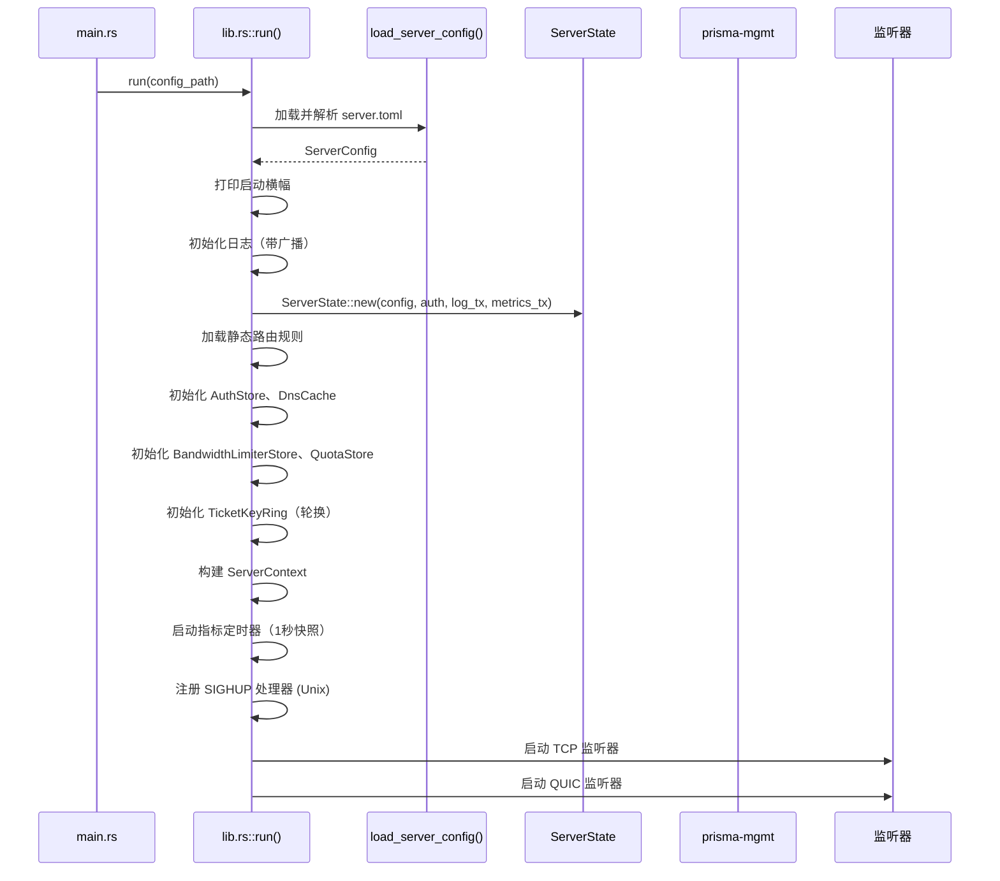
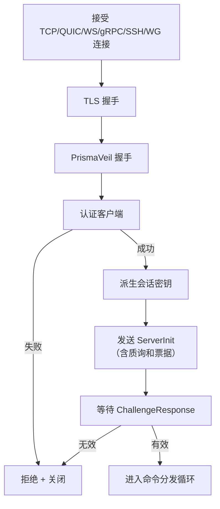

# prisma-server 参考

`prisma-server` 是服务端二进制 crate。通过多种传输协议接受客户端的加密连接，进行认证，并将流量中继到互联网。

**路径：** `crates/prisma-server/src/`

---

## 启动序列

---

## 模块列表

| 模块 | 用途 |
|------|------|
| `listener::tcp` | TCP 监听器：接受、TLS 握手、分发到处理器 |
| `listener::quic` | QUIC 监听器：基于 quinn，H3 ALPN 伪装 |
| `listener::cdn` | CDN HTTPS 监听器：WS/gRPC/XHTTP/XPorta 多路复用 |
| `listener::ssh` | SSH 传输监听器 |
| `listener::wireguard` | WireGuard 兼容 UDP 监听器 |
| `handler` | 主连接处理器管道 |
| `auth` | 认证存储和验证 |
| `relay` | 双向数据中继 |
| `forward` | 端口转发系统 |
| `reload` | 热重载：配置差异比较、应用更改 |

---

## 连接处理器管道

---

## 监听器类型

| 监听器 | 描述 |
|--------|------|
| TCP | 原始 TCP，可选 TLS，支持 PrismaTLS |
| QUIC | 基于 quinn 的 QUIC v1/v2，H3 ALPN |
| CDN | HTTPS 多协议：WS、gRPC、XHTTP、XPorta |
| SSH | SSH 通道隧道 |
| WireGuard | WireGuard 兼容 UDP |

---

## 中继模式

| 模式 | 描述 |
|------|------|
| 加密 | 标准双向中继，每帧加密/解密 |
| 仅传输 | BLAKE3 MAC 完整性检查（适用于 TLS/QUIC 传输） |
| Splice | Linux 零拷贝 splice(2) 系统调用 |
| io_uring | Linux io_uring 高吞吐量中继 |

---

## 热重载系统

配置热重载可通过以下方式触发：

1. **SIGHUP 信号** (仅 Unix)
2. **管理 API：** `POST /api/reload`
3. **文件监控：** 自动检测配置文件变更（2秒防抖）

重载过程：加载新配置 -> 差异比较 -> 原子性应用更改 -> 返回变更摘要
