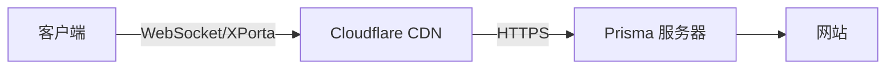
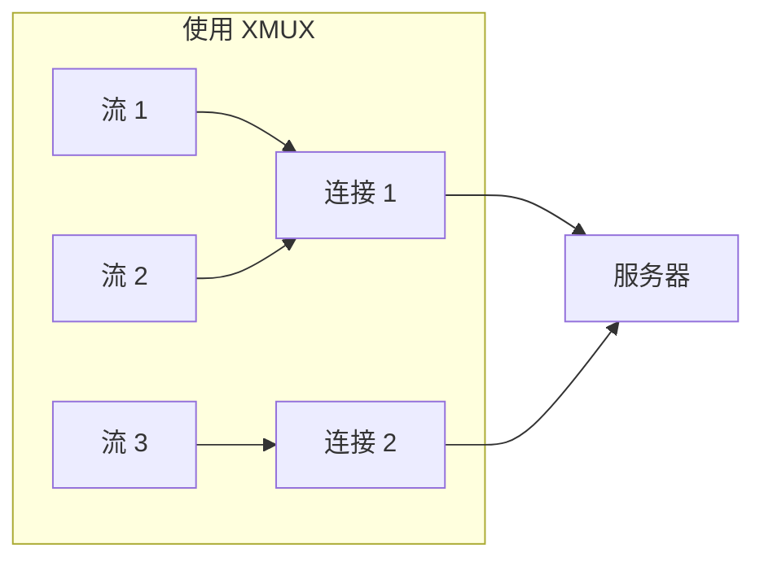
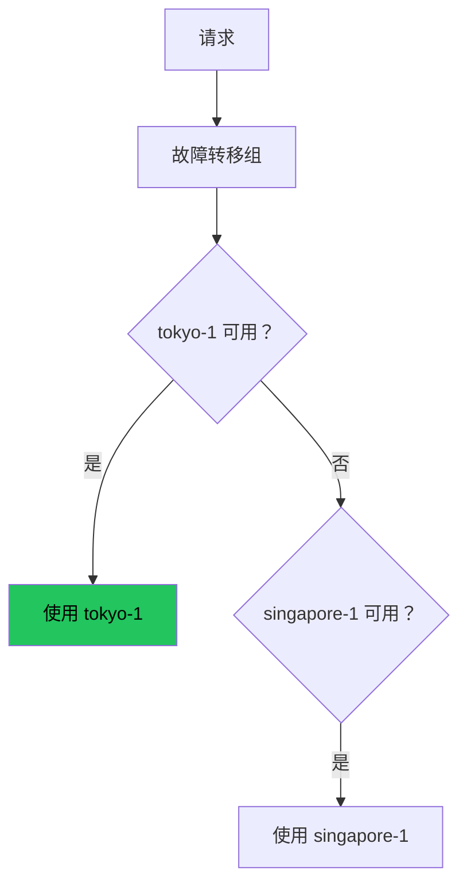

# 进阶设置

## Cloudflare CDN 部署



1. 将域名添加到 Cloudflare，创建 A 记录并启用代理
2. 从 Cloudflare 获取源站证书
3. 服务端使用 443 端口和源站证书
4. 客户端使用 `transport = "ws"` 或 `"xporta"`

## XMUX 连接池



```toml
# [xmux] 配置节的存在即表示启用多路复用，无需单独的开关
[xmux]
max_connections_min = 1
max_connections_max = 4
max_concurrency_min = 8
max_concurrency_max = 128
```

## 路由规则（分流）

```toml
[[routing.rules]]
type = "ip-cidr"
value = "192.168.0.0/16"
action = "direct"

[[routing.rules]]
type = "domain-keyword"
value = "ads"
action = "block"

[[routing.rules]]
type = "all"
action = "proxy"
```

## 代理组故障转移



## 规则提供者

```toml
[[rule_providers]]
name = "ad-block"
type = "domain"
url = "https://example.com/rules/ad-domains.txt"
interval_hours = 24
action = "block"
```

## io_uring 性能调优

Linux 5.11+ 自动启用 io_uring 零拷贝 I/O。

```toml
[performance]
max_connections = 4096

[congestion]
mode = "bbr"
```

## 安全最佳实践

1. 始终用 `prisma gen-key` 生成凭证
2. 生产环境使用 Let's Encrypt 证书
3. 管理 API 绑定到 `127.0.0.1`
4. 每台设备使用唯一凭证
5. 定期检查日志

## 恭喜！

你已经完成了 Prisma 新手指南。更多内容请查看：

- [服务端配置参考](/docs/configuration/server)
- [客户端配置参考](/docs/configuration/client)
- [配置示例](/docs/deployment/config-examples)
- [PrismaVeil 协议](/docs/security/prismaveil-protocol)
