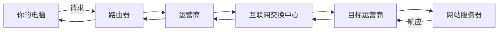
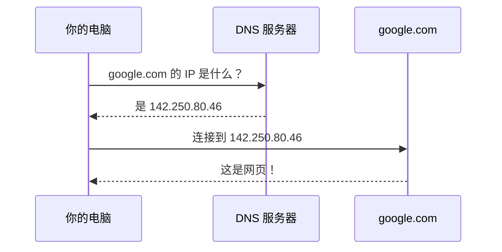
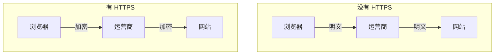
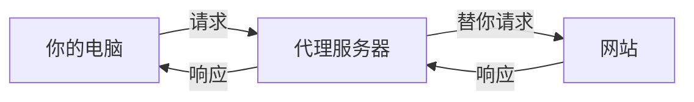
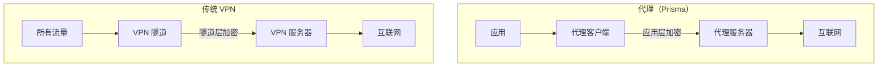
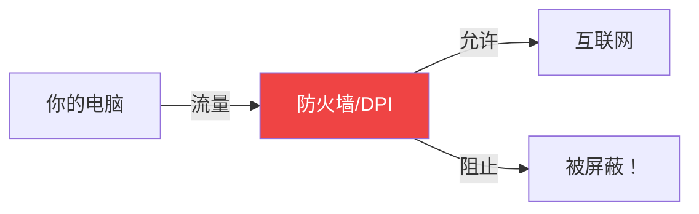
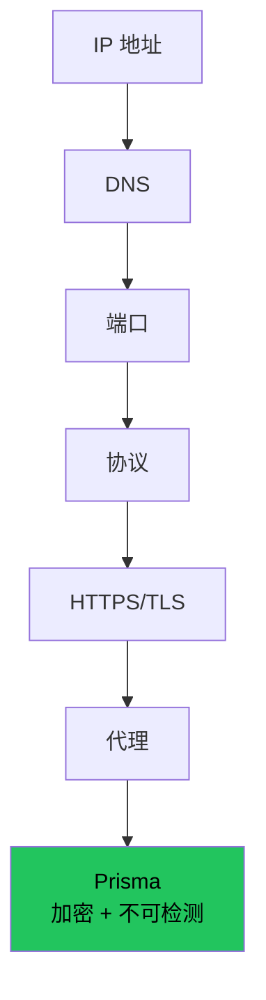

# 理解基础概念

在安装 Prisma 之前，让我们先建立关于互联网工作原理的心理模型。

## 互联网如何工作

## IP 地址和域名

**DNS** 将域名翻译成 IP 地址：

## 端口和协议

| 端口 | 协议 | 用途 |
|------|------|------|
| 80 | HTTP | 网站（未加密） |
| 443 | HTTPS | 网站（加密） |
| 22 | SSH | 远程访问 |
| 1080 | SOCKS5 | 代理 |
| 8443 | 自定义 | Prisma 默认 |

## HTTP、HTTPS 和 TLS

:::warning HTTPS 还不够
即使使用 HTTPS，运营商仍能看到你访问了哪些域名。Prisma 连域名都能隐藏。
:::

## 什么是代理？

## 代理与 VPN 的区别

| 特性 | 代理（Prisma） | 传统 VPN |
|------|--------------|---------|
| 覆盖范围 | 按应用或全系统（TUN） | 所有流量 |
| 抗检测 | 非常高（8 种传输） | 低 |
| CDN 支持 | 完整 | 罕见 |

## 防火墙和 DPI

| DPI 技术 | Prisma 应对 |
|---------|-----------|
| 协议签名匹配 | PrismaVeil 无可识别签名 |
| 数据包大小分析 | 每帧随机填充 |
| 时间关联 | 时间抖动随机化 |
| 熵分析 | 熵伪装调整分布 |
| 主动探测 | 伪装模式以真实网站回应 |

## 总结

## 下一步

前往 [Prisma 的工作原理](./how-prisma-works.md)。
