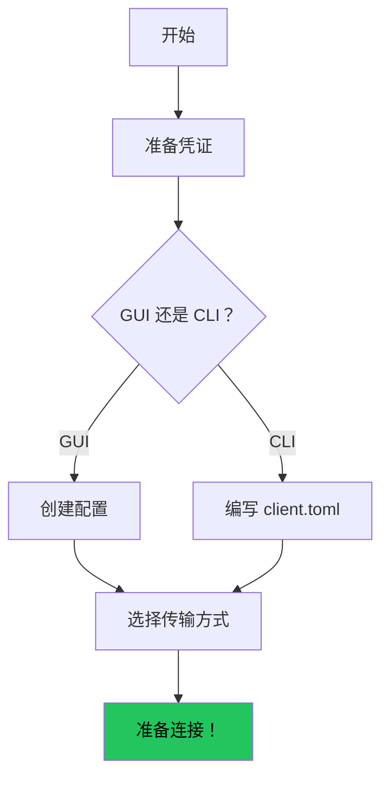
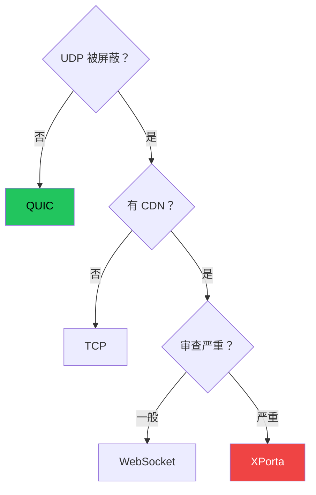
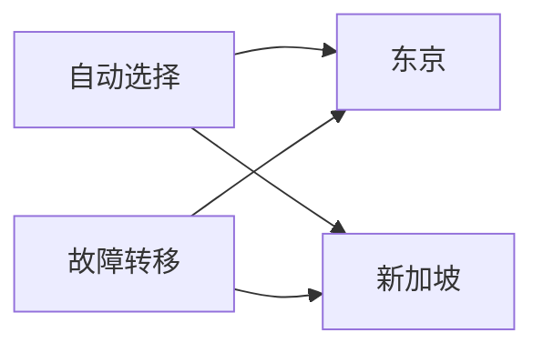

# 配置客户端

## 配置流程



## CLI 配置

```toml title="client.toml"
socks5_listen_addr = "127.0.0.1:1080"
http_listen_addr = "127.0.0.1:8080"
server_addr = "你的服务器IP:8443"
cipher_suite = "chacha20-poly1305"
transport = "quic"
skip_cert_verify = true

[identity]
client_id = "你的客户端ID"
auth_secret = "你的认证密钥"

[logging]
level = "info"
format = "pretty"
```

## 传输选择



## 订阅管理

```toml
[[subscriptions]]
url = "https://example.com/sub/token"
auto_update = true
```

## 代理组



```toml
[[proxy_groups]]
name = "auto-best"
type = "auto-url"
servers = ["tokyo-1", "singapore-1"]
test_url = "https://www.google.com/generate_204"
```

## DNS 和 TUN 模式

```toml
[dns]
mode = "tunnel"

[tun]
enabled = true
```

## 下一步

前往[首次连接](./first-connection.md)。
