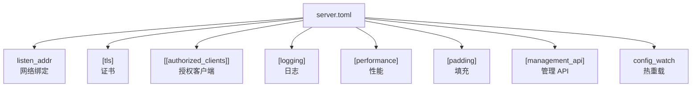

# 配置服务端

## 配置概览



## 步骤 1：生成凭证

```bash
prisma gen-key
```

## 步骤 2：生成 TLS 证书

```bash
prisma gen-cert --output /etc/prisma --cn prisma-server
```

## 步骤 3：编写配置

```toml title="server.toml"
listen_addr = "0.0.0.0:8443"
quic_listen_addr = "0.0.0.0:8443"

[tls]
cert_path = "/etc/prisma/prisma-cert.pem"
key_path = "/etc/prisma/prisma-key.pem"

[[authorized_clients]]
id = "你的客户端ID"
auth_secret = "你的认证密钥"
name = "我的客户端"

[logging]
level = "info"
format = "pretty"

[performance]
max_connections = 1024
connection_timeout_secs = 300

[padding]
min = 0
max = 256
```

## 步骤 4：验证并测试

```bash
prisma validate -c /etc/prisma/server.toml
prisma server -c /etc/prisma/server.toml
```

## 高级选项

### SSH / WireGuard 传输、ACL、端口转发、伪装模式、热重载、管理 API

详见英文版完整文档。

## Let's Encrypt 证书

```bash
sudo certbot certonly --standalone -d proxy.yourdomain.com
```

## 下一步

前往[安装客户端](./install-client.md)。
