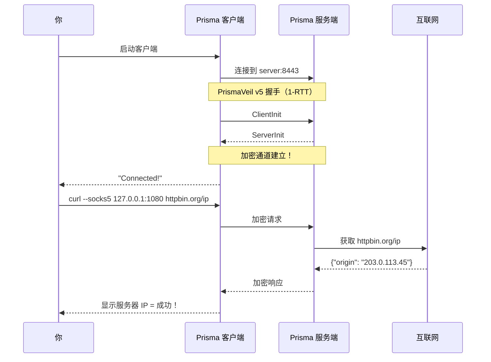
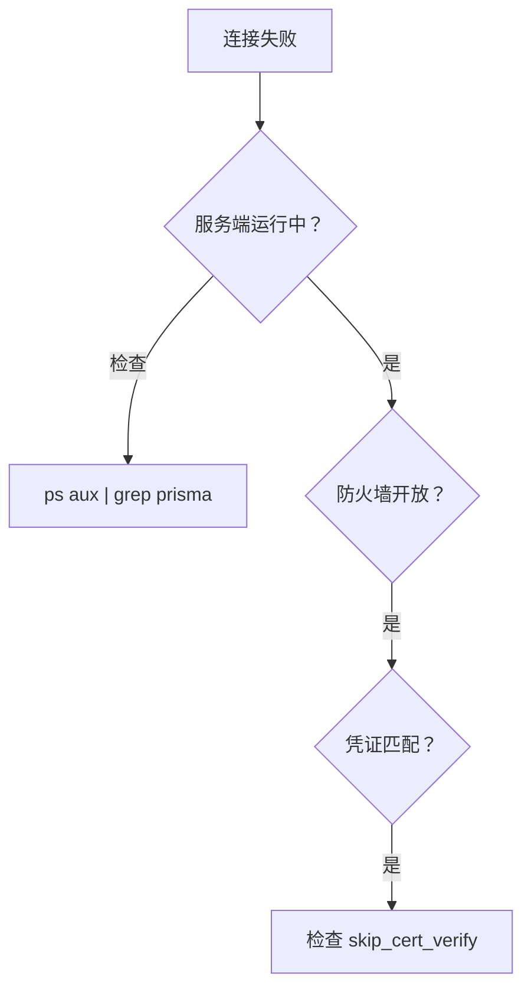

# 首次连接

## 连接过程



## 步骤 1：启动服务端

```bash
prisma server -c /etc/prisma/server.toml
```

## 步骤 2：启动客户端

```bash
prisma client -c ~/client.toml
```

## 步骤 3：验证

```bash
curl --socks5 127.0.0.1:1080 https://httpbin.org/ip
```

显示的应该是**服务器的 IP**。

## 故障排查



| 问题 | 解决 |
|------|------|
| 连接被拒绝 | 检查服务端运行状态和防火墙 |
| 认证失败 | 凭证必须完全匹配 |
| TLS 错误 | 设置 `skip_cert_verify = true` |
| 速度慢 | 尝试不同传输方式 |

## 成功！


## 下一步

前往[进阶设置](./advanced-setup.md)。
