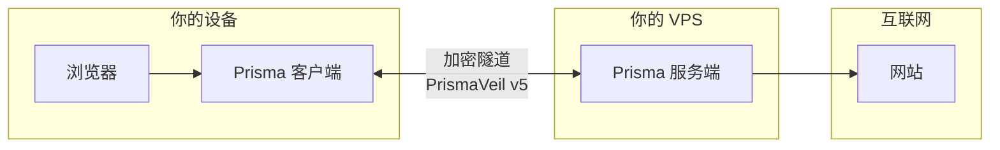
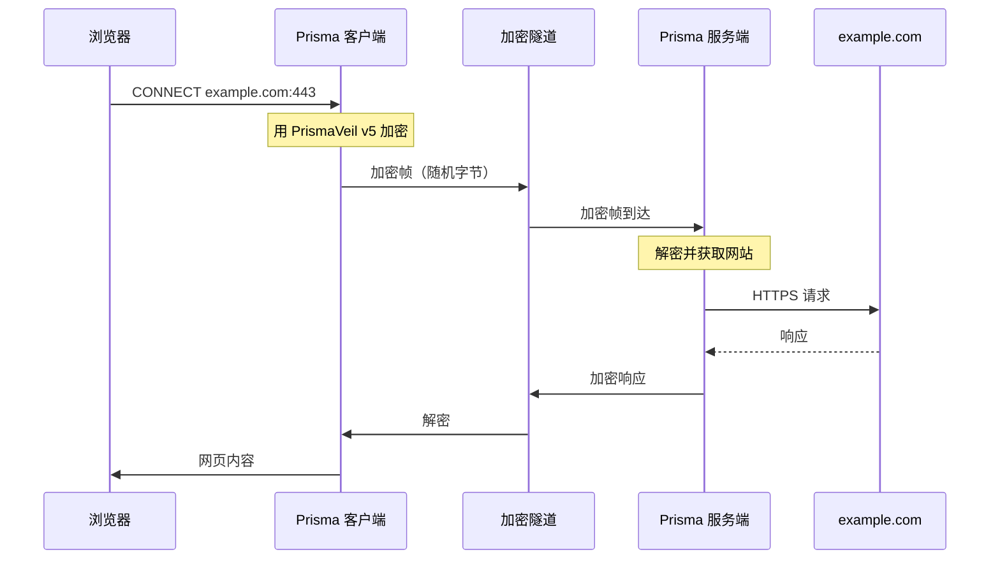
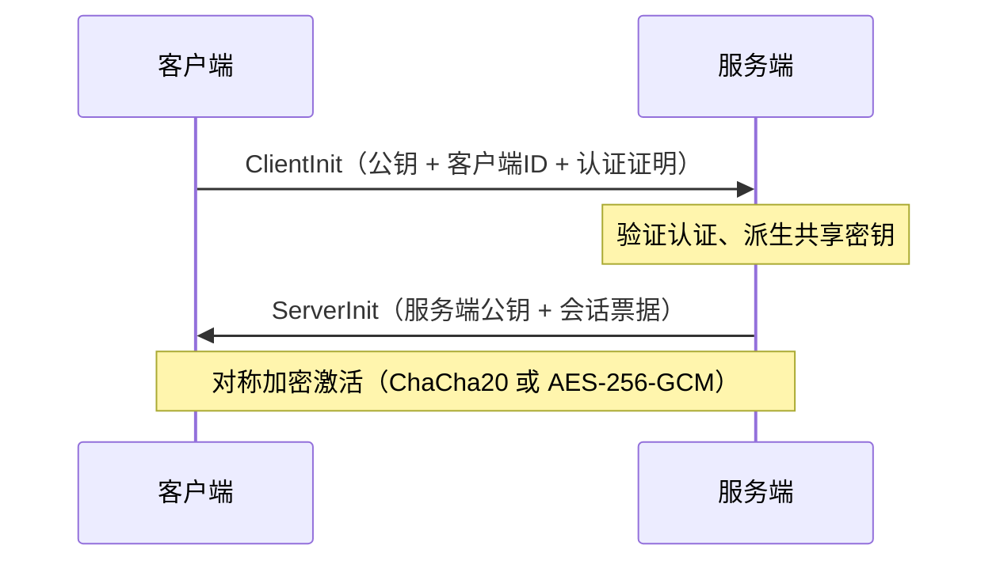
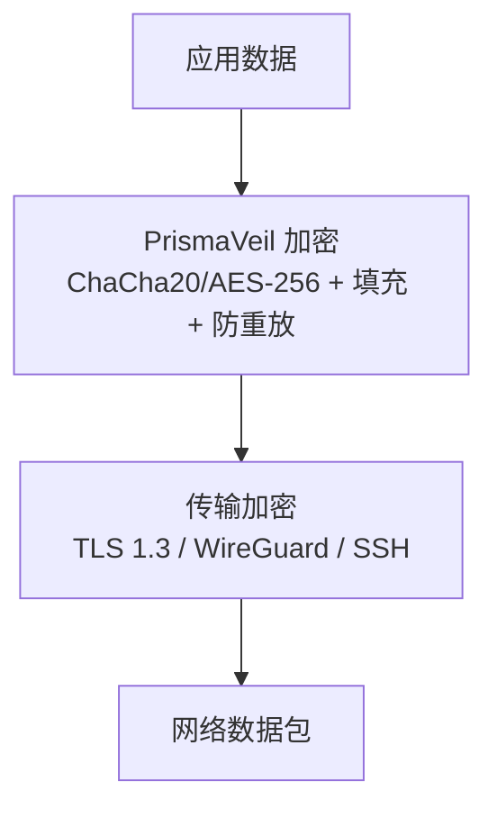
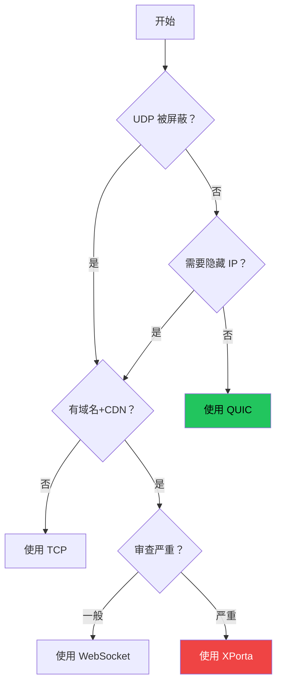
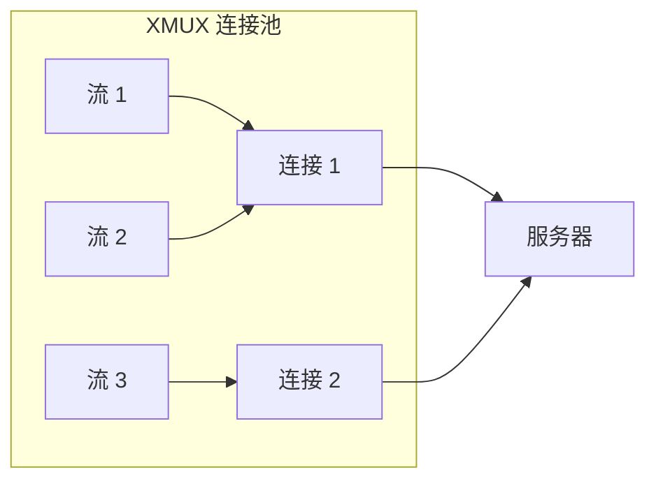
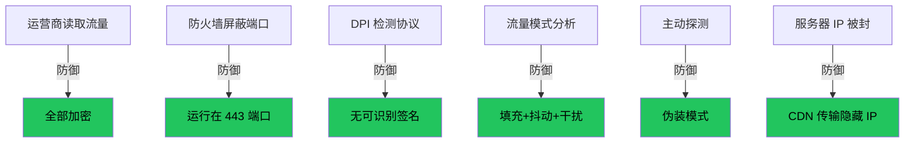

# Prisma 的工作原理

## 客户端和服务端

## 完整连接流程

## PrismaVeil v5 协议

### 握手过程（1-RTT）

### 加密层

## 传输方式

| 传输 | 协议 | CDN | 隐蔽性 | 速度 |
|------|------|-----|-------|------|
| **QUIC** | UDP | 否 | 中 | 最快 |
| **TCP** | TCP | 否 | 中 | 快 |
| **WebSocket** | TCP | 是 | 中高 | 好 |
| **gRPC** | TCP | 是 | 高 | 好 |
| **XHTTP** | TCP | 是 | 高 | 好 |
| **XPorta** | TCP | 是 | 最高 | 中等 |
| **SSH** | TCP | 否 | 中 | 好 |
| **WireGuard** | UDP | 否 | 低 | 最快 |

### 传输选择决策树

## XMUX 多路复用

## 为什么 Prisma 难以被检测

## 下一步

前往[准备工作](./prepare.md)。
