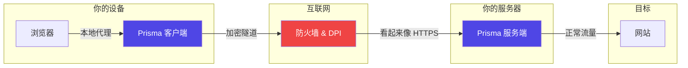

# 新手指南

欢迎来到 Prisma 新手指南——一份全面的、循序渐进的教程，带你从零开始搭建一个完整可用的加密代理系统。无需任何网络、服务器或命令行的基础知识。

## 你将学到什么

```mermaid
flowchart LR
    A["<b>基础概念</b>\n~15 分钟"] --> B["<b>工作原理</b>\n~20 分钟"]
    B --> C["<b>准备工作</b>\n~15 分钟"]
    C --> D["<b>安装服务端</b>\n~10 分钟"]
    D --> E["<b>配置服务端</b>\n~20 分钟"]
    E --> F["<b>安装客户端</b>\n~10 分钟"]
    F --> G["<b>配置客户端</b>\n~20 分钟"]
    G --> H["<b>首次连接</b>\n~10 分钟"]
    H --> I["<b>进阶设置</b>\n~25 分钟"]

    style A fill:#4f46e5,color:#fff
    style B fill:#4f46e5,color:#fff
    style C fill:#4f46e5,color:#fff
    style D fill:#4f46e5,color:#fff
    style E fill:#4f46e5,color:#fff
    style F fill:#4f46e5,color:#fff
    style G fill:#4f46e5,color:#fff
    style H fill:#22c55e,color:#000
    style I fill:#f59e0b,color:#000
```

| # | 章节 | 内容 | 时间 |
|---|------|------|------|
| 1 | [理解基础概念](./basics.md) | 互联网工作原理、代理和加密 | ~15 分钟 |
| 2 | [Prisma 的工作原理](./how-prisma-works.md) | 架构、PrismaVeil v5 协议、8 种传输、反检测 | ~20 分钟 |
| 3 | [准备工作](./prepare.md) | 获取 VPS、SSH、域名和 TLS、防火墙 | ~15 分钟 |
| 4 | [安装服务端](./install-server.md) | 一键脚本、Docker、源码编译 | ~10 分钟 |
| 5 | [配置服务端](./configure-server.md) | TOML、凭证、TLS、高级选项 | ~20 分钟 |
| 6 | [安装客户端](./install-client.md) | GUI、CLI、Android、iOS | ~10 分钟 |
| 7 | [配置客户端](./configure-client.md) | 传输选择、订阅、代理组、端口转发 | ~20 分钟 |
| 8 | [首次连接](./first-connection.md) | 启动、验证、故障排查 | ~10 分钟 |
| 9 | [进阶设置](./advanced-setup.md) | CDN、XMUX、io_uring、规则提供者 | ~25 分钟 |

**预计总时间：~2.5 小时**

## 前提条件

1. **一台电脑或手机** —— Windows、macOS、Linux、Android 或 iOS
2. **网络连接**

:::tip 无需任何经验
本指南假设你**完全没有**任何基础知识。每个概念都从头开始解释。
:::

## Prisma 概览

核心能力：**8 种传输** / **PrismaVeil v5** / **反检测** / **跨平台** / **后量子就绪**

准备好了吗？让我们从[理解基础概念](./basics.md)开始。
