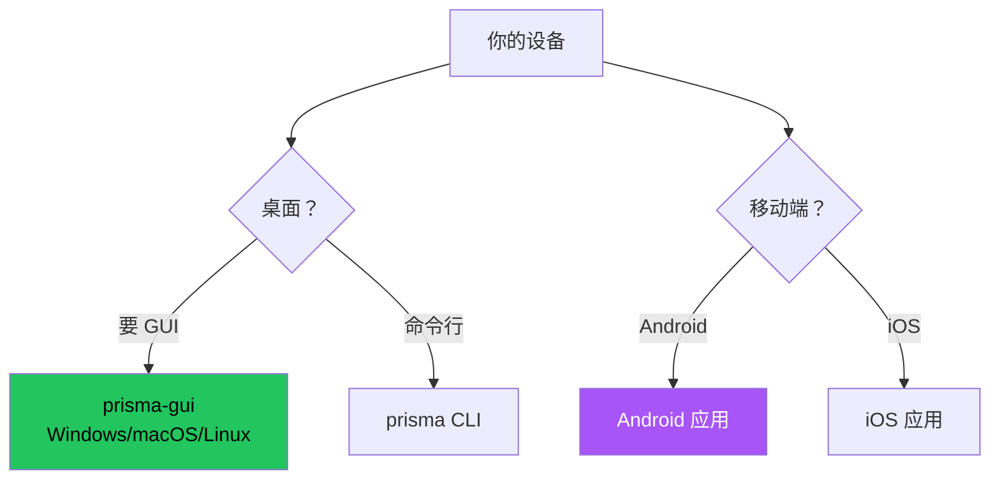

# 安装客户端

## 选择客户端



| 客户端 | 适用 | 平台 |
|--------|------|------|
| **prisma-gui** | 大多数用户 | Windows、macOS、Linux |
| **CLI** | 高级用户 | 所有平台 |
| **Android** | 手机 | Android 7.0+ |
| **iOS** | 手机 | iOS 15.0+ |

## prisma-gui

从 [GitHub Releases](https://github.com/prisma-proxy/prisma/releases/latest) 下载安装。

## CLI

```bash
# Linux/macOS
curl -fsSL https://raw.githubusercontent.com/prisma-proxy/prisma/master/scripts/install.sh | bash

# Windows PowerShell
irm https://raw.githubusercontent.com/prisma-proxy/prisma/master/scripts/install.ps1 | iex
```

## 移动端

- **Android:** 下载 APK，支持全部 8 种传输、分应用代理、TUN 模式、订阅导入
- **iOS:** 从 TestFlight 下载，支持 Network Extension TUN 模式

## 验证

```bash
prisma --version
```

## 下一步

前往[配置客户端](./configure-client.md)。
