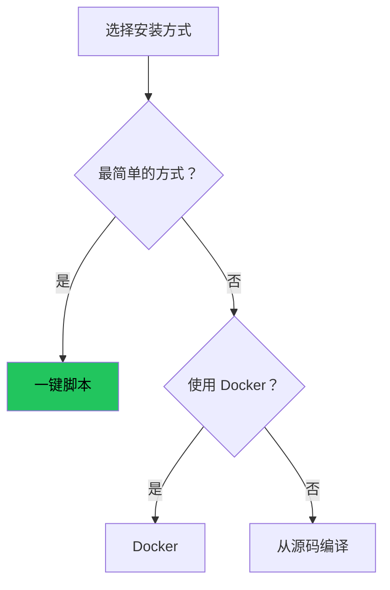

# 安装服务端

## 选择安装方式



## 方法一：一键脚本（推荐）

```bash
curl -fsSL https://raw.githubusercontent.com/prisma-proxy/prisma/master/scripts/install.sh | bash
```

加 `--setup` 同时生成凭证和配置：

```bash
curl -fsSL https://raw.githubusercontent.com/prisma-proxy/prisma/master/scripts/install.sh | bash -s -- --setup
```

## 方法二：Docker

```bash
docker run -d --name prisma-server --restart unless-stopped \
  -v /etc/prisma:/config -p 8443:8443/tcp -p 8443:8443/udp \
  ghcr.io/yamimega/prisma server -c /config/server.toml
```

## 方法三：从源码编译

```bash
curl --proto '=https' --tlsv1.2 -sSf https://sh.rustup.rs | sh
source ~/.cargo/env
git clone https://github.com/prisma-proxy/prisma.git && cd prisma
cargo build --release
sudo cp target/release/prisma /usr/local/bin/
```

## 验证安装

```bash
prisma --version
# 预期：prisma 1.3.0
```

## Systemd 服务

```ini title="prisma-server.service"
[Unit]
Description=Prisma Proxy Server
After=network-online.target

[Service]
ExecStart=/usr/local/bin/prisma server -c /etc/prisma/server.toml
Restart=on-failure
RestartSec=5
LimitNOFILE=65536

[Install]
WantedBy=multi-user.target
```

```bash
sudo systemctl daemon-reload && sudo systemctl enable --now prisma-server
```

## 开放防火墙

```bash
sudo ufw allow 8443/tcp && sudo ufw allow 8443/udp
```

## 下一步

前往[配置服务端](./configure-server.md)。
