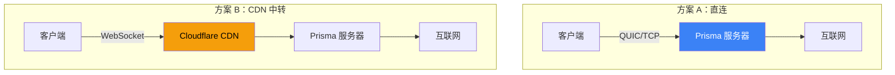
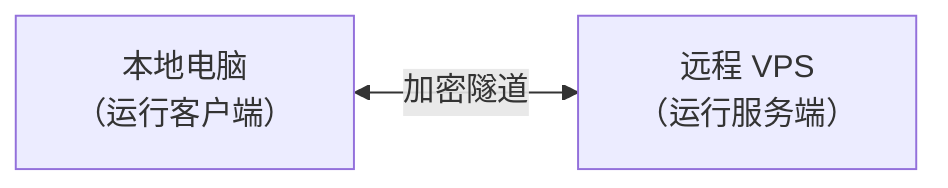
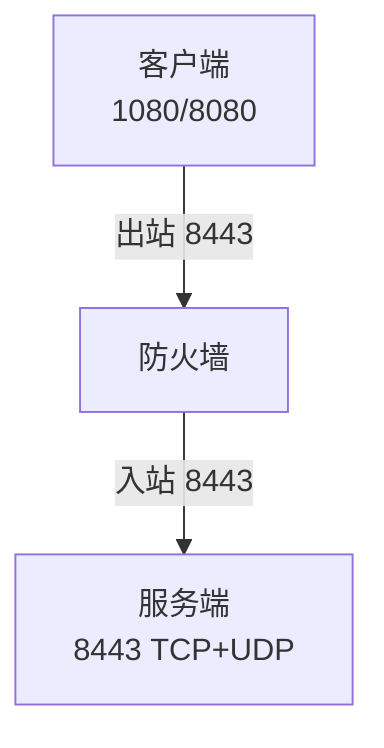

# 准备工作

## 部署架构选项



| 架构 | 隐蔽性 | 速度 | 适用场景 |
|------|-------|------|---------|
| 直连 | 中 | 最快 | 审查较少的环境 |
| CDN 中转 | 高 | 好 | 需要隐藏服务器 IP |

## 你需要什么



### 服务器要求

| 资源 | 最低 | 推荐 |
|------|------|------|
| CPU | 1 核 | 2 核 |
| 内存 | 256 MB | 512 MB |
| 带宽 | 500 GB/月 | 1 TB/月 |
| 系统 | 任何现代 Linux | Ubuntu 24.04 LTS |

### 防火墙规划



| 端口 | 协议 | 用途 | 必需？ |
|------|------|------|--------|
| 8443 | TCP+UDP | Prisma | 是 |
| 22 | TCP | SSH | 是 |
| 443 | TCP | 替代端口 | 可选 |

## 连接服务器（SSH）

```bash
ssh root@你的服务器IP
```

## 终端基础

| 命令 | 功能 |
|------|------|
| `ls` | 列出文件 |
| `cd` | 切换目录 |
| `nano` | 编辑文件 |
| `sudo` | 管理员权限 |
| `systemctl` | 管理服务 |

## 更新服务器

```bash
sudo apt update && sudo apt upgrade -y
```

## 下一步

前往[安装服务端](./install-server.md)。
