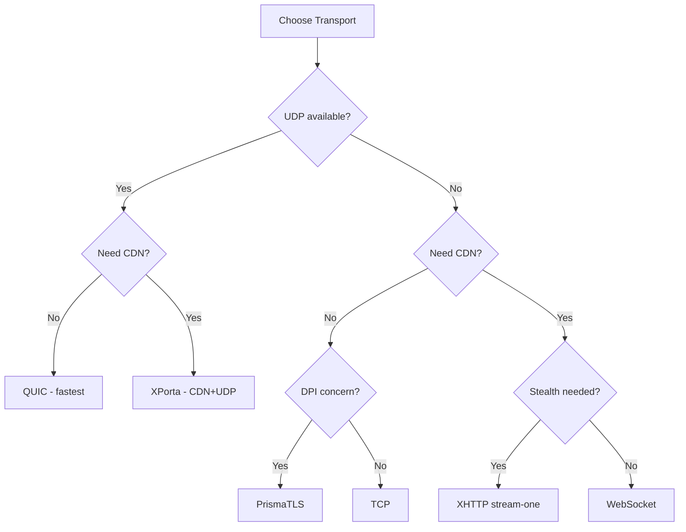

# 客户端配置

客户端通过 TOML 文件配置（默认：`client.toml`）。配置按三层解析——编译默认值、TOML 文件、环境变量。详见[环境变量](./environment-variables.md)了解覆盖机制。

:::info 版本
此页面反映 Prisma **v2.28.0**。协议 v4 支持已移除；仅接受 PrismaVeil v5 (0x05)。
:::

## 顶级字段

| 字段 | 类型 | 默认值 | 描述 |
|------|------|--------|------|
| `server_addr` | string | -- | 远程 Prisma 服务器地址（如 `"1.2.3.4:8443"`） |
| `socks5_listen_addr` | string | `"127.0.0.1:1080"` | 本地 SOCKS5 代理绑定地址 |
| `http_listen_addr` | string? | -- | 本地 HTTP CONNECT 代理绑定地址（可选，省略则禁用） |
| `pac_port` | u16? | `8070` | PAC（代理自动配置）服务器端口 |
| `cipher_suite` | string | `"chacha20-poly1305"` | `"chacha20-poly1305"` / `"aes-256-gcm"` / `"auto"`。当设为 `"auto"` 时，在支持 AES-NI/NEON 的硬件上选择 AES-256-GCM，否则选择 ChaCha20-Poly1305 |
| `transport` | string | `"quic"` | `"quic"` / `"tcp"` / `"ws"` / `"grpc"` / `"xhttp"` / `"xporta"` / `"prisma-tls"` / `"ssh"` / `"wireguard"` |
| `skip_cert_verify` | bool | `false` | 跳过 TLS 证书验证（仅限开发环境） |
| `tls_on_tcp` | bool | `false` | 通过 TLS 包裹的 TCP 连接（须与服务端伪装设置匹配） |
| `tls_server_name` | string? | -- | TLS SNI 服务器名称覆盖（默认使用 `server_addr` 的主机名） |
| `alpn_protocols` | string[] | `["h2", "http/1.1"]` | TLS/QUIC ALPN 协议 |
| `fingerprint` | string | `"chrome"` | uTLS 指纹：`"chrome"` / `"firefox"` / `"safari"` / `"random"` / `"none"` |
| `quic_version` | string | `"auto"` | QUIC 版本：`"v2"` / `"v1"` / `"auto"` |
| `transport_mode` | string | `"auto"` | 传输模式：`"auto"` 或显式名称 |
| `fallback_order` | string[] | `["quic-v2", "prisma-tls", "ws-cdn", "xporta"]` | 自动模式的传输回退顺序 |
| `sni_slicing` | bool | `false` | QUIC SNI 分片——将 TLS ClientHello 分片到多个 QUIC CRYPTO 帧中，防止中间设备在单个数据包中读取 SNI。无需 ECH 支持即可有效对抗基于 SNI 的过滤。 |
| `entropy_camouflage` | bool | `false` | Salamander/原始 UDP 的熵伪装——重塑加密数据包的字节分布以匹配典型 HTTPS 流量模式，击败标记高熵 UDP 流的基于熵的 DPI 分类器。 |
| `transport_only_cipher` | bool | `false` | 使用仅传输层加密模式（BLAKE3 MAC，无应用层加密）。仅当传输层已提供加密（TLS/QUIC）时安全。服务端也须启用。 |
| `server_key_pin` | string? | -- | 服务端临时公钥的 SHA-256 哈希（十六进制）。提供独立于 TLS 的端到端服务器认证。 |
| `salamander_password` | string? | -- | Salamander UDP 混淆密码（仅 QUIC） |
| `prisma_auth_secret` | string? | -- | PrismaTLS 认证密钥（十六进制编码，须与服务端匹配） |
| `user_agent` | string? | -- | 覆盖 User-Agent 请求头 |
| `referer` | string? | -- | 覆盖 Referer 请求头 |

## `[connection_pool]` -- 传输连接复用

启用传输层连接池，在多个 SOCKS5/HTTP 代理请求间复用已建立的传输连接。减少握手开销，改善突发工作负载的延迟。

| 字段 | 类型 | 默认值 | 描述 |
|------|------|--------|------|
| `enabled` | bool | `false` | 启用传输连接池 |
| `max_idle` | u16 | `4` | 连接池中保留的最大空闲连接数 |
| `idle_timeout_secs` | u64 | `300` | N 秒后关闭空闲的池化连接 |

示例：

```toml
[connection_pool]
enabled = true
max_idle = 8
idle_timeout_secs = 600
```

:::tip
连接池在使用握手开销较大的传输方式（PrismaTLS、通过 CDN 的 WebSocket）时最为有效。对于 QUIC，其内置多路复用使得池化效果不太明显。
:::

## `[connection_retry]` -- 连接失败自动重试

当传输连接尝试失败时，客户端会自动以指数退避策略重试。这在不稳定的网络或传输回退期间特别有用。

| 字段 | 类型 | 默认值 | 描述 |
|------|------|--------|------|
| `max_attempts` | u32 | `3` | 放弃前的最大连接重试次数 |
| `initial_backoff_ms` | u64 | `500` | 初始退避延迟（毫秒）。每次失败后加倍（500ms、1000ms、2000ms）。 |

示例：

```toml
[connection_retry]
max_attempts = 3
initial_backoff_ms = 500
```

:::note
连接重试仅适用于初始传输连接。连接建立后，传输层的保活和重连由传输本身处理（如 QUIC 连接迁移）。
:::

## `[identity]` -- 客户端凭证

| 字段 | 类型 | 默认值 | 描述 |
|------|------|--------|------|
| `client_id` | string | -- | 客户端 UUID（须与服务端 `authorized_clients[].id` 匹配） |
| `auth_secret` | string | -- | 64 个十六进制字符的共享密钥（须与服务端匹配） |

## 传输特定配置节

### `[ws]` -- WebSocket 传输

| 字段 | 类型 | 默认值 | 描述 |
|------|------|--------|------|
| `url` | string? | -- | WebSocket 服务器 URL（如 `"wss://domain.com/ws-tunnel"`） |
| `host` | string? | -- | 覆盖 WebSocket `Host` 请求头 |
| `extra_headers` | \[\[k,v\]\] | `[]` | 额外的 WebSocket 请求头 |

### `[grpc]` -- gRPC 传输

| 字段 | 类型 | 默认值 | 描述 |
|------|------|--------|------|
| `url` | string? | -- | gRPC 服务器 URL |

### `[xhttp]` -- XHTTP 传输

| 字段 | 类型 | 默认值 | 描述 |
|------|------|--------|------|
| `mode` | string? | -- | XHTTP 模式：`"packet-up"` / `"stream-up"` / `"stream-one"` |
| `upload_url` | string? | -- | XHTTP packet-up/stream-up 上传 URL |
| `download_url` | string? | -- | XHTTP packet-up 下载 URL |
| `stream_url` | string? | -- | XHTTP stream-one 流 URL |
| `extra_headers` | \[\[k,v\]\] | `[]` | 额外的 XHTTP 请求头 |

### `[xporta]` -- XPorta 传输

| 字段 | 类型 | 默认值 | 描述 |
|------|------|--------|------|
| `base_url` | string | -- | XPorta 服务器基础 URL（如 `"https://your-domain.com"`） |
| `session_path` | string | `"/api/auth"` | 会话初始化端点 |
| `data_paths` | string[] | `["/api/v1/data", "/api/v1/sync", "/api/v1/update"]` | 上传端点路径 |
| `poll_paths` | string[] | `["/api/v1/notifications", "/api/v1/feed", "/api/v1/events"]` | 长轮询下载路径 |
| `encoding` | string | `"json"` | 编码方式：`"json"` / `"binary"` / `"auto"` |
| `poll_concurrency` | u8 | `3` | 并发待处理轮询请求数（1-8） |
| `upload_concurrency` | u8 | `4` | 并发上传请求数（1-8） |
| `max_payload_size` | u32 | `65536` | 每请求最大负载字节数 |
| `poll_timeout_secs` | u16 | `55` | 长轮询超时时间（10-90 秒） |
| `extra_headers` | \[\[k,v\]\] | `[]` | 额外的 XPorta 请求头 |
| `cookie_name` | string | `"_sess"` | 会话 Cookie 名称（须与服务端配置匹配） |

### `[wireguard]` -- WireGuard 传输

| 字段 | 类型 | 默认值 | 描述 |
|------|------|--------|------|
| `endpoint` | string | -- | 服务器 WireGuard 端点（如 `"1.2.3.4:51820"`） |
| `keepalive_secs` | u64 | `25` | Keepalive 间隔（秒） |

## `[xmux]` -- 流多路复用

启用传输连接上的 XMUX 流多路复用。此配置节的存在即表示启用多路复用，无需单独的开关。随机化连接生命周期以避免指纹识别。用于 XHTTP 和 WebSocket 传输。

| 字段 | 类型 | 默认值 | 描述 |
|------|------|--------|------|
| `max_connections_min` | u16 | `1` | 连接池最小连接数 |
| `max_connections_max` | u16 | `4` | 连接池最大连接数 |
| `max_concurrency_min` | u16 | `8` | 每连接最小并发数 |
| `max_concurrency_max` | u16 | `16` | 每连接最大并发数 |
| `max_lifetime_secs_min` | u64 | `300` | 连接最小生存时间（秒） |
| `max_lifetime_secs_max` | u64 | `600` | 连接最大生存时间（秒） |
| `max_requests_min` | u32 | `100` | 轮换前最小请求数 |
| `max_requests_max` | u32 | `200` | 轮换前最大请求数 |

## `[[port_forwards]]` -- 端口转发

通过服务器的公共端口暴露本地服务。每个条目是一个 `[[port_forwards]]` 数组项。

| 字段 | 类型 | 默认值 | 描述 |
|------|------|--------|------|
| `name` | string | -- | 此端口转发的人类可读标签 |
| `local_addr` | string | -- | 本地服务地址（如 `"127.0.0.1:3000"`） |
| `remote_port` | u16 | -- | 在服务器端监听的端口 |
| `protocol` | string | `"tcp"` | 协议：`"tcp"` / `"udp"` |
| `bind_addr` | string? | -- | 服务端绑定地址覆盖（默认：`0.0.0.0`） |
| `max_connections` | u32? | -- | 此转发的最大并发连接数（0 = 无限） |
| `idle_timeout_secs` | u64? | `300` | N 秒后关闭空闲连接 |
| `connect_timeout_secs` | u64? | `10` | 连接本地服务的超时时间 |
| `bandwidth_up` | string? | -- | 每转发上传限制（如 `"10mbps"`） |
| `bandwidth_down` | string? | -- | 每转发下载限制（如 `"10mbps"`） |
| `allowed_ips` | string[] | `[]` | 服务端监听器的 IP 白名单（空 = 允许所有） |
| `enabled` | bool | `true` | 启用/禁用单个转发 |
| `retry_on_failure` | bool | `false` | 本地连接失败时自动重试 |
| `buffer_size` | usize? | `8192` | 自定义缓冲区大小（字节） |

示例：

```toml
[[port_forwards]]
name = "my-web-app"
local_addr = "127.0.0.1:3000"
remote_port = 10080
protocol = "tcp"
max_connections = 50
idle_timeout_secs = 600
connect_timeout_secs = 5
bandwidth_up = "10mbps"
bandwidth_down = "50mbps"
allowed_ips = ["0.0.0.0/0"]
enabled = true
retry_on_failure = true
buffer_size = 16384

[[port_forwards]]
name = "my-api"
local_addr = "127.0.0.1:8000"
remote_port = 10081
```

## `[dns]` -- DNS 处理

| 字段 | 类型 | 默认值 | 描述 |
|------|------|--------|------|
| `mode` | string | `"direct"` | DNS 模式：`"smart"` / `"fake"` / `"tunnel"` / `"direct"` |
| `protocol` | string | `"udp"` | DNS 协议：`"udp"` / `"doh"` / `"dot"` |
| `fake_ip_range` | string | `"198.18.0.0/15"` | 虚假 DNS IP 的 CIDR 范围 |
| `upstream` | string | `"8.8.8.8:53"` | 上游 DNS 服务器（UDP 协议时使用） |
| `doh_url` | string | `"https://1.1.1.1/dns-query"` | DoH 服务器 URL（协议为 `"doh"` 时使用） |
| `dns_listen_addr` | string | `"127.0.0.1:53"` | 本地 DNS 服务器监听地址 |
| `geosite_path` | string? | -- | 智能 DNS 模式的 GeoSite 数据库路径 |

## `[tun]` -- TUN 模式（系统全局代理）

| 字段 | 类型 | 默认值 | 描述 |
|------|------|--------|------|
| `enabled` | bool | `false` | 启用 TUN 模式 |
| `device_name` | string | `"prisma-tun0"` | TUN 设备名称 |
| `mtu` | u16 | `1500` | TUN 设备 MTU |
| `include_routes` | string[] | `["0.0.0.0/0"]` | TUN 模式捕获的路由 |
| `exclude_routes` | string[] | `[]` | 排除的路由（服务器 IP 自动排除） |
| `dns` | string | `"fake"` | TUN DNS 模式：`"fake"` / `"tunnel"` |

:::warning
TUN 模式需要 root/管理员权限。在 Linux 上使用 `sudo` 运行或授予 `CAP_NET_ADMIN` 能力。
:::

## `[routing]` -- 基于规则的路由

| 字段 | 类型 | 默认值 | 描述 |
|------|------|--------|------|
| `geoip_path` | string? | -- | v2fly `geoip.dat` 文件路径，用于 GeoIP 路由 |
| `rules` | array | `[]` | 有序的路由规则列表 |

每个 `[[routing.rules]]`：

| 字段 | 类型 | 默认值 | 描述 |
|------|------|--------|------|
| `type` | string | -- | 规则类型：`"domain"` / `"domain-suffix"` / `"domain-keyword"` / `"ip-cidr"` / `"geoip"` / `"port"` / `"all"` |
| `value` | string | -- | 匹配值（`geoip` 类型使用国家代码，如 `"cn"`、`"private"`） |
| `action` | string | `"proxy"` | 动作：`"proxy"` / `"direct"` / `"block"` |

## `[traffic_shaping]` -- 抗指纹识别

| 字段 | 类型 | 默认值 | 描述 |
|------|------|--------|------|
| `padding_mode` | string | `"none"` | `"none"` / `"random"` / `"bucket"` |
| `bucket_sizes` | u16[] | `[128,256,512,1024,2048,4096,8192,16384]` | 桶填充模式的桶大小 |
| `timing_jitter_ms` | u32 | `0` | 握手帧的最大时序抖动（毫秒） |
| `chaff_interval_ms` | u32 | `0` | 杂音注入间隔（毫秒），0 = 禁用 |
| `coalesce_window_ms` | u32 | `0` | 帧合并窗口（毫秒），0 = 禁用 |

## `[congestion]` -- QUIC 拥塞控制

| 字段 | 类型 | 默认值 | 描述 |
|------|------|--------|------|
| `mode` | string | `"bbr"` | 拥塞控制：`"brutal"` / `"bbr"` / `"adaptive"` |
| `target_bandwidth` | string? | -- | brutal/adaptive 模式的目标带宽（如 `"100mbps"`） |

## `[port_hopping]` -- QUIC 端口跳变

| 字段 | 类型 | 默认值 | 描述 |
|------|------|--------|------|
| `enabled` | bool | `false` | 启用 QUIC 端口跳变 |
| `base_port` | u16 | `10000` | 端口范围起始值 |
| `port_range` | u16 | `50000` | 端口范围数量 |
| `interval_secs` | u64 | `60` | 端口跳变间隔（秒） |
| `grace_period_secs` | u64 | `10` | 双端口接受窗口（秒） |

## `[udp_fec]` -- 前向纠错

| 字段 | 类型 | 默认值 | 描述 |
|------|------|--------|------|
| `enabled` | bool | `false` | 启用 UDP 中继的 FEC |
| `data_shards` | usize | `10` | 每 FEC 组的原始数据包数 |
| `parity_shards` | usize | `3` | 每 FEC 组的校验包数 |

## `[[subscriptions]]` -- 服务器列表订阅

| 字段 | 类型 | 默认值 | 描述 |
|------|------|--------|------|
| `url` | string | -- | 获取服务器列表的 HTTP(S) URL |
| `name` | string | -- | 此订阅的人类可读名称 |
| `update_interval_secs` | u64 | `3600` | 自动更新间隔（秒），0 = 禁用 |
| `last_updated` | string? | -- | 上次成功更新的 ISO 8601 时间戳（自动管理） |

## `[fallback]` -- 客户端传输回退

控制客户端在主要传输失败或服务器通告备用传输时如何处理传输回退。

| 字段 | 类型 | 默认值 | 描述 |
|------|------|--------|------|
| `use_server_fallback` | bool | `true` | 是否使用服务器通告的回退传输 |
| `max_fallback_attempts` | u32 | `3` | 放弃前的最大回退尝试次数 |
| `connect_timeout_secs` | u64 | `10` | 每次回退连接尝试的超时时间（秒） |

示例：

```toml
[fallback]
use_server_fallback = true
max_fallback_attempts = 5
connect_timeout_secs = 15
```

## `[logging]` -- 日志输出

| 字段 | 类型 | 默认值 | 描述 |
|------|------|--------|------|
| `level` | string | `"info"` | 日志级别：`trace` / `debug` / `info` / `warn` / `error` |
| `format` | string | `"pretty"` | 日志格式：`pretty` / `json` |

## 完整示例

```toml title="client.toml"
socks5_listen_addr = "127.0.0.1:1080"
http_listen_addr = "127.0.0.1:8080"  # 可选，删除此行以禁用 HTTP 代理
server_addr = "127.0.0.1:8443"
cipher_suite = "auto"                # "auto" | "chacha20-poly1305" | "aes-256-gcm"
transport = "quic"                   # quic | tcp | ws | grpc | xhttp | xporta | ...
skip_cert_verify = true              # 开发环境中使用自签名证书时设为 true
fingerprint = "chrome"               # uTLS 指纹，模拟浏览器 ClientHello
quic_version = "auto"                # "v2"、"v1" 或 "auto"
# server_key_pin = "hex-sha256"      # 在 CDN 场景中锁定服务器公钥
# prisma_auth_secret = "hex-encoded-32-bytes"   # PrismaTLS 传输使用

# 须与 prisma gen-key 生成的密钥匹配
[identity]
client_id = "00000000-0000-0000-0000-000000000001"
auth_secret = "0123456789abcdef0123456789abcdef0123456789abcdef0123456789abcdef"

# 端口转发（反向代理）— 通过服务器暴露本地服务
[[port_forwards]]
name = "my-web-app"
local_addr = "127.0.0.1:3000"
remote_port = 10080
protocol = "tcp"
enabled = true
retry_on_failure = true

[[port_forwards]]
name = "my-api"
local_addr = "127.0.0.1:8000"
remote_port = 10081

# 连接池（复用传输连接）
# [connection_pool]
# enabled = true
# max_idle = 8
# idle_timeout_secs = 600

# 服务器列表订阅
# [[subscriptions]]
# url = "https://example.com/prisma-servers.json"
# name = "my-provider"
# update_interval_secs = 3600

# 客户端传输回退
# [fallback]
# use_server_fallback = true
# max_fallback_attempts = 3
# connect_timeout_secs = 10

[logging]
level = "info"
format = "pretty"
```

## 验证规则

客户端配置在启动时进行验证，以下规则将被强制执行：

- `socks5_listen_addr` 不能为空
- `server_addr` 不能为空
- `identity.client_id` 不能为空
- `identity.auth_secret` 必须是有效的十六进制字符串
- `cipher_suite` 必须是以下之一：`chacha20-poly1305`、`aes-256-gcm`、`auto`
- `transport` 必须是以下之一：`quic`、`tcp`、`ws`、`grpc`、`xhttp`、`xporta`、`prisma-tls`、`ssh`、`wireguard`
- `xhttp.mode`（当 transport 为 `xhttp` 时）必须是以下之一：`packet-up`、`stream-up`、`stream-one`
- `xhttp.mode = "stream-one"` 需要设置 `xhttp.stream_url`
- `xhttp.mode = "packet-up"` 或 `"stream-up"` 需要设置 `xhttp.upload_url` 和 `xhttp.download_url`
- XMUX 范围须满足 `min <= max`
- `transport = "xporta"` 时需要设置 `xporta.base_url`
- XPorta：所有路径必须以 `/` 开头
- XPorta：`data_paths` 和 `poll_paths` 不能为空且不能重叠
- XPorta：`encoding` 必须是以下之一：`json`、`binary`、`auto`
- XPorta：`poll_concurrency` 须为 1-8，`upload_concurrency` 须为 1-8
- XPorta：`poll_timeout_secs` 须为 10-90
- `transport = "wireguard"` 需要设置 `wireguard.endpoint`
- `logging.level` 必须是以下之一：`trace`、`debug`、`info`、`warn`、`error`
- `logging.format` 必须是以下之一：`pretty`、`json`

## 传输选择

使用此决策树为您的网络环境选择合适的传输方式：



### QUIC（默认）

QUIC 基于 UDP 提供多路复用流传输，内置 TLS 1.3。这是大多数部署的推荐传输方式。

```toml
transport = "quic"
```

### TCP 备用

如果您的网络阻断了 UDP 流量，请使用 TCP 传输：

```toml
transport = "tcp"
```

### PrismaTLS（主动探测防御）

PrismaTLS 替代 REALITY，在直连场景下提供最强的主动探测防御。服务器对主动探测者来说与真实网站无法区分。

```toml
transport = "prisma-tls"
tls_server_name = "www.microsoft.com"
fingerprint = "chrome"
prisma_auth_secret = "hex-encoded-32-bytes"
```

详见 [PrismaTLS](/docs/features/prisma-tls) 了解详细配置。

### SSH 传输

将流量伪装为 SSH 会话。

```toml
transport = "ssh"
server_addr = "proxy.example.com:2222"
```

### WireGuard 传输

使用 WireGuard 兼容的 UDP 帧。

```toml
transport = "wireguard"

[wireguard]
endpoint = "proxy.example.com:51820"
keepalive_secs = 25
```

### XPorta（最高隐蔽性 -- CDN）

新一代 CDN 传输，将代理数据分片为多个短命的 REST API 风格请求。流量与普通 SPA 发起的 API 调用无法区分。

```toml
transport = "xporta"

[xporta]
base_url = "https://your-domain.com"
session_path = "/api/auth"
data_paths = ["/api/v1/data", "/api/v1/sync", "/api/v1/update"]
poll_paths = ["/api/v1/notifications", "/api/v1/feed", "/api/v1/events"]
encoding = "json"
```

详见 [XPorta 传输](/docs/features/xporta-transport) 了解详细配置。

## 禁用 HTTP 代理

HTTP CONNECT 代理是可选的。要禁用它，只需在配置中省略 `http_listen_addr` 字段：

```toml
socks5_listen_addr = "127.0.0.1:1080"
# http_listen_addr 未设置 -- HTTP 代理已禁用
server_addr = "1.2.3.4:8443"
```

## 证书验证

在使用有效 TLS 证书的生产部署中，请保持 `skip_cert_verify` 为 `false`（默认值）。仅在开发环境中使用自签名证书时将其设为 `true`。
