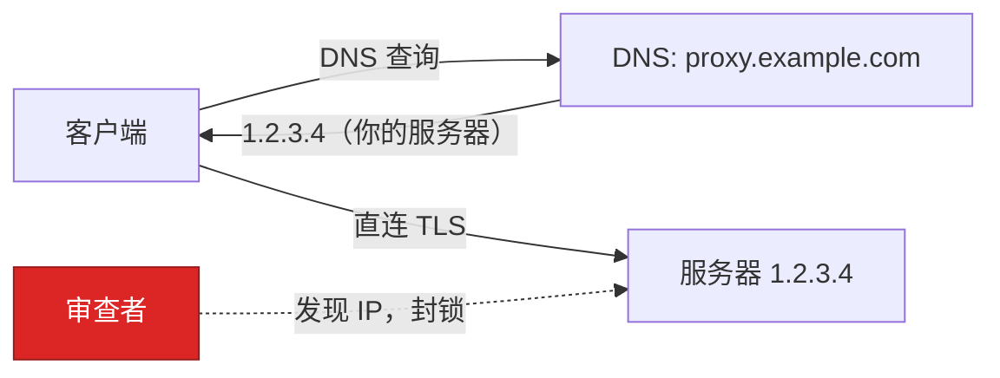
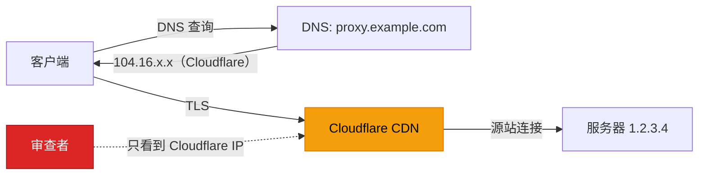

# Cloudflare CDN 部署

本指南介绍如何在 Cloudflare CDN 代理后部署 Prisma，以隐藏服务器真实 IP 地址。这是在受审查网络环境（如 GFW 后）中推荐的部署方案。

## 为什么选择 Cloudflare

### 问题所在

直接连接代理服务器时，服务器的 IP 地址会在两处暴露：

1. **DNS 记录** — 任何人查询你的域名都能看到真实 IP
2. **网络流量** — 目标 IP 对网络观察者可见

审查者可以发现该 IP，将其加入黑名单，你的代理就无法访问了。

### Cloudflare 如何解决

启用 Cloudflare 代理（橙色云朵图标）后，流量路径发生变化：

**没有 Cloudflare：**



**使用 Cloudflare：**



你的真实服务器 IP 永远不会出现在 DNS 响应或客户端的网络流量中。只有 Cloudflare 基础设施知道你的源站 IP。

### 为什么审查者不会封锁 Cloudflare

Cloudflare 承载了约 20% 的网站流量 — 包括大型企业、政府门户和关键服务。封锁 Cloudflare 的 IP 段会对国内互联网造成灾难性的附带损害。你的代理域名与成千上万的正常网站共享相同的 Cloudflare Anycast IP，在 IP 层面无法区分。

### 仍然可能的攻击手段

| 攻击方式 | 描述 | 应对措施 |
|---------|------|---------|
| **SNI 嗅探 (SNI Sniffing)** | TLS ClientHello 中明文包含域名 | 启用 Cloudflare ECH（Encrypted Client Hello），或使用看起来无害的域名 |
| **域名级封锁 (Domain Blocking)** | 审查者封锁你的特定域名 DNS 解析 | 使用加密 DNS（DoH/DoT）— 如通过 HTTPS 使用 `1.1.1.1` 或 `8.8.8.8` |
| **流量分析 (Traffic Analysis)** | 通过数据包大小和时序检测代理特征 | PrismaVeil 每帧填充 (Padding) 和 XHTTP 伪装 |
| **主动探测 (Active Probing)** | 审查者连接你的域名进行服务指纹识别 (Fingerprinting) | CDN `cover_upstream` — 访客和探测器看到的是真实网站 |
| **源站 IP 泄露 (IP Leak)** | 源站服务器在自身 IP 上响应直接连接 | 配置防火墙仅接受 [Cloudflare IP 段](https://www.cloudflare.com/ips/) 的连接 |

## 前提条件

- 一个已注册的域名（如从 Namecheap、Cloudflare Registrar 等购买）
- 一个 Cloudflare 账户（免费计划即可）
- 一台已安装 Prisma 的服务器

## 第 1 步：将域名添加到 Cloudflare

1. 登录 Cloudflare 控制台 → **添加站点** → 输入你的域名
2. 选择 **Free** 计划（支持 WebSocket、gRPC 和 XHTTP）
3. Cloudflare 提供两个域名服务器 — 在域名注册商处更新为 Cloudflare 的 NS 记录
4. 等待 DNS 传播（通常几分钟）

## 第 2 步：创建 DNS 记录

在 Cloudflare DNS 设置中：

| 类型 | 名称 | 内容 | 代理状态 |
|------|------|------|---------|
| A | `proxy`（或任意子域名） | 你的服务器 IP | **已代理**（橙色云朵） |

:::warning
**已代理** 开关（橙色云朵）必须为开启状态。如果设置为"仅 DNS"（灰色云朵），你的真实 IP 将会暴露。
:::

## 第 3 步：生成 Origin 证书

Cloudflare 使用自己的 TLS 证书面向客户端。Cloudflare 与你的服务器之间需要单独的证书。

1. Cloudflare 控制台 → **SSL/TLS** → **源服务器** → **创建证书**
2. 保持默认设置（RSA 2048，15 年有效期）
3. 将证书保存为 `origin-cert.pem`，私钥保存为 `origin-key.pem` 到服务器上

在 SSL/TLS → 概览中，将 Cloudflare 的 SSL/TLS 加密模式设为 **完全（严格）**。

## 第 4 步：配置服务端

```toml
# server.toml

listen_addr = "0.0.0.0:8443"
quic_listen_addr = "0.0.0.0:8443"

[tls]
cert_path = "prisma-cert.pem"
key_path = "prisma-key.pem"

[[authorized_clients]]
id = "your-client-uuid"
auth_secret = "your-auth-secret-hex"
name = "my-client"

# ─── CDN 传输（Cloudflare → 你的服务器）───
[cdn]
enabled = true
listen_addr = "0.0.0.0:443"
ws_tunnel_path = "/ws-tunnel"
grpc_tunnel_path = "/tunnel.PrismaTunnel"

# 伪装流量 — 让你的站点在探测者和访客眼中看起来是真实网站
cover_upstream = "http://127.0.0.1:3000"     # 反向代理到本地网站
# cover_static_dir = "/var/www/html"          # 或提供本地静态文件

# 仅接受 Cloudflare IP（推荐）
trusted_proxies = [
  "173.245.48.0/20",
  "103.21.244.0/22",
  "103.22.200.0/22",
  "103.31.5.0/22",
  "141.101.64.0/18",
  "108.162.192.0/18",
  "190.93.240.0/20",
  "188.114.96.0/20",
  "197.234.240.0/22",
  "198.41.128.0/17",
  "162.158.0.0/15",
  "104.16.0.0/13",
  "104.24.0.0/14",
  "172.64.0.0/13",
  "131.0.72.0/22"
]

[cdn.tls]
cert_path = "origin-cert.pem"                 # Cloudflare Origin 证书
key_path = "origin-key.pem"

# XHTTP 传输路径（可选 — 用于 XHTTP 模式）
xhttp_upload_path = "/api/v1/upload"
xhttp_download_path = "/api/v1/pull"
xhttp_stream_path = "/api/v1/stream"
xhttp_mode = "stream-one"
response_server_header = "nginx"              # 伪装服务器身份
padding_header = true

[logging]
level = "info"
format = "pretty"
```

:::tip
使用 `cover_upstream` 代理一个真实网站（如博客或占位页面）。当 Cloudflare 健康检查访问你的服务器，或有人在浏览器中访问你的域名时，他们看到的是一个正常的网站 — 而不是连接错误或可疑响应。
:::

## 第 5 步：配置客户端

选择四种 CDN 兼容传输之一：

### WebSocket（推荐默认选项）

兼容性最好。Cloudflare 免费计划即可使用，无需额外配置。

```toml
# client.toml

socks5_listen_addr = "127.0.0.1:1080"
http_listen_addr = "127.0.0.1:8080"
server_addr = "proxy.example.com:443"
transport = "ws"

[ws]
url = "wss://proxy.example.com/ws-tunnel"

[identity]
client_id = "your-client-uuid"
auth_secret = "your-auth-secret-hex"
```

### gRPC

吞吐量好。需要在 Cloudflare 控制台 → **网络** → **gRPC** 中启用。

```toml
server_addr = "proxy.example.com:443"
transport = "grpc"

[grpc]
url = "https://proxy.example.com/tunnel.PrismaTunnel/Tunnel"
```

### XHTTP（最高隐蔽性）

流量看起来像普通的 REST API 调用。最难被指纹识别。

```toml
server_addr = "proxy.example.com:443"
transport = "xhttp"
# 可选：添加逼真的请求头
user_agent = "Mozilla/5.0 (Windows NT 10.0; Win64; x64) AppleWebKit/537.36"

[xhttp]
mode = "stream-one"
stream_url = "https://proxy.example.com/api/v1/stream"
```

`packet-up` 模式（即使 CDN 有激进的请求超时也能工作）：

```toml
transport = "xhttp"

[xhttp]
mode = "packet-up"
upload_url = "https://proxy.example.com/api/v1/upload"
download_url = "https://proxy.example.com/api/v1/pull"
```

### XPorta（终极隐蔽性）

流量与正常 Web 应用发起的 REST API 调用完全无法区分。主动探测者看到的是逼真的 401 JSON 错误响应。

```toml
server_addr = "proxy.example.com:443"
transport = "xporta"

[xporta]
base_url = "https://proxy.example.com"
session_path = "/api/auth"
data_paths = ["/api/v1/data", "/api/v1/sync", "/api/v1/update"]
poll_paths = ["/api/v1/notifications", "/api/v1/feed", "/api/v1/events"]
encoding = "json"
poll_concurrency = 3
```

## 传输方式对比

| 传输方式 | Cloudflare 计划 | 延迟 | 隐蔽性 | 最适合 |
|---------|----------------|------|--------|--------|
| **WebSocket** | 免费 | 低 | 好 | 通用 — 最可靠 |
| **gRPC** | 免费（需在控制台启用） | 低 | 好 | 高吞吐量 |
| **XHTTP stream-one** | 免费 | 最低 | 极好 | 最高隐蔽性 — 看起来像长轮询 API |
| **XHTTP packet-up** | 免费 | 中等 | 极好 | 请求超时较短的限制性 CDN |
| **XHTTP stream-up** | 免费 | 低 | 极好 | 隐蔽性与性能的平衡 |
| **XPorta** | 免费 | 低 | 最佳 | 终极隐蔽性 — 与 REST API 无法区分 |

## 第 6 步：加固源站 (Harden the Origin)

即使 Cloudflare 在 DNS 中隐藏了你的 IP，如果源站响应直接连接，真实 IP 仍可能泄露。需要锁定：

### 防火墙（iptables）

仅接受来自 Cloudflare IP 段的 HTTPS 流量：

```bash
# 允许 Cloudflare IP 访问 443 端口
for cidr in 173.245.48.0/20 103.21.244.0/22 103.22.200.0/22 103.31.5.0/22 \
            141.101.64.0/18 108.162.192.0/18 190.93.240.0/20 188.114.96.0/20 \
            197.234.240.0/22 198.41.128.0/17 162.158.0.0/15 104.16.0.0/13 \
            104.24.0.0/14 172.64.0.0/13 131.0.72.0/22; do
  iptables -A INPUT -p tcp --dport 443 -s "$cidr" -j ACCEPT
done

# 拒绝所有其他流量到 443 端口
iptables -A INPUT -p tcp --dport 443 -j DROP
```

### 其他注意事项

- 如果只使用 CDN 传输，**不要公开暴露 8443 端口**。将 `listen_addr` 绑定到 `127.0.0.1:8443` 或用防火墙屏蔽。
- **不要从服务器发送邮件** — 邮件头可能泄露源站 IP。
- **检查 IP 泄露** — 在 [Censys](https://search.censys.io) 和 [Shodan](https://www.shodan.io) 上搜索你的 TLS 证书指纹。
- **使用 Cloudflare 的 Authenticated Origin Pulls** 作为额外验证层，确保请求来自 Cloudflare。

## 第 7 步：验证部署

从客户端机器：

```bash
# 1. 检查 DNS 解析到 Cloudflare（而非你的服务器 IP）
nslookup proxy.example.com
# 应返回 104.16.x.x 或类似的 Cloudflare IP

# 2. 启动客户端
prisma client -c client.toml

# 3. 测试连接
curl --socks5 127.0.0.1:1080 https://httpbin.org/ip
# 应返回代理服务器的 IP（而非你的本地 IP）

# 4. 验证真实服务器 IP 未泄露
curl https://proxy.example.com
# 应返回伪装网站的内容
```

## XMUX 连接池

对于 XHTTP 和 WebSocket 传输，XMUX 随机化连接生命周期以避免指纹识别：

```toml
[xmux]
max_connections_min = 1
max_connections_max = 4
max_concurrency_min = 8
max_concurrency_max = 16
max_lifetime_secs_min = 300
max_lifetime_secs_max = 600
max_requests_min = 100
max_requests_max = 200
```

这会创建多个具有随机生命周期和请求计数的连接，使流量模式更难被指纹识别。

## 故障排除

### 502 Bad Gateway

Cloudflare 无法连接到你的源站。检查：
- 源站服务器正在运行并监听 443 端口
- Origin 证书配置正确
- Cloudflare SSL 模式设为 **完全（严格）**
- 防火墙允许 Cloudflare IP 段

### 522 Connection Timed Out

Cloudflare 到源站的连接超时：
- 验证服务器正在运行：`prisma status`
- 检查 443 端口是否开放：`ss -tlnp | grep 443`
- 本地测试：`curl -k https://127.0.0.1:443`

### WebSocket 断连

- 检查 Cloudflare 控制台 → **网络** → **WebSocket** 是否已启用（免费计划默认启用）
- Cloudflare 对 WebSocket 连接有 100 秒空闲超时 — PrismaVeil 的 keepalive（PING/PONG）会自动处理

### gRPC 不工作

- 在 Cloudflare 控制台 → **网络** → **gRPC** 中启用
- 确保 SSL 模式为 **完全** 或 **完全（严格）**

### SNI 级别封锁 (SNI-based Blocking)

如果你的域名本身被封锁：
- 注册一个名称无害的新域名
- 考虑使用 Cloudflare Workers 作为前端（更高级的方案）
- 使用加密 DNS（DoH）防止域名级别的 DNS 封锁
