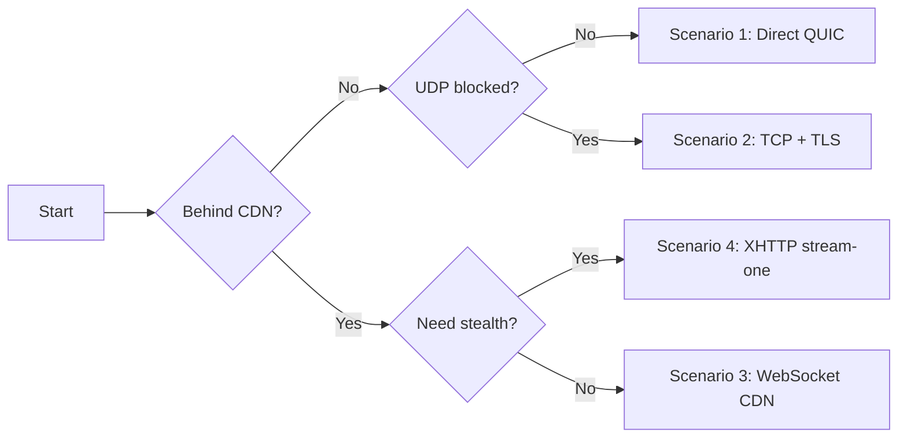

# 配置示例

常见部署场景的即用配置模板。每个示例包含完整的服务端和客户端配置，以及优缺点和推荐使用场景。

使用此流程图找到适合您网络的部署方案：



## 1. 基础 — 直连 QUIC

最简单的部署。客户端通过 QUIC (UDP) 直接连接服务器。

**最适合：** 个人使用，网络无 UDP 阻断或深度包检测。

### 服务端

```toml
listen_addr = "0.0.0.0:8443"
quic_listen_addr = "0.0.0.0:8443"

[tls]
cert_path = "prisma-cert.pem"
key_path = "prisma-key.pem"

[[authorized_clients]]
id = "YOUR-CLIENT-UUID"
auth_secret = "YOUR-AUTH-SECRET-HEX"
name = "my-device"

[logging]
level = "info"
format = "pretty"

[performance]
max_connections = 1024
connection_timeout_secs = 300

[padding]
min = 0
max = 256
```

### 客户端

```toml
socks5_listen_addr = "127.0.0.1:1080"
http_listen_addr = "127.0.0.1:8080"
server_addr = "YOUR-SERVER-IP:8443"
cipher_suite = "chacha20-poly1305"
transport = "quic"
skip_cert_verify = false
fingerprint = "chrome"
quic_version = "auto"

[identity]
client_id = "YOUR-CLIENT-UUID"
auth_secret = "YOUR-AUTH-SECRET-HEX"

[logging]
level = "info"
format = "pretty"
```

| 优点 | 缺点 |
|------|------|
| 最低延迟（QUIC v2 多路复用流） | 服务器 IP 对网络观察者可见 |
| 配置最简单 | 某些网络可能阻断 UDP |
| 无需域名或 CDN | 无主动探测防御 |
| 内置 TLS 1.3 + 浏览器指纹模拟 | IP 可被发现并封锁 |

---

## 2. TCP + TLS 伪装 — 无 CDN 的抗审查方案

将连接包裹在标准 TLS over TCP 中，并配置诱饵回落站点。看起来像普通的 HTTPS 网站连接。

**最适合：** 阻断 UDP 但不使用 CDN 感知 DPI 的网络。

### 服务端

```toml
listen_addr = "0.0.0.0:8443"
quic_listen_addr = "0.0.0.0:8443"

[tls]
cert_path = "/etc/letsencrypt/live/example.com/fullchain.pem"
key_path = "/etc/letsencrypt/live/example.com/privkey.pem"

[[authorized_clients]]
id = "YOUR-CLIENT-UUID"
auth_secret = "YOUR-AUTH-SECRET-HEX"
name = "my-device"

[logging]
level = "info"
format = "pretty"

[performance]
max_connections = 1024
connection_timeout_secs = 300

[padding]
min = 64
max = 256

[camouflage]
enabled = true
tls_on_tcp = true
fallback_addr = "example.com:443"
alpn_protocols = ["h2", "http/1.1"]
```

### 客户端

```toml
socks5_listen_addr = "127.0.0.1:1080"
http_listen_addr = "127.0.0.1:8080"
server_addr = "YOUR-SERVER-IP:8443"
cipher_suite = "chacha20-poly1305"
transport = "tcp"
skip_cert_verify = false
fingerprint = "chrome"
tls_on_tcp = true
tls_server_name = "example.com"
alpn_protocols = ["h2", "http/1.1"]

[identity]
client_id = "YOUR-CLIENT-UUID"
auth_secret = "YOUR-AUTH-SECRET-HEX"

[logging]
level = "info"
format = "pretty"
```

| 优点 | 缺点 |
|------|------|
| 在 UDP 被阻断的网络可用 | 服务器 IP 仍然可见（无 CDN） |
| 主动探测者看到诱饵网站 | 需要有效域名 + TLS 证书 |
| TLS 握手看起来正常 | IP 仍可被直接封锁 |
| 无 CDN 依赖 | 延迟高于 QUIC |

---

## 3. Cloudflare + WebSocket — 可靠的 CDN 代理

最兼容的 CDN 方案。通过 Cloudflare 隐藏服务器 IP，并通过 WebSocket 建立隧道。

**最适合：** 通用抗审查。Cloudflare 免费计划即可使用，无需额外设置。

### 服务端

```toml
listen_addr = "127.0.0.1:8443"
quic_listen_addr = "127.0.0.1:8443"

[tls]
cert_path = "prisma-cert.pem"
key_path = "prisma-key.pem"

[[authorized_clients]]
id = "YOUR-CLIENT-UUID"
auth_secret = "YOUR-AUTH-SECRET-HEX"
name = "my-device"

[logging]
level = "info"
format = "pretty"

[performance]
max_connections = 1024
connection_timeout_secs = 300

[padding]
min = 0
max = 256

[cdn]
enabled = true
listen_addr = "0.0.0.0:443"
ws_tunnel_path = "/ws-tunnel"
cover_upstream = "http://127.0.0.1:3000"
trusted_proxies = [
  "173.245.48.0/20", "103.21.244.0/22", "103.22.200.0/22",
  "103.31.5.0/22", "141.101.64.0/18", "108.162.192.0/18",
  "190.93.240.0/20", "188.114.96.0/20", "197.234.240.0/22",
  "198.41.128.0/17", "162.158.0.0/15", "104.16.0.0/13",
  "104.24.0.0/14", "172.64.0.0/13", "131.0.72.0/22"
]
response_server_header = "nginx"

[cdn.tls]
cert_path = "origin-cert.pem"
key_path = "origin-key.pem"

[management_api]
enabled = true
listen_addr = "0.0.0.0:9090"
auth_token = "YOUR-SECURE-TOKEN"
```

### 客户端

```toml
socks5_listen_addr = "127.0.0.1:1080"
http_listen_addr = "127.0.0.1:8080"
server_addr = "proxy.example.com:443"
cipher_suite = "chacha20-poly1305"
transport = "ws"

[ws]
url = "wss://proxy.example.com/ws-tunnel"

[identity]
client_id = "YOUR-CLIENT-UUID"
auth_secret = "YOUR-AUTH-SECRET-HEX"

[logging]
level = "info"
format = "pretty"
```

| 优点 | 缺点 |
|------|------|
| 服务器 IP 隐藏在 Cloudflare 后 | 需要域名 + Cloudflare 账户 |
| DPI 可检测 WebSocket 升级头 | 伪装站点掩盖服务 |
| Cloudflare 免费计划可用 | 略高的延迟（额外一跳） |
| 最可靠的 CDN 传输 | WebSocket 有 100 秒空闲超时 |

---

## 4. Cloudflare + XHTTP stream-one — 高隐蔽性 CDN

通过 HTTP/2 POST 流建立隧道。无 WebSocket 升级头——比 WebSocket 更难指纹识别。

**最适合：** WebSocket 流量被标记或限速的环境。

### 服务端

```toml
listen_addr = "127.0.0.1:8443"
quic_listen_addr = "127.0.0.1:8443"

[tls]
cert_path = "prisma-cert.pem"
key_path = "prisma-key.pem"

[[authorized_clients]]
id = "YOUR-CLIENT-UUID"
auth_secret = "YOUR-AUTH-SECRET-HEX"
name = "my-device"

[logging]
level = "info"
format = "pretty"

[performance]
max_connections = 1024
connection_timeout_secs = 300

[cdn]
enabled = true
listen_addr = "0.0.0.0:443"
xhttp_stream_path = "/api/v1/stream"
xhttp_mode = "stream-one"
cover_upstream = "http://127.0.0.1:3000"
response_server_header = "nginx"
padding_header = true
trusted_proxies = [
  "173.245.48.0/20", "103.21.244.0/22", "103.22.200.0/22",
  "103.31.5.0/22", "141.101.64.0/18", "108.162.192.0/18",
  "190.93.240.0/20", "188.114.96.0/20", "197.234.240.0/22",
  "198.41.128.0/17", "162.158.0.0/15", "104.16.0.0/13",
  "104.24.0.0/14", "172.64.0.0/13", "131.0.72.0/22"
]

[cdn.tls]
cert_path = "origin-cert.pem"
key_path = "origin-key.pem"
```

### 客户端

```toml
socks5_listen_addr = "127.0.0.1:1080"
http_listen_addr = "127.0.0.1:8080"
server_addr = "proxy.example.com:443"
cipher_suite = "chacha20-poly1305"
transport = "xhttp"
user_agent = "Mozilla/5.0 (Windows NT 10.0; Win64; x64) AppleWebKit/537.36"

[xhttp]
mode = "stream-one"
stream_url = "https://proxy.example.com/api/v1/stream"

[identity]
client_id = "YOUR-CLIENT-UUID"
auth_secret = "YOUR-AUTH-SECRET-HEX"

[xmux]
max_connections_min = 1
max_connections_max = 4
max_lifetime_secs_min = 300
max_lifetime_secs_max = 600

[logging]
level = "info"
format = "pretty"
```

| 优点 | 缺点 |
|------|------|
| 无 WebSocket 升级头 | 长生命周期 H2 POST 可被指纹识别 |
| CDN 延迟最低 | 二进制 `application/octet-stream` Content-Type |
| 标准 HTTP/2 流量 | 固定单一 URL 路径 |
| XMUX 随机化连接生命周期 | 无主动探测防御 |

---

## 5. Cloudflare + XPorta — 最高隐蔽性 CDN

流量与普通 SPA 发起的 REST API 调用无法区分。短生命周期请求、JSON 负载、多个随机路径、基于 Cookie 的会话。最具抗审查能力的传输方式。

**最适合：** 具有高级 DPI 的严格审查环境。当其他所有 CDN 传输都被检测到时使用。

### 服务端

```toml
listen_addr = "127.0.0.1:8443"
quic_listen_addr = "127.0.0.1:8443"

[tls]
cert_path = "prisma-cert.pem"
key_path = "prisma-key.pem"

[[authorized_clients]]
id = "YOUR-CLIENT-UUID"
auth_secret = "YOUR-AUTH-SECRET-HEX"
name = "my-device"

[logging]
level = "info"
format = "pretty"

[performance]
max_connections = 1024
connection_timeout_secs = 300

[cdn]
enabled = true
listen_addr = "0.0.0.0:443"
cover_upstream = "http://127.0.0.1:3000"
response_server_header = "nginx"
trusted_proxies = [
  "173.245.48.0/20", "103.21.244.0/22", "103.22.200.0/22",
  "103.31.5.0/22", "141.101.64.0/18", "108.162.192.0/18",
  "190.93.240.0/20", "188.114.96.0/20", "197.234.240.0/22",
  "198.41.128.0/17", "162.158.0.0/15", "104.16.0.0/13",
  "104.24.0.0/14", "172.64.0.0/13", "131.0.72.0/22"
]

[cdn.tls]
cert_path = "origin-cert.pem"
key_path = "origin-key.pem"

[cdn.xporta]
enabled = true
session_path = "/api/auth"
data_paths = ["/api/v1/data", "/api/v1/sync", "/api/v1/update"]
poll_paths = ["/api/v1/notifications", "/api/v1/feed", "/api/v1/events"]
session_timeout_secs = 300
max_sessions_per_client = 8
cookie_name = "_sess"
encoding = "json"

[management_api]
enabled = true
listen_addr = "0.0.0.0:9090"
auth_token = "YOUR-SECURE-TOKEN"
```

### 客户端

```toml
socks5_listen_addr = "127.0.0.1:1080"
http_listen_addr = "127.0.0.1:8080"
server_addr = "proxy.example.com:443"
cipher_suite = "chacha20-poly1305"
transport = "xporta"

[identity]
client_id = "YOUR-CLIENT-UUID"
auth_secret = "YOUR-AUTH-SECRET-HEX"

[xporta]
base_url = "https://proxy.example.com"
session_path = "/api/auth"
data_paths = ["/api/v1/data", "/api/v1/sync", "/api/v1/update"]
poll_paths = ["/api/v1/notifications", "/api/v1/feed", "/api/v1/events"]
encoding = "json"
poll_concurrency = 3
upload_concurrency = 4
max_payload_size = 65536
poll_timeout_secs = 55

[logging]
level = "info"
format = "pretty"
```

| 优点 | 缺点 |
|------|------|
| 与正常 REST API 流量无法区分 | ~37% 额外开销（JSON+base64 编码） |
| 主动探测防御（401 JSON 响应） | 略高的延迟（长轮询） |
| 多个随机 URL 路径 | 配置较为复杂 |
| 短生命周期请求（无可指纹识别的长流） | 需要 Cloudflare + 域名 |
| 基于 Cookie 的会话（标准 HTTP） | 吞吐量低于 XHTTP 二进制模式 |

:::tip
如需更高吞吐量（略微降低隐蔽性），可在服务端和客户端都设置 `encoding = "binary"`。这将额外开销从 ~37% 降低到 ~0.5%。
:::

---

## 6. QUIC + 端口跳变 + Salamander — 直连抗封锁

结合 QUIC 端口跳变（轮换 UDP 端口）和 Salamander UDP 混淆。无需 CDN 即可对抗基于端口的封锁和基本 UDP 指纹识别。

**最适合：** 封锁特定 UDP 端口但不对所有端口进行深度包检测的网络。

### 服务端

```toml
listen_addr = "0.0.0.0:8443"
quic_listen_addr = "0.0.0.0:8443"

[tls]
cert_path = "prisma-cert.pem"
key_path = "prisma-key.pem"

[[authorized_clients]]
id = "YOUR-CLIENT-UUID"
auth_secret = "YOUR-AUTH-SECRET-HEX"
name = "my-device"

[logging]
level = "info"
format = "pretty"

[performance]
max_connections = 1024
connection_timeout_secs = 300

[padding]
min = 64
max = 512

[camouflage]
enabled = true
salamander_password = "YOUR-SHARED-OBFUSCATION-KEY"
alpn_protocols = ["h3"]

# 流量整形（抗指纹识别）
[traffic_shaping]
padding_mode = "bucket"
bucket_sizes = [128, 256, 512, 1024, 2048, 4096, 8192, 16384]
timing_jitter_ms = 5
chaff_interval_ms = 500

[congestion]
mode = "bbr"

[port_hopping]
enabled = true
base_port = 10000
port_range = 50000
interval_secs = 30
grace_period_secs = 10
```

### 客户端

```toml
socks5_listen_addr = "127.0.0.1:1080"
http_listen_addr = "127.0.0.1:8080"
server_addr = "YOUR-SERVER-IP:8443"
cipher_suite = "chacha20-poly1305"
transport = "quic"
skip_cert_verify = false
fingerprint = "chrome"
quic_version = "v2"
salamander_password = "YOUR-SHARED-OBFUSCATION-KEY"
alpn_protocols = ["h3"]
entropy_camouflage = true

[identity]
client_id = "YOUR-CLIENT-UUID"
auth_secret = "YOUR-AUTH-SECRET-HEX"

[traffic_shaping]
padding_mode = "bucket"

[congestion]
mode = "bbr"

[port_hopping]
enabled = true

[logging]
level = "info"
format = "pretty"
```

| 优点 | 缺点 |
|------|------|
| 最低延迟（直连 QUIC） | 服务器 IP 可见（无 CDN） |
| 端口轮换对抗端口封锁 | 服务器需要开放大量 UDP 端口 |
| Salamander 混淆 UDP 负载 | IP 仍可被直接封锁 |
| 无需域名或 CDN | 对 DPI 无效 |

---

## 7. 全功能 — 全部启用

生产部署，启用所有功能：CDN 传输（XPorta + WebSocket + XHTTP）、端口转发、管理 API、控制台、伪装和带宽控制。

**最适合：** 服务多个客户端的共享代理服务器，需要完整可观测性。

### 服务端

```toml
listen_addr = "0.0.0.0:8443"
quic_listen_addr = "0.0.0.0:8443"
dns_upstream = "8.8.8.8:53"

[tls]
cert_path = "/etc/letsencrypt/live/example.com/fullchain.pem"
key_path = "/etc/letsencrypt/live/example.com/privkey.pem"

[[authorized_clients]]
id = "CLIENT-UUID-1"
auth_secret = "CLIENT-SECRET-1-HEX"
name = "laptop"
bandwidth_up = "100mbps"
bandwidth_down = "500mbps"
quota = "500GB"
quota_period = "monthly"

[[authorized_clients]]
id = "CLIENT-UUID-2"
auth_secret = "CLIENT-SECRET-2-HEX"
name = "phone"
bandwidth_up = "50mbps"
bandwidth_down = "200mbps"

[logging]
level = "info"
format = "json"

[performance]
max_connections = 2048
connection_timeout_secs = 600

[padding]
min = 32
max = 256

[port_forwarding]
enabled = true
port_range_start = 10000
port_range_end = 20000

[camouflage]
enabled = true
tls_on_tcp = true
fallback_addr = "example.com:443"
alpn_protocols = ["h2", "http/1.1"]
salamander_password = "YOUR-OBFUSCATION-KEY"

[traffic_shaping]
padding_mode = "random"
timing_jitter_ms = 3

[congestion]
mode = "bbr"

[port_hopping]
enabled = true
base_port = 20000
port_range = 40000
interval_secs = 60
grace_period_secs = 10

[cdn]
enabled = true
listen_addr = "0.0.0.0:443"
ws_tunnel_path = "/ws-tunnel"
grpc_tunnel_path = "/tunnel.PrismaTunnel"
xhttp_stream_path = "/api/v1/stream"
xhttp_upload_path = "/api/v1/upload"
xhttp_download_path = "/api/v1/pull"
xhttp_mode = "stream-one"
cover_upstream = "http://127.0.0.1:3000"
response_server_header = "nginx"
padding_header = true
expose_management_api = true
management_api_path = "/prisma-mgmt"
trusted_proxies = [
  "173.245.48.0/20", "103.21.244.0/22", "103.22.200.0/22",
  "103.31.5.0/22", "141.101.64.0/18", "108.162.192.0/18",
  "190.93.240.0/20", "188.114.96.0/20", "197.234.240.0/22",
  "198.41.128.0/17", "162.158.0.0/15", "104.16.0.0/13",
  "104.24.0.0/14", "172.64.0.0/13", "131.0.72.0/22"
]

[cdn.tls]
cert_path = "origin-cert.pem"
key_path = "origin-key.pem"

[cdn.xporta]
enabled = true
session_path = "/api/auth"
data_paths = ["/api/v1/data", "/api/v1/sync", "/api/v1/update"]
poll_paths = ["/api/v1/notifications", "/api/v1/feed", "/api/v1/events"]
session_timeout_secs = 300
max_sessions_per_client = 8
cookie_name = "_sess"
encoding = "json"

[management_api]
enabled = true
listen_addr = "0.0.0.0:9090"
auth_token = "YOUR-SECURE-TOKEN"
console_dir = "/opt/prisma/console"

# 静态路由规则（重启后保持不变）
[routing]
# geoip_path = "/etc/prisma/geoip.dat"

[[routing.rules]]
type = "ip-cidr"
value = "10.0.0.0/8"
action = "block"

[[routing.rules]]
type = "ip-cidr"
value = "172.16.0.0/12"
action = "block"

[[routing.rules]]
type = "domain-keyword"
value = "torrent"
action = "block"

[[routing.rules]]
type = "all"
action = "direct"
```

### 客户端（XPorta — 最高隐蔽性）

```toml
socks5_listen_addr = "127.0.0.1:1080"
http_listen_addr = "127.0.0.1:8080"
server_addr = "proxy.example.com:443"
cipher_suite = "chacha20-poly1305"
transport = "xporta"
user_agent = "Mozilla/5.0 (Windows NT 10.0; Win64; x64) AppleWebKit/537.36"
fingerprint = "chrome"

[identity]
client_id = "CLIENT-UUID-1"
auth_secret = "CLIENT-SECRET-1-HEX"

[traffic_shaping]
padding_mode = "random"

[xporta]
base_url = "https://proxy.example.com"
session_path = "/api/auth"
data_paths = ["/api/v1/data", "/api/v1/sync", "/api/v1/update"]
poll_paths = ["/api/v1/notifications", "/api/v1/feed", "/api/v1/events"]
encoding = "json"
poll_concurrency = 3
upload_concurrency = 4
max_payload_size = 65536
poll_timeout_secs = 55

[[port_forwards]]
name = "my-web-app"
local_addr = "127.0.0.1:3000"
remote_port = 10080

[logging]
level = "info"
format = "pretty"
```

| 优点 | 缺点 |
|------|------|
| 最大灵活性——支持所有传输方式 | 配置复杂 |
| 单客户端带宽 + 配额控制 | 资源消耗较高 |
| 完整可观测性（控制台 + API） | 需要域名 + CDN + 伪装站点 |
| 主动探测防御（XPorta + 伪装站点） | 更多需要加固的攻击面 |
| 端口转发用于 NAT 后服务 | — |

---

## 8. TUN 模式 — 系统级代理

使用 TUN 虚拟网络设备将所有系统流量路由通过代理。无需为每个应用单独配置 SOCKS5。

**最适合：** 需要所有流量都通过代理的设备，包括不支持 SOCKS5 的应用。

### 客户端

```toml
socks5_listen_addr = "127.0.0.1:1080"
server_addr = "YOUR-SERVER-IP:8443"
cipher_suite = "chacha20-poly1305"
transport = "quic"
skip_cert_verify = false
fingerprint = "chrome"
quic_version = "auto"

[identity]
client_id = "YOUR-CLIENT-UUID"
auth_secret = "YOUR-AUTH-SECRET-HEX"

[dns]
mode = "fake"
fake_ip_range = "198.18.0.0/15"
upstream = "8.8.8.8:53"
dns_listen_addr = "127.0.0.1:53"

[tun]
enabled = true
device_name = "prisma-tun0"
mtu = 1500
include_routes = ["0.0.0.0/0"]
# exclude_routes 自动排除服务器 IP
dns = "fake"

# 基于 GeoIP 的分流路由
[routing]
geoip_path = "/etc/prisma/geoip.dat"

# 私有/本地网络直连（通过 GeoIP）
[[routing.rules]]
type = "geoip"
value = "private"
action = "direct"

# 中国 IP 直连（国内流量绕过代理）
[[routing.rules]]
type = "geoip"
value = "cn"
action = "direct"

# 中国域名直连
[[routing.rules]]
type = "domain-suffix"
value = "cn"
action = "direct"

[[routing.rules]]
type = "domain-suffix"
value = "baidu.com"
action = "direct"

[[routing.rules]]
type = "domain-suffix"
value = "qq.com"
action = "direct"

# 拦截广告
[[routing.rules]]
type = "domain-keyword"
value = "ads"
action = "block"

# 其余全部走代理
[[routing.rules]]
type = "all"
action = "proxy"

[logging]
level = "info"
format = "pretty"
```

:::warning
TUN 模式需要 root/管理员权限。在 Linux 上使用 `sudo` 运行或授予 `CAP_NET_ADMIN` 能力。
:::

| 优点 | 缺点 |
|------|------|
| 所有系统流量自动代理 | 需要 root/管理员权限 |
| 无需为每个应用配置 SOCKS5 | 配置不当可能导致 DNS 泄露 |
| 虚假 DNS 防止 DNS 泄露 | 复杂度较高 |
| 路由规则实现分流 | TUN 支持因平台而异 |

---

## 快速对比

| 示例 | 隐蔽性 | 延迟 | 复杂度 | 需要 CDN | 最适合 |
|------|--------|------|--------|---------|--------|
| 1. 基础 QUIC | 低 | 最低 | 简单 | 否 | 个人使用，无阻断网络 |
| 2. TCP + 伪装 | 中 | 低 | 中等 | 否 | UDP 被阻断，无 DPI |
| 3. CF + WebSocket | 好 | 中 | 中等 | 是 | 通用抗审查 |
| 4. CF + XHTTP | 高 | 低 | 中等 | 是 | WebSocket 被标记的网络 |
| 5. CF + XPorta | 最高 | 中 | 高 | 是 | 高级 DPI 环境 |
| 6. QUIC + 端口跳变 | 中 | 最低 | 中等 | 否 | 端口被封锁的网络 |
| 7. 全功能 | 最高 | 中 | 高 | 是 | 共享服务器，完全控制 |
| 8. TUN 模式 | 取决于传输 | 取决于传输 | 中等 | 否 | 系统级代理 |

:::tip 选择配置建议
- **从简单开始**：先尝试示例 1（基础 QUIC）。如果可用，就无需更复杂的配置。
- **UDP 被阻断？** 尝试示例 2（TCP + 伪装）或直接跳到示例 3+（CDN）。
- **需要隐藏服务器 IP？** 使用任意 CDN 示例（3、4、5 或 7）。
- **高级 DPI？** 使用示例 5（XPorta）— 对流量分析抗性最强。
- **全部流量？** 将 TUN 模式（示例 8）添加到任何方案中。
:::
