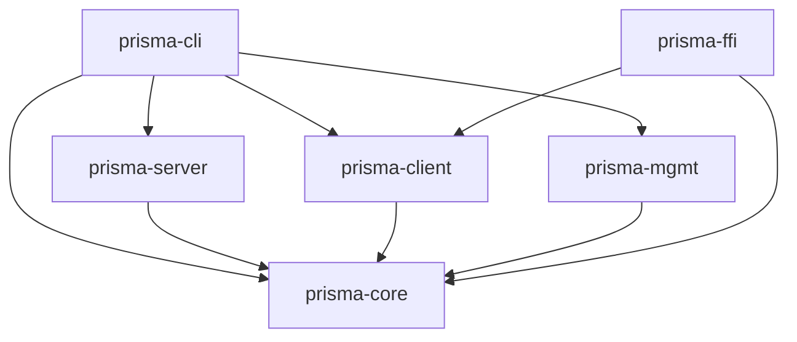

# 开发者文档

Prisma 代理系统的全面内部参考文档 -- 架构、模块 API、线路协议、配置字段、CLI 命令、管理端点、FFI 函数及扩展指南。

**工作区版本：** v2.32.0 | **协议：** PrismaVeil v5 | **Rust 版本：** 2021

## 工作区架构

| Crate | 角色 |
|-------|------|
| **prisma-core** | 共享库：加密、协议、配置、路由、DNS、多路复用 |
| **prisma-server** | 服务端：监听器、中继、认证、伪装、热重载 |
| **prisma-client** | 客户端：SOCKS5/HTTP、传输选择、TUN、连接池 |
| **prisma-cli** | CLI：服务端/客户端运行、管理命令、守护进程 |
| **prisma-mgmt** | 管理 API：REST + WebSocket、认证中间件 |
| **prisma-ffi** | C FFI 共享库：生命周期、配置文件、系统代理 |

## 子页面

| 页面 | 内容 |
|------|------|
| [prisma-core](./prisma-core) | 共享库参考 |
| [prisma-server](./prisma-server) | 服务端参考 |
| [prisma-client](./prisma-client) | 客户端参考 |
| [prisma-mgmt](./prisma-mgmt) | 管理 API 参考 |
| [prisma-ffi](./prisma-ffi) | FFI 参考 |
| [prisma-cli](./prisma-cli) | CLI 参考 |
| [protocol](./protocol) | 协议参考 |
| [contributing](./contributing) | 贡献指南 |
