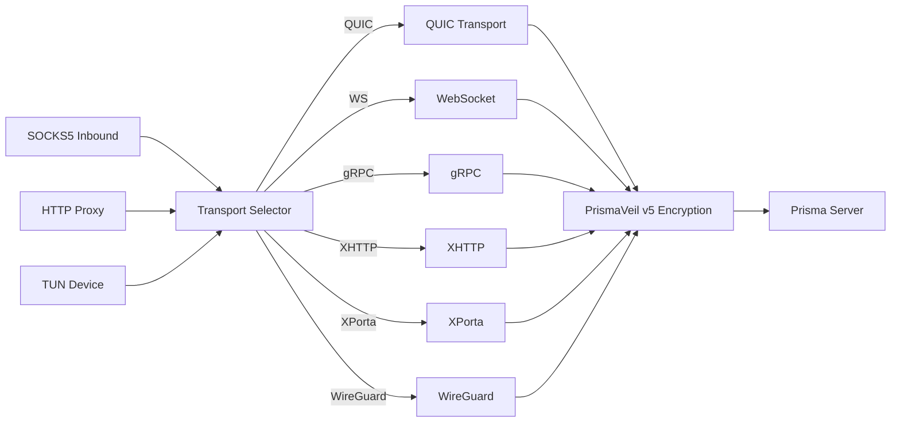

# prisma-client 参考

客户端库 crate。提供 SOCKS5/HTTP 代理、传输选择、TUN 模式、连接池、DNS 解析等。

## 客户端架构

## 传输选择

QUIC、PrismaTLS、WebSocket、gRPC、XHTTP、XPorta、SSH、WireGuard

## TUN 模式

支持分应用过滤：`{"mode": "include", "apps": ["Firefox"]}`

详细内容请参阅英文版本。
