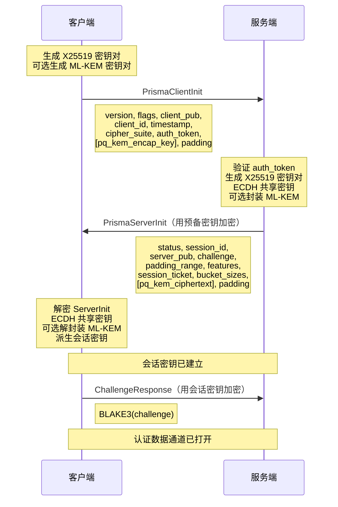
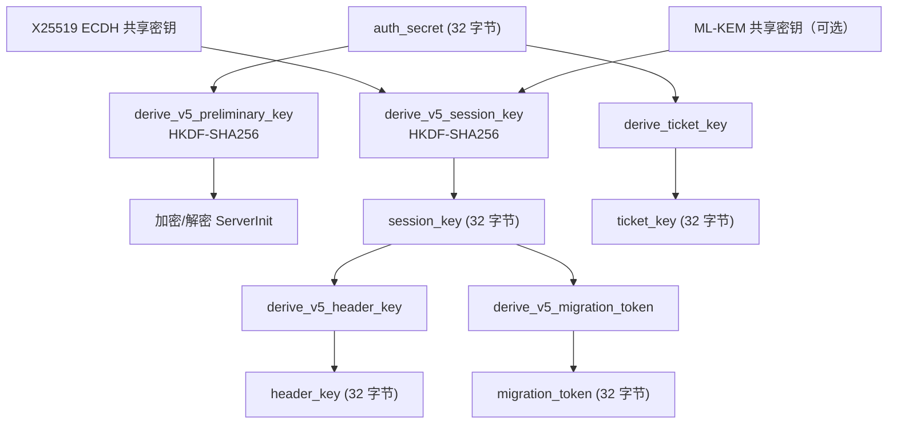
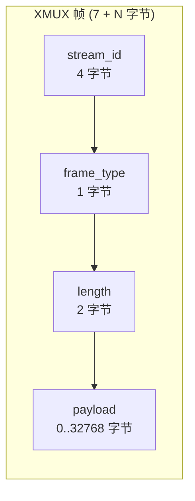

# 线路协议参考

PrismaVeil v5 线路协议的完整规范，包括握手、帧格式、命令字节、标志、nonce 构造、密钥派生、会话票据、XMUX 帧和 WireGuard 数据包格式。

---

## PrismaVeil v5 握手

握手在 **1 RTT**（2条消息）内建立共享会话密钥。



### PrismaClientInit 线路格式

```
[version: 1 字节]
[flags: 1 字节]
[client_ephemeral_pub: 32 字节]
[client_id: 16 字节 (UUID)]
[timestamp: 8 字节 (BE u64)]
[cipher_suite: 1 字节]
[auth_token: 32 字节 (HMAC-BLAKE3)]
[pq_kem_encap_key_len: 2 字节]     -- 仅当 FLAG_PQ_KEM
[pq_kem_encap_key: 可变]            -- 仅当 FLAG_PQ_KEM (ML-KEM-768: 1184 字节)
[padding: 可变]
```

### PrismaServerInit 线路格式

发送前用预备密钥加密：

```
[status: 1 字节]
[session_id: 16 字节 (UUID)]
[server_ephemeral_pub: 32 字节]
[challenge: 32 字节 (随机)]
[padding_min: 2 字节 (BE u16)]
[padding_max: 2 字节 (BE u16)]
[server_features: 4 字节 (BE u32, 位掩码)]
[ticket_len: 2 字节 (BE u16)]
[session_ticket: 可变]
[bucket_count: 2 字节 (BE u16)]
[bucket_sizes: 2 * bucket_count 字节]
[pq_kem_ciphertext_len: 2 字节]   -- 仅当 FEATURE_PQ_KEM
[pq_kem_ciphertext: 可变]          -- 仅当 FEATURE_PQ_KEM (ML-KEM-768: 1088 字节)
[padding: 可变]
```

---

## 密钥派生链



---

## 帧格式

### 外层线路格式（加密后）

```
[frame_length: 2 字节 (BE u16)]
[encrypted_frame: frame_length 字节]
```

最大 `frame_length`：32768 字节。

### 内层帧格式（解密后）

```
[cmd: 1 字节]
[flags: 2 字节 (LE u16)]
[stream_id: 4 字节 (BE u32)]
[payload: 可变]
```

---

## Nonce 构造

12 字节 nonce 由方向标志和单调递增计数器构造：

```
[direction: 1 字节] [零填充: 3 字节] [counter: 8 字节 (BE u64)]
```

| 方向 | 字节 0 |
|------|--------|
| 客户端 -> 服务端 | `0x00` |
| 服务端 -> 客户端 | `0x01` |

---

## 命令字节

| 字节 | 常量 | 方向 | 描述 |
|------|------|------|------|
| `0x01` | `CMD_CONNECT` | C->S | 打开代理连接 |
| `0x02` | `CMD_DATA` | 双向 | 中继数据 |
| `0x03` | `CMD_CLOSE` | 双向 | 关闭流 |
| `0x04` | `CMD_PING` | 双向 | 保活 ping |
| `0x05` | `CMD_PONG` | 双向 | 保活 pong |
| `0x06` | `CMD_REGISTER_FORWARD` | C->S | 注册端口转发 |
| `0x07` | `CMD_FORWARD_READY` | S->C | 确认端口转发 |
| `0x08` | `CMD_FORWARD_CONNECT` | S->C | 转发新连接 |
| `0x09` | `CMD_UDP_ASSOCIATE` | C->S | 建立 UDP 中继 |
| `0x0A` | `CMD_UDP_DATA` | 双向 | UDP 数据报 |
| `0x0B` | `CMD_SPEED_TEST` | 双向 | 带宽测量 |
| `0x0C` | `CMD_DNS_QUERY` | C->S | 加密 DNS 查询 |
| `0x0D` | `CMD_DNS_RESPONSE` | S->C | 加密 DNS 响应 |
| `0x0E` | `CMD_CHALLENGE_RESP` | C->S | 质询响应 |
| `0x0F` | `CMD_MIGRATION` | C->S | 连接迁移 (v5) |

---

## 帧标志

2 字节小端位掩码：

| 位 | 值 | 描述 |
|-----|------|------|
| 0 | `0x0001` | 随机填充 |
| 1 | `0x0002` | 前向纠错数据 |
| 2 | `0x0004` | 高优先级帧 |
| 3 | `0x0008` | UDP 数据报模式 |
| 4 | `0x0010` | 有效载荷已压缩 |
| 5 | `0x0020` | 0-RTT 恢复帧 |
| 6 | `0x0040` | 桶填充（抗 TLS 指纹） |
| 7 | `0x0080` | 混淆流量（丢弃） |
| 8 | `0x0100` | 头部作为 AAD 绑定 (v5) |
| 9 | `0x0200` | 携带迁移令牌 (v5) |

---

## XMUX 帧格式



| 值 | 类型 | 描述 |
|-----|------|------|
| `0x01` | SYN | 打开新流 |
| `0x02` | DATA | 流数据 |
| `0x03` | FIN | 正常关闭 |
| `0x04` | RST | 错误重置 |

---

## WireGuard 数据包格式

| 类型 | 值 | 描述 |
|------|-----|------|
| 握手发起 | `1` | 客户端 -> 服务端 |
| 握手响应 | `2` | 服务端 -> 客户端 |
| Cookie 回复 | `3` | DDoS 保护 |
| 传输数据 | `4` | 加密数据载荷 |

Prisma 数据封装在类型 4（传输数据）消息中。
