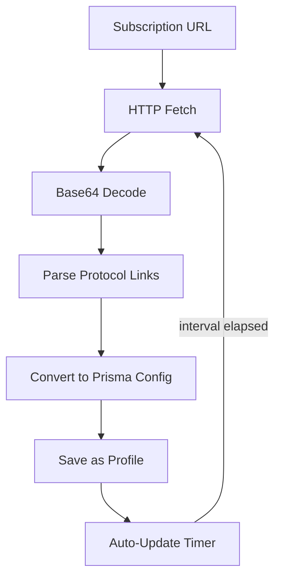

import Tabs from '@theme/Tabs';
import TabItem from '@theme/TabItem';

# GUI 客户端

Prisma 提供统一的 GUI 客户端，覆盖所有主流平台。**prisma-gui** 是一个基于 **Tauri 2 + React** 的跨平台应用，可从单一代码库编译到 Windows、macOS、Linux、Android 和 iOS 五个平台。Tauri 2 的移动端支持消除了对独立原生应用的需求——同一个 Rust 后端和 React 前端编译到所有五个目标平台。

```
prisma-gui  (Tauri 2 + React 19)
    |
    |-- 桌面端:  Windows / macOS / Linux   (Tauri 桌面目标)
    +-- 移动端:  Android / iOS             (Tauri 2 移动目标)
              |
              +-- prisma-ffi  (C-ABI 共享库，由 Tauri 移动 shell 链接)
```

---

## prisma-gui（桌面端）

主要的桌面客户端是一个 **Tauri 2** 应用，前端使用 **React + TypeScript**。它提供了一个功能完整的 GUI，可在 Windows、macOS 和 Linux 上通过单一代码库管理 Prisma 连接。

### 架构

```
React (Vite + React Router) ─── Tauri IPC ─── Rust commands ─── prisma-ffi
                                                    │
                                            系统托盘 (桌面端)
```

前端使用 **Zustand** 进行状态管理，**Recharts** 绘制图表，**Radix UI** 作为组件库，**react-i18next** 实现国际化（英文 + 简体中文），**TailwindCSS** 进行样式设计。

### 页面

应用有 **11 个页面**，可通过侧边栏导航（可折叠）或窄视口下的底部导航访问：

| 页面 | 描述 |
|------|------|
| **主页** | 连接开关、实时速度图表（带当前速度标签 &#8593;/&#8595; MB/s）、会话统计（上传/下载速度、已传输数据、运行时间）、代理模式选择器（SOCKS5/系统代理/TUN/按应用）、连接质量指示器、每日数据用量、连接历史 |
| **配置文件** | 配置文件列表，支持搜索、排序（按名称/最近使用/延迟）、每个配置文件的指标（延迟、总数据量、会话数、峰值速度）。通过**选项卡对话框**创建/编辑，包含连接、认证、传输、路由和 TUN、高级设置选项卡。传输选择器支持全部 8 种传输方式：**TCP**、**QUIC**、**WebSocket**、**gRPC**、**XHTTP**、**XPorta**、**PrismaTLS**、**WireGuard**。端口跳跃、熵伪装和 SNI 切片等 QUIC 专属设置仅在选择 QUIC 传输时显示。**5 个预设模板**：隐蔽 Cloudflare（XPorta + CDN）、低延迟 QUIC、PrismaTLS 直连、SSH 隧道和 WireGuard VPN——每个预设都会预填传输特定字段以便快速设置。支持以 TOML、prisma:// URI 或二维码分享配置文件。可从二维码扫描、二维码图片文件或 JSON 文件导入。复制对话框支持编辑名称，支持批量导出/导入。移动端优化工具栏（溢出菜单）。**延迟测试** —— 点击服务器运行实时延迟测试；结果内联显示并持久化用于排序 |
| **订阅** | 管理自动更新服务器配置文件的订阅 URL。添加/编辑/删除订阅，支持自定义更新间隔（1h-7d）。手动刷新、启动时自动刷新、从剪贴板或二维码导入。订阅状态指示器（最后更新时间、服务器数量、到期日期）。支持 Prisma、Clash 和 base64 订阅格式 |
| **代理组** | 可视化代理组管理器。创建 Select/AutoUrl/Fallback/LoadBalance 组。拖放排序服务器。每个服务器实时延迟指示器。Select 组手动选择服务器。AutoUrl/Fallback 组 URL 测试配置 |
| **导入** | 统一导入页面，从多个来源添加服务器和配置文件：二维码扫描（移动端摄像头、桌面端粘贴）、二维码图片文件（选择截图或保存的二维码图片）、`prisma://` URI、剪贴板检测、TOML 文件、JSON 文件、订阅 URL 和 Clash YAML。批量导入，支持预览和选择性添加 |
| **连接** | 实时活跃连接列表，显示目标地址、匹配规则、代理链、上传/下载速度和每连接总数据。使用虚拟化列表高效渲染 1000+ 并发连接。可关闭单个连接。按域名、IP 或规则过滤。按速度、数据或持续时间排序。页面重载和应用恢复时正确检测重连状态 |
| **路由规则** | 路由规则编辑器，支持 DOMAIN、IP-CIDR、GEOIP 和 FINAL 规则类型。操作：PROXY、DIRECT、REJECT 或代理组名称。支持 JSON 格式导入/导出规则。规则提供者管理（添加远程规则集 URL）。移动端响应式表格（小屏幕隐藏匹配列） |
| **日志** | 实时日志查看器，虚拟化滚动，搜索并高亮匹配文本，级别过滤（ALL/ERROR/WARN/INFO/DEBUG），级别统计标签，暂停/恢复自动滚动，导出为文本文件 |
| **速度测试** | 通过代理运行速度测试，可配置服务器（Cloudflare/Google）和持续时间（5-60 秒）。测量下载、上传和延迟。持久化测试历史，支持列表和图表视图，汇总统计（平均值/最佳值） |
| **设置** | 语言（英文/中文）、主题（跟随系统/浅色/深色）、开机启动、最小化到托盘、代理端口（HTTP/SOCKS5）、**局域网服务模式**（`allowLan` 将本地代理绑定到 0.0.0.0 以便局域网共享）、DNS 设置（直连/隧道/Fake-IP/智能）、自动重连（可配置延迟和最大尝试次数）、数据管理（导出/导入设置和完整备份）、自动更新检查和安装。**分流设置** -- 可视化双列编辑器，用于代理/直连域名路由，支持在两列之间拖放。 |
| **网络诊断** | 内置网络诊断工具 -- 延迟测试、DNS 查询和连接测试。三个卡片分别提供输入框和测试按钮，结果内联显示并带颜色编码的通过/失败指示器 |
| **数据分析** | 连接分析、热门域名、每日趋势、规则分布、CSV 导出 |

### 订阅流程

订阅系统自动从远程 URL 获取并更新服务器配置文件：



### 系统托盘集成

在桌面平台上，prisma-gui 显示一个**系统托盘图标**，具有以下功能：

- **状态感知图标** — 在断开连接、正在连接和已连接状态之间切换
- **连接/断开切换** — 从托盘菜单快速连接/断开
- **配置文件切换器** — 列出所有配置文件的子菜单，当前活跃的配置文件带有标记
- **复制代理地址** — 将本地代理地址复制到剪贴板
- **复制终端代理** — 复制平台适配的代理导出命令（如 `export https_proxy=...`），方便终端使用
- **实时工具提示** — 显示实时上传/下载速度（如 "Prisma Up: 1.2 MB/s Down: 4.5 MB/s"）
- **显示窗口/退出** — 标准窗口管理操作

### 键盘快捷键

所有快捷键使用 `Cmd`（macOS）或 `Ctrl`（Windows/Linux）作为修饰键：

| 快捷键 | 操作 |
|--------|------|
| `Mod+1` 到 `Mod+6` | 导航到主页、配置文件、路由规则、日志、速度测试、设置 |
| `Mod+K` | 切换连接/断开 |
| `Mod+N` | 前往配置文件页面 |

### 连接管理

- **代理模式** — 在主页可选择：SOCKS5、系统代理、TUN、按应用（可同时启用多个）
- **自动重连** — 在设置中配置重试延迟（秒）和最大尝试次数
- **连接历史** — 记录连接/断开事件，包含配置文件名称、延迟、会话传输数据和时间戳
- **连接质量指示器** — 基于速度稳定性的实时信号质量（优秀/良好/一般/较差）
- **每日数据用量追踪** — 持久化的每日上传/下载追踪，自动清理 90 天前的数据
- **快速连接悬浮按钮** — 移动端悬浮操作按钮，一键连接/断开，显示已连接时长标记

### 通知

- **状态栏** — 底部持久显示的状态栏，展示连接状态、实时速度/数据统计和消息通知
- **速度图表** — 实时速度图表现在显示当前速度标签，未连接时显示断开占位图
- **通知历史** — 铃铛图标带未读标记；点击查看完整通知历史，包含时间戳和严重级别（错误、警告、成功、信息）
- **桌面通知** — 通过 Tauri 通知插件

### 摄像头二维码扫描

除了从图片文件导入二维码和粘贴 URI 之外，prisma-gui 在桌面平台还支持通过摄像头实时扫描配置二维码。在导入或配置文件页面点击摄像头图标即可激活摄像头画面。检测到的二维码会立即解析并提示导入配置。

### 连接时间线

连接页面包含一个 SVG 水平时间线，显示 5 分钟滑动窗口内的活跃连接条。每个条形代表一个活跃连接的生命周期。鼠标悬停可查看包含目标地址、传输方式、匹配规则和已传输数据的工具提示。

### 剪贴板导入

当应用窗口获得焦点时，会自动检查剪贴板中的 `prisma://` URI，并提示用户导入检测到的配置文件。

### 构建

```bash
cd apps/prisma-gui

# 开发
npm run dev
npm run tauri dev

# 生产
npm run tauri build
# 输出：平台特定的安装包（MSI、DMG、AppImage、deb）
```

### 安装

从[发布页面](https://github.com/prisma-proxy/prisma/releases/latest)下载适合您平台的安装包：

- **Windows**：`prisma-gui_x.y.z_x64-setup.exe` 或 `.msi`
- **macOS**：`prisma-gui_x.y.z_aarch64.dmg` 或 `_x64.dmg`
- **Linux**：`.AppImage`、`.deb` 或 `.rpm`

---

## 功能对比

| 功能 | prisma-gui（桌面端） | Android | iOS |
|------|---------------------|---------|-----|
| SOCKS5 代理 | ✓ | ✓ | ✓ |
| 系统代理 | ✓ | ✓ | — |
| TUN 模式 | ✓ | ✓ (VPN) | ✓ (NEPacketTunnel) |
| 按应用代理 | ✓ | ✓ | ✓ (NEAppProxy) |
| 二维码导入 | ✓ (粘贴 URI / 图片文件) | ✓ (摄像头 / 图片文件) | ✓ (摄像头 / 图片文件) |
| 配置分享 (TOML/URI/QR) | ✓ | — | — |
| 速度图表 | ✓ | ✓ | ✓ |
| 速度测试（含历史） | ✓ | — | — |
| 路由规则编辑器 | ✓ | ✓ | ✓ |
| 自动更新 | ✓ | ✓ | App Store |
| 系统托盘/菜单栏 | ✓ | — | — |
| 键盘快捷键 | ✓ | — | — |
| 剪贴板导入 | ✓ | — | — |
| 自动重连 | ✓ | — | — |
| 通知历史 | ✓ | — | — |
| 国际化（英文 + 中文） | ✓ | — | — |
| 完整备份/恢复 | ✓ | — | — |
| 连接历史 | ✓ | — | — |
| 每日数据用量追踪 | ✓ | — | — |
| 网络诊断（延迟/DNS/连接测试） | ✓ | ✓ | ✓ |
| 分流编辑器 | ✓ | ✓ | ✓ |
| 摄像头二维码扫描 | ✓ | ✓（摄像头） | ✓（摄像头） |
| 连接时间线 | ✓ | ✓ | ✓ |

---

## prisma-ffi

所有 GUI 客户端都链接 `prisma-ffi`，这是一个 `cdylib`/`staticlib` crate，通过稳定的 C ABI 暴露完整的 Prisma 客户端 API。头文件位于 `crates/prisma-ffi/include/prisma_ffi.h`。

### 核心函数

```c
// Lifecycle
PrismaHandle* prisma_create(void);
void          prisma_destroy(PrismaHandle* h);

// Connection
int  prisma_connect(PrismaHandle* h, const char* config_json, uint32_t modes);
int  prisma_disconnect(PrismaHandle* h);
int  prisma_get_status(PrismaHandle* h);

// Events (stats, logs, status changes — delivered as JSON)
void prisma_set_callback(PrismaHandle* h, PrismaCallbackFn cb, void* userdata);

// Profiles
char* prisma_profiles_list_json(void);
int   prisma_profile_save(const char* json);
int   prisma_profile_delete(const char* id);
void  prisma_free_string(char* s);

// QR
char* prisma_profile_to_qr_svg(const char* profile_json);
int   prisma_profile_from_qr(const char* data, char** out_json);

// System proxy
int prisma_set_system_proxy(const char* host, uint16_t port);
int prisma_clear_system_proxy(void);

// Auto-update
char* prisma_check_update_json(void);
int   prisma_apply_update(const char* url, const char* sha256);
```

### 模式标志

| 标志 | 值 | 描述 |
|------|-----|------|
| `PRISMA_MODE_SOCKS5` | `0x01` | 在 127.0.0.1:1080 上启动本地 SOCKS5 监听器 |
| `PRISMA_MODE_SYSTEM_PROXY` | `0x02` | 配置操作系统系统代理 |
| `PRISMA_MODE_TUN` | `0x04` | 创建 TUN/VPN 接口 |
| `PRISMA_MODE_PER_APP` | `0x08` | 按应用路由 (Routing)（仅 Android/iOS） |

### 事件 JSON

回调函数接收 JSON 事件：

```json
// Status change
{"type":"status_changed","status":"connected"}

// Stats (delivered every 1s while connected)
{"type":"stats","bytes_up":1024,"bytes_down":4096,
 "speed_up_bps":512,"speed_down_bps":2048,"uptime_secs":60}

// Log entry
{"type":"log","level":"INFO","target":"prisma_client","msg":"Connected to server"}

// Update available
{"type":"update_available","version":"1.5.0","changelog":"..."}
```

### 构建 prisma-ffi

```bash
# Desktop (produces prisma_ffi.dll / libprisma_ffi.so / libprisma_ffi.dylib)
cargo build --release -p prisma-ffi

# Android targets (requires Android NDK)
cargo build --release -p prisma-ffi --target aarch64-linux-android
cargo build --release -p prisma-ffi --target armv7-linux-androideabi
cargo build --release -p prisma-ffi --target x86_64-linux-android

# iOS / macOS (on macOS with Xcode)
cargo build --release -p prisma-ffi --target aarch64-apple-ios
cargo build --release -p prisma-ffi --target aarch64-apple-darwin
```

---

## 移动端支持（Tauri 2）

从 v2.10.0 开始，**prisma-gui** 使用 **Tauri 2 移动目标** 支持 Android 和 iOS。不再需要独立的原生应用（`prisma-gui-android`、`prisma-gui-ios`）。同一个 Tauri 2 + React 代码库编译到移动目标，`prisma-ffi` 作为原生后端通过 Tauri 的移动 shell 链接。

移动端构建与桌面端客户端具有完全功能对等，包括订阅、代理组、统一导入页面、活跃连接视图、延迟测试、规则提供者和完整的国际化（英文 + 中文）。

### 移动端构建目标

```bash
cd apps/prisma-gui

# Android（需要 Android SDK + NDK）
npm run tauri android init
npm run tauri android dev
npm run tauri android build

# iOS（需要 macOS 上的 Xcode）
npm run tauri ios init
npm run tauri ios dev
npm run tauri ios build
```

### 平台特定行为

| 功能 | Android | iOS |
|------|---------|-----|
| VPN / TUN | 通过 Tauri 插件使用 `VpnService` | 通过 Tauri 插件使用 `NEPacketTunnelProvider` |
| 按应用代理 | `VpnService.Builder.addAllowedApplication()` | `NEAppProxyProvider` |
| 系统代理 | `VpnService.Builder.setHttpProxy()` | 不可用 |
| 二维码导入 | 摄像头扫描 | 摄像头扫描 |
| 自动更新 | 应用内更新 | App Store |

### 代理模式

| 模式 | Android 实现机制 | iOS 实现机制 |
|------|-------------------|--------------|
| SOCKS5 | 在 127.0.0.1:1080 上直接启动 SOCKS5 监听器 | 在 127.0.0.1:1080 上直接启动 SOCKS5 监听器 |
| 系统代理 | 通过 `VpnService.Builder.setHttpProxy()` 设置 `ProxyInfo` | -- |
| TUN | `VpnService.Builder.establish()` | `NEPacketTunnelProvider` |
| 按应用 | `VpnService.Builder.addAllowedApplication()` | `NEAppProxyProvider` |

---

## 通过 QR 码分享配置

所有客户端都支持通过扫描二维码导入配置文件。QR 负载是一个 `prisma://` URI，路径为 base64 编码的配置文件 JSON：

```
prisma://<base64(profile_json)>
```

从现有配置文件 JSON 生成二维码：

```bash
# Using the CLI
prisma profile export --id <id> --qr
# Outputs an SVG QR code to stdout

# Programmatically via FFI
char* svg = prisma_profile_to_qr_svg(profile_json);
```

---

## 故障排除

### prisma-gui：系统代理设置失败

设置系统代理需要平台特定的权限。在 macOS 上，应用使用 HTTP/HTTPS 代理设置（而非 SOCKS5）调用 `networksetup`，可能会提示输入管理员凭据。在 Linux 上，系统代理配置取决于您的桌面环境。

### prisma-gui：托盘图标不可见

在 Linux 上，系统托盘支持取决于您的桌面环境和合成器。请确保安装了兼容的系统托盘实现（如 `libappindicator`）。在 GNOME 上，您可能需要 AppIndicator 扩展。

### 移动端：VPN 权限被拒绝

在 Android 上，必须接受系统 VPN 同意对话框。在 iOS 上，必须在 Apple Developer 门户中配置 Network Extension entitlement 并包含在 provisioning profile 中。
