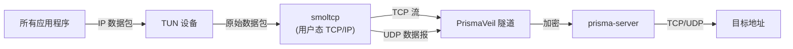

import Tabs from '@theme/Tabs';
import TabItem from '@theme/TabItem';

# TUN 模式

TUN 模式通过虚拟网络接口捕获系统所有流量，并将其路由到 PrismaVeil 隧道。与需要逐应用配置的 SOCKS5/HTTP 代理模式不同，TUN 模式在系统范围内工作——机器上的每个应用程序都会自动被代理。

## 工作原理



1. 创建虚拟网络接口（TUN 设备），并更新操作系统路由表以将流量路由到该接口
2. 所有应用程序的原始 IP 数据包到达 TUN 设备
3. 用户态 TCP/IP 协议栈（[smoltcp](https://github.com/smoltcp-rs/smoltcp)）处理数据包——提取 TCP 流和 UDP 数据报
4. TCP 连接桥接到 PrismaVeil `CMD_CONNECT` 隧道，UDP 数据报通过 `CMD_UDP_DATA` 中继
5. DNS 查询（端口 53）被拦截并根据配置的 DNS 模式处理

## 平台支持

| 平台 | 驱动 | 要求 |
|------|------|------|
| **Windows** | [Wintun](https://www.wintun.net/) | `wintun.dll` 在 PATH 或工作目录中。Windows 10+ 内置。以管理员身份运行。 |
| **Linux** | `/dev/net/tun` (ioctl) | `CAP_NET_ADMIN` 权限或 root。 |
| **macOS** | `utun` 内核接口 | Root 权限（`sudo`）。 |

## 配置

在客户端配置中启用 TUN 模式：

```toml title="client.toml"
[tun]
enabled = true
device_name = "prisma-tun0"
mtu = 1500
include_routes = ["0.0.0.0/0"]
exclude_routes = []           # 服务器 IP 自动排除
dns = "fake"                  # "fake" 或 "tunnel"
```

### 配置参考

| 字段 | 类型 | 默认值 | 描述 |
|------|------|--------|------|
| `enabled` | bool | `false` | 启用 TUN 模式 |
| `device_name` | string | `"prisma-tun0"` | TUN 设备名称（Linux：任意名称，macOS：必须为 `utunN`，Windows：适配器名称） |
| `mtu` | u16 | `1500` | 最大传输单元（有效值：576–9000） |
| `include_routes` | string[] | `["0.0.0.0/0"]` | 通过隧道捕获的 CIDR 路由 |
| `exclude_routes` | string[] | `[]` | 排除的 CIDR 路由（服务器 IP 始终自动排除） |
| `dns` | string | `"fake"` | TUN 的 DNS 模式：`"fake"` 或 `"tunnel"` |

## DNS 模式

TUN 模式拦截所有 DNS 查询（端口 53 流量），并根据配置的模式处理：

### Fake DNS（`dns = "fake"`）

推荐模式。为查询的域名分配 `198.18.0.0/15` 范围内的虚拟 IP。当连接到虚拟 IP 时，Prisma 将其解析回原始域名并通过隧道发送域名。优势：

- **零 DNS 泄漏** — 不会有真实的 DNS 查询离开本机
- **基于域名的路由** — 路由规则可以匹配域名，而非仅匹配 IP
- **更快的解析** — 无需 DNS 网络往返

### Tunnel DNS（`dns = "tunnel"`）

通过 PrismaVeil 隧道使用 `CMD_DNS_QUERY` 转发原始 DNS 查询。服务端使用配置的上游 DNS 服务器解析查询。适用于需要真实 DNS 响应的场景（例如验证 DNS 记录的应用程序）。

## 快速开始

### 1. 配置 TUN 模式

在现有客户端配置中添加 TUN 部分：

```toml title="client.toml"
socks5_listen_addr = "127.0.0.1:1080"
server_addr = "your-server:8443"
transport = "quic"

[identity]
client_id = "your-client-id"
auth_secret = "your-auth-secret"

[tun]
enabled = true
dns = "fake"
```

### 2. 以提升的权限运行

<Tabs>
  <TabItem value="linux" label="Linux" default>

```bash
sudo prisma client -c client.toml
```

或授予二进制文件 `CAP_NET_ADMIN` 权限以避免使用 root：

```bash
sudo setcap cap_net_admin+ep $(which prisma)
prisma client -c client.toml
```

  </TabItem>
  <TabItem value="macos" label="macOS">

```bash
sudo prisma client -c client.toml
```

  </TabItem>
  <TabItem value="windows" label="Windows">

以**管理员身份**运行 PowerShell 或命令提示符，然后：

```powershell
prisma client -c client.toml
```

确保 `wintun.dll` 与 `prisma.exe` 在同一目录中，或在系统 PATH 中。

  </TabItem>
</Tabs>

### 3. 验证

所有流量现在都通过隧道传输：

```bash
curl https://httpbin.org/ip
# 应显示服务器的 IP，而非本地 IP
```

## 路由配置

### 代理所有流量（默认）

```toml
[tun]
enabled = true
include_routes = ["0.0.0.0/0"]
```

### 仅代理特定子网

```toml
[tun]
enabled = true
include_routes = ["10.0.0.0/8", "172.16.0.0/12", "192.168.0.0/16"]
```

### 排除特定目标

```toml
[tun]
enabled = true
include_routes = ["0.0.0.0/0"]
exclude_routes = ["192.168.1.0/24", "10.0.0.0/8"]
```

:::tip
服务器的 IP 地址始终自动从 TUN 路由中排除，以防止路由环路。
:::

## 结合路由规则 (Routing Rules)

TUN 模式可与 Prisma 的[路由规则](/docs/features/routing-rules)引擎配合使用。您可以通过 TUN 捕获所有流量，但选择性地路由 (Routing)：

```toml title="client.toml"
[tun]
enabled = true
dns = "fake"

[[routing.rules]]
type = "domain-suffix"
value = "google.com"
action = "proxy"

[[routing.rules]]
type = "domain-suffix"
value = "local"
action = "direct"

[[routing.rules]]
type = "ip-cidr"
value = "192.168.0.0/16"
action = "direct"
```

## 架构细节

### TCP 处理

TUN 设备的 TCP 数据包由 [smoltcp](https://github.com/smoltcp-rs/smoltcp) 用户态 TCP/IP 协议栈处理：

1. 原始 SYN 数据包触发 smoltcp 中的套接字创建
2. TCP 三次握手在 smoltcp 内完成
3. 连接建立后，TCP 流通过 `CMD_CONNECT` 桥接到 PrismaVeil 隧道
4. 数据双向流动：应用程序 ↔ smoltcp ↔ PrismaVeil ↔ 服务端 ↔ 目标地址

协议栈支持最多 64 个并发 TCP 连接，每个套接字配备 64KB 的发送/接收缓冲区。

### UDP 处理

UDP 数据报通过 PrismaVeil 的 `CMD_UDP_DATA` 命令中继：

- **DNS（端口 53）**：被 DNS 解析器拦截并处理（fake 或 tunnel 模式）
- **其他 UDP**：通过 PrismaUDP 子协议中继，支持游戏、VoIP 和其他 UDP 应用

### 性能调优

| 参数 | 默认值 | 建议 |
|------|--------|------|
| `mtu` | 1500 | 大多数网络使用 1500。本地网络的巨型帧可增加到 9000。 |
| Wintun 环形缓冲区 | 4 MB | 硬编码值，足以满足高吞吐量代理需求。 |
| smoltcp 套接字 | 最多 64 个 | 满足大多数桌面使用。繁重的服务器工作负载可能需要改用 SOCKS5 模式。 |

## 故障排除

### "Failed to load Wintun driver"（Windows）

从 [wintun.net](https://www.wintun.net/) 下载 `wintun.dll`，并将其放在与 `prisma.exe` 相同的目录中。

### "Failed to open /dev/net/tun"（Linux）

确保具有所需权限：

```bash
# 方法 1：以 root 运行
sudo prisma client -c client.toml

# 方法 2：授予权限
sudo setcap cap_net_admin+ep $(which prisma)
```

### "Failed to connect utun socket"（macOS）

macOS 需要 root 权限才能创建 TUN 设备：

```bash
sudo prisma client -c client.toml
```

### 路由环路 (Routing Loop)

如果启用 TUN 模式后失去网络连接，可能是服务器 IP 未被正确排除。请显式排除：

```toml
[tun]
enabled = true
exclude_routes = ["<server-ip>/32"]
```

### DNS 无法解析

确保 `dns` 设置为 `"fake"` 或 `"tunnel"`。使用 `dns = "fake"` 时，应用程序会将域名解析为 `198.18.0.0/15` 范围内的虚拟 IP——这是预期行为。
