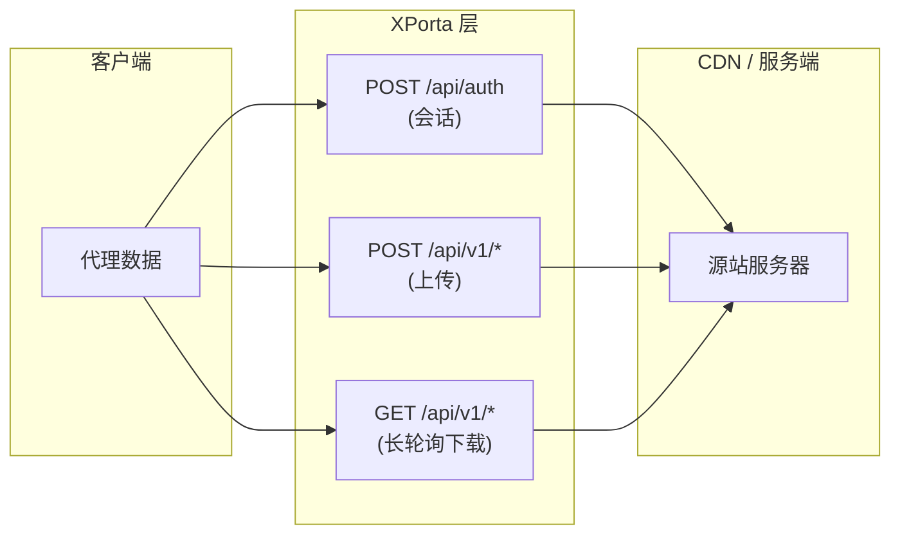

# XPorta 传输

XPorta 是新一代 CDN 传输协议，使代理流量与普通单页应用调用 REST API 的流量完全无法区分。与 XHTTP stream-one 使用单一无限双向流不同，XPorta 将代理数据拆分为大量短生命周期的 HTTP 请求/响应对——这正是真实 Web 应用调用后端 API 时产生的流量模式。

## 为什么选择 XPorta

XHTTP stream-one 运行良好，但单一长生命周期的 HTTP/2 流搭配 `application/octet-stream` 内容类型越来越容易被检测。审查系统可以标记异常的流存活时间、二进制内容类型和固定的单一 URL 路径。XPorta 消除了所有这些指纹特征：

| 方面 | XHTTP stream-one | XPorta |
|------|-------------------|--------|
| H2 流模式 | 1 条流，永久存活 | 3-8 条并发短生命周期流 |
| 请求存活时间 | 数分钟到数小时 | 毫秒到 55 秒 |
| Content-Type | 始终为 application/octet-stream | JSON（默认）或二进制 |
| URL 路径 | 1 条固定路径 | 多条随机路径 |
| 主动探测响应 | 二进制流（可疑） | 逼真的 JSON 401 / 伪装站点 |
| DPI 特征 | 可检测：长 POST + 二进制流 | 与正常 API 流量无法区分 |

## 工作原理

XPorta 将代理隧道拆分为三个逻辑通道——会话、上传和下载——每个通道都使用标准 HTTP 语义，任何 CDN 都能无障碍地透传。



### 会话建立

客户端向 `session_path`（例如 `/api/auth`）发送 POST 请求，请求体为 JSON：

```json
{
  "v": 1,
  "t": 1710000000,
  "c": "a1b2c3d4e5f6...",
  "a": "hmac-sha256-hex",
  "p": "random-padding..."
}
```

| 字段 | 说明 |
|------|------|
| `v` | 协议版本 |
| `t` | Unix 时间戳 |
| `c` | 客户端 ID（十六进制） |
| `a` | HMAC-SHA256 认证标签 |
| `p` | 随机长度填充 |

服务端验证认证信息、创建会话，然后通过 `Set-Cookie` 响应头返回一个 BLAKE3 密钥派生的令牌。后续所有请求都携带此 cookie——不需要自定义头部，不需要特殊的认证方式。

### 上传（客户端到服务端）

客户端将 POST 请求发送到从 `data_paths` 中随机选择的路径。每个请求携带一块代理数据，支持两种编码方式：

**JSON 编码**（默认）：

```json
{
  "s": 42,
  "d": "base64-encoded-payload",
  "p": "random-padding..."
}
```

**二进制编码**：

```
[序列号: 4 字节小端序][长度: 4 字节小端序][载荷][填充]
```

服务端会在响应体中捎带待下载的数据，减少往返次数。

### 下载（服务端到客户端）

客户端在 `poll_paths` 的多个路径上维持 `poll_concurrency`（默认 3）个挂起的 GET 请求。服务端将每个请求保持最多 55 秒（长轮询）。当有数据可用时，服务端立即响应：

```json
{
  "items": [
    {"s": 10, "d": "base64-data"},
    {"s": 11, "d": "base64-data"}
  ],
  "p": "random-padding..."
}
```

如果在超时时间内没有数据到达，服务端返回空响应，客户端立即发送新的轮询请求。

### 基于序列号的重组 (Sequence-Based Reassembly)

由于 HTTP/2 在单一 TCP 连接上多路复用 (Multiplexing) 请求，响应可能乱序到达。每个上传和下载的数据块都携带序列号。接收端缓冲乱序的数据块，并按正确的序列号顺序重组后再传递给隧道层。

## 编码模式

### JSON（默认）

所有载荷通过 base64 编码后封装在 JSON 对象中，请求使用 `Content-Type: application/json`。这是最隐蔽的模式——流量与典型单页应用的 API 调用完全无法区分。代价是 base64 编码带来约 37% 的额外开销。

### 二进制

载荷以原始字节发送，使用 `Content-Type: application/octet-stream`。吞吐量最大，额外开销仅约 0.5%（只有 8 字节的序列号/长度头）。适用于隐蔽性要求较低但性能优先的场景。

### 自动

小载荷（低于可配置阈值）使用 JSON 编码；大载荷切换为二进制编码。这在日常浏览时提供良好的隐蔽性，同时避免批量传输时的过高开销。

## 服务端配置

```toml title="server.toml"
[cdn]
enabled = true
listen_addr = "0.0.0.0:443"

[cdn.xporta]
enabled = true
session_path = "/api/auth"
data_paths = ["/api/v1/data", "/api/v1/sync", "/api/v1/update"]
poll_paths = ["/api/v1/notifications", "/api/v1/feed", "/api/v1/events"]
session_timeout_secs = 300
max_sessions_per_client = 8
cookie_name = "_sess"
encoding = "json"

[cdn.tls]
cert_path = "origin-cert.pem"
key_path = "origin-key.pem"
```

| 参数 | 默认值 | 说明 |
|------|--------|------|
| `session_path` | `/api/auth` | 会话创建端点 |
| `data_paths` | — | 上传端点列表（客户端每次请求随机选择） |
| `poll_paths` | — | 长轮询下载端点列表 |
| `session_timeout_secs` | 300 | 会话空闲超时时间（秒） |
| `max_sessions_per_client` | 8 | 每个客户端最大并发会话数 |
| `cookie_name` | `_sess` | 会话 cookie 名称 |
| `encoding` | `json` | 默认编码方式：`json`、`binary` 或 `auto` |

## 客户端配置

```toml title="client.toml"
transport = "xporta"

[xporta]
base_url = "https://your-domain.com"
session_path = "/api/auth"
data_paths = ["/api/v1/data", "/api/v1/sync", "/api/v1/update"]
poll_paths = ["/api/v1/notifications", "/api/v1/feed", "/api/v1/events"]
encoding = "json"          # "json" | "binary" | "auto"
poll_concurrency = 3       # 1-8
upload_concurrency = 4     # 1-8
max_payload_size = 65536   # 字节
poll_timeout_secs = 55     # 10-90
extra_headers = [["X-App-Version", "2.10.0"]]
```

| 参数 | 默认值 | 说明 |
|------|--------|------|
| `base_url` | — | 服务器 URL（必须包含协议前缀） |
| `encoding` | `json` | 载荷编码模式 |
| `poll_concurrency` | 3 | 并发长轮询 GET 请求数（1-8） |
| `upload_concurrency` | 4 | 并发上传 POST 请求数（1-8） |
| `max_payload_size` | 65536 | 每个请求的最大载荷大小（字节） |
| `poll_timeout_secs` | 55 | 长轮询超时时间（秒，范围 10-90） |
| `extra_headers` | — | 所有请求附加的额外 HTTP 头部 |

## 主动探测防御 (Active Probe Resistance)

XPorta 是 PrismaVeil 首个内置主动探测防御 (Active Probe Resistance) 能力的传输协议。当审查系统或自动化扫描器连接到服务端时，响应取决于请求是否携带有效的会话 cookie：

**无有效 cookie** —— 服务端将请求反向代理到伪装站点（通过 `cover_upstream` 配置），或返回逼真的 JSON 错误：

```json
{"error": "unauthorized", "code": 401}
```

这与真实 API 对未认证请求的响应完全一致。没有二进制数据、没有协议不匹配、没有连接拒绝行为——无法将该服务器与正常的 Web 应用区分开来。

**有效 cookie + 无效载荷** —— 服务端立即终止该会话。这防止攻击者重放捕获的 cookie 来探测协议行为。

## Cloudflare 兼容性

XPorta 专为在 Cloudflare 免费套餐的限制条件内工作而设计：

| 限制条件 | Cloudflare 限制 | XPorta 设定 |
|----------|-----------------|-------------|
| 请求超时 | 100 秒 | 55 秒轮询超时 |
| 请求体大小 | 100 MB | 64 KB 载荷 |
| WebSocket 升级 | 不需要 | 仅标准 POST/GET |
| Cookie | 透明传递 | 会话 cookie 正常工作 |
| HTTP/2 | 完全支持 | 多路复用短生命周期流 |

无需任何特殊的 Cloudflare 配置——不需要开启 WebSocket、不需要启用 gRPC。XPorta 仅使用标准的 HTTP POST 和 GET 请求，所有 CDN 都能原生处理。

## 会话持久性

XPorta 会话被设计为能够在瞬时网络中断中保持弹性。多种机制确保代理连接在短暂中断期间不会丢失用户流量：

### 处理器循环延续

每个 XPorta 会话在服务端运行一个专用的处理器循环。当单个中继连接结束时，该循环不会终止——它会继续在同一会话 cookie 上接受新的上传和下载请求。单个会话可以在无需重新认证的情况下服务多个连续的代理连接。

### 空闲超时

会话在最后一次活动（上传、下载或轮询请求）后保持 **60 秒** 存活。在此窗口内，客户端可以恢复发送数据而无需重新建立会话。如果在空闲超时内没有任何活动，服务端将清理会话并释放其资源。

### 即时下载数据传递

服务端使用轮询通知机制处理下载路径。当会话有新数据到达时，所有待处理的长轮询请求会立即收到通知并返回数据，无需等待下一个轮询周期。即使客户端正处于两次轮询请求之间，这也能确保服务端到客户端数据传递的最低延迟。

### 实际影响

- **页面导航** —— 当浏览器加载新页面时，现有的代理连接可能关闭。XPorta 会话持续存在，因此下一个连接会复用同一会话 cookie。
- **网络切换** —— 在 Wi-Fi 和蜂窝网络之间切换可能会短暂中断连接。60 秒的空闲超时为客户端重新连接提供了时间窗口。
- **CDN 连接重置** —— 如果 CDN 断开了 HTTP/2 连接，源站服务器上的 XPorta 会话保持完好，继续接受新请求。

## 与其他传输协议的比较

| 特性 | QUIC | TCP | WebSocket | gRPC | XHTTP | XPorta |
|------|------|-----|-----------|------|-------|--------|
| 看起来像正常 HTTP | 否 | 否 | Upgrade 头部 | grpc content-type | 是 | 是 |
| CDN 兼容 | 否 | 否 | 是 | 部分 | 是 | 是 |
| DPI 抗检测能力 | 低 | 低 | 中 | 中 | 高 | 最高 |
| 主动探测防御 | 否 | 否 | 否 | 否 | 否 | 是 |
| 单连接开销 | 低 | 低 | 中 | 中 | 低 | 低 |
| 多 URL 路径 | 否 | 否 | 否 | 否 | 否 | 是 |
