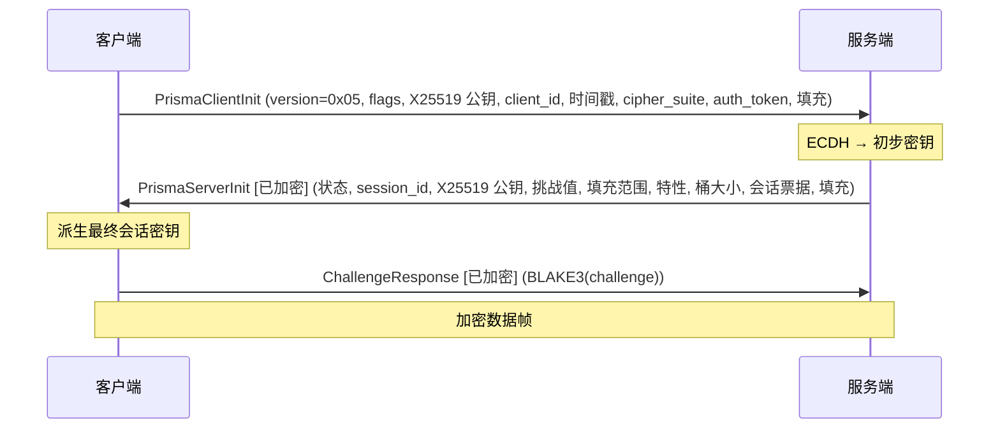
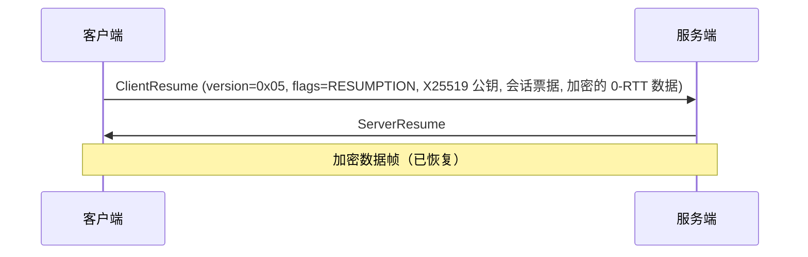

# PrismaVeil 协议

PrismaVeil 是 Prisma 客户端和服务端之间使用的自定义线路协议 (Wire Protocol)。它提供认证密钥交换 (Key Exchange)、加密 (Encryption) 数据传输、多路复用 (Multiplexing) 流管理、UDP 中继 (Relay) 和前向纠错 (FEC)。

## 协议版本

| 版本 | 握手 | 特性 |
|------|------|------|
| **v5 (0x05)** | **2 步（1 RTT）** | 所有 v4 功能，另增：基于 BLAKE3 密钥的 16 字节 AAD 头部认证加密（绑定会话上下文）、连接迁移（CMD_MIGRATION，含 32 字节令牌 + 16 字节会话 ID）、零拷贝 v5 帧编码、增强型抗重放窗口追踪、增强型 KDF |
| **v4 (0x04)** | **2 步（1 RTT）** | 0-RTT 恢复、PrismaUDP、FEC、DNS、速度测试、拥塞控制、端口跳变、Salamander v2、桶填充、流量整形、PrismaTLS、PrismaFP、熵伪装（向后兼容 — v4 客户端仍可连接 v5 服务器，使用空 AAD） |

## PrismaVeil 握手

PrismaVeil 握手通过将认证整合到初始密钥交换中实现 1 RTT：



### ClientInit

| 字段 | 大小 | 描述 |
|------|------|------|
| `version` | 1 字节 | `0x05`（v4 客户端为 `0x04`） |
| `flags` | 1 字节 | 位 0: has_0rtt_data，位 1: resumption |
| `client_ephemeral_pub` | 32 字节 | X25519 临时公钥 |
| `client_id` | 16 字节 | 客户端 UUID |
| `timestamp` | 8 字节（大端） | Unix 时间戳（秒） |
| `cipher_suite` | 1 字节 | `0x01` = ChaCha20-Poly1305，`0x02` = AES-256-GCM |
| `auth_token` | 32 字节 | HMAC-SHA256(auth_secret, client_id \|\| timestamp) |
| `padding` | 可变 | 随机填充（0-256 字节） |

### ServerInit（使用初步密钥加密）

| 字段 | 大小 | 描述 |
|------|------|------|
| `status` | 1 字节 | 接受状态码 |
| `session_id` | 16 字节 | 此会话的 UUID |
| `server_ephemeral_pub` | 32 字节 | X25519 临时公钥 |
| `challenge` | 32 字节 | 用于验证的随机挑战值 |
| `padding_min` | 2 字节（小端） | 协商的最小逐帧填充 |
| `padding_max` | 2 字节（小端） | 协商的最大逐帧填充 |
| `server_features` | 4 字节（小端） | 支持的功能位掩码 |
| `bucket_count` | 2 字节 | 流量整形桶大小数量 |
| `bucket_sizes` | 可变 | 桶大小列表（每个 2 字节，共 `bucket_count` 条） |
| `session_ticket_len` | 2 字节 | 会话票据长度 |
| `session_ticket` | 可变 | 用于 0-RTT 恢复的不透明票据 |
| `padding` | 可变 | 随机填充 |

### 密钥派生 (Key Derivation)（两阶段）

1. **初步密钥**（加密 ServerInit）：`BLAKE3("prisma-v3-preliminary", shared_secret || client_pub || server_pub || timestamp)`
2. **最终会话密钥**：`BLAKE3("prisma-v3-session", shared_secret || client_pub || server_pub || challenge || timestamp)`

### 0-RTT 会话恢复 (Session Resumption)

后续连接可使用会话票据 (Session Ticket) 跳过完整握手 (Handshake)：



抗重放 (Anti-Replay) 保护：服务端维护已使用会话票据的布隆过滤器 (Bloom Filter)。

### 服务端功能位掩码

| 位 | 功能 | 描述 |
|----|------|------|
| 0x0001 | UDP_RELAY | PrismaUDP 中继支持 |
| 0x0002 | FEC | 前向纠错 |
| 0x0004 | PORT_HOPPING | 端口跳变支持 |
| 0x0008 | SPEED_TEST | 带宽测试支持 |
| 0x0010 | DNS_TUNNEL | 加密 DNS 查询 |
| 0x0020 | BANDWIDTH_LIMIT | 每客户端带宽限制 |

### AcceptStatus 值

| 代码 | 名称 | 描述 |
|------|------|------|
| `0x00` | Ok | 认证成功 |
| `0x01` | AuthFailed | 凭证无效 |
| `0x02` | ServerBusy | 已达最大连接数 |
| `0x03` | VersionMismatch | 不支持的协议版本 |
| `0x04` | QuotaExceeded | 流量配额已超 |

## 加密帧线路格式

握手完成后，所有数据以加密帧的形式交换：

```
[nonce:12 字节][密文长度:2 字节 大端][密文 + AEAD 标签]
```

nonce 随每个帧一起传输。密文包含 AEAD 认证标签（ChaCha20-Poly1305 和 AES-256-GCM 均为 16 字节）。

## 数据帧明文格式

```
无填充:   [command:1][flags:2 小端][stream_id:4][payload:可变]
有填充:   [command:1][flags:2 小端][stream_id:4][payload_len:2][payload:可变][padding:可变]
桶填充:   [command:1][flags:2 小端 (FLAG_BUCKETED)][stream_id:4][payload_len:2][payload:可变][bucket_padding:可变]
```

## 命令类型

| 代码 | 命令 | 方向 | 载荷 |
|------|------|------|------|
| `0x01` | CONNECT | 客户端 → 服务端 | 目标地址 + 端口 |
| `0x02` | DATA | 双向 | 原始数据字节 |
| `0x03` | CLOSE | 双向 | 无 |
| `0x04` | PING | 双向 | 序列号（4 字节） |
| `0x05` | PONG | 双向 | 序列号（4 字节） |
| `0x06` | REGISTER_FORWARD | 客户端 → 服务端 | 远程端口（2 字节）+ 名称 |
| `0x07` | FORWARD_READY | 服务端 → 客户端 | 远程端口（2 字节）+ 成功标志（1 字节） |
| `0x08` | FORWARD_CONNECT | 服务端 → 客户端 | 远程端口（2 字节） |
| `0x09` | UDP_ASSOCIATE | 客户端 → 服务端 | 绑定地址 + 端口（PrismaUDP） |
| `0x0A` | UDP_DATA | 双向 | 带地址的 UDP 数据报（PrismaUDP） |
| `0x0B` | SPEED_TEST | 双向 | 方向（1 字节）+ 持续时间（1 字节）+ 数据 |
| `0x0C` | DNS_QUERY | 客户端 → 服务端 | 查询 ID（2 字节）+ 原始 DNS 查询 |
| `0x0D` | DNS_RESPONSE | 服务端 → 客户端 | 查询 ID（2 字节）+ 原始 DNS 响应 |
| `0x0E` | CHALLENGE_RESP | 客户端 → 服务端 | BLAKE3 哈希（32 字节） |
| `0x0F` | MIGRATION | 双向 | 迁移令牌 (Migration Token)（32 字节）+ 会话 ID（16 字节）— 无缝连接迁移 (Connection Migration)（仅 v5） |

## 标志位（2 字节，小端序）

| 位 | 名称 | 描述 |
|----|------|------|
| 0x0001 | PADDED | 帧包含逐帧填充 |
| 0x0002 | FEC | 前向纠错奇偶校验数据 |
| 0x0004 | PRIORITY | 高优先级（游戏、VoIP） |
| 0x0008 | DATAGRAM | 不可靠传输提示 |
| 0x0010 | COMPRESSED | zstd 压缩载荷 |
| 0x0020 | 0RTT | 0-RTT 数据的一部分 |
| 0x0040 | BUCKETED | 帧填充到桶边界 |
| 0x0080 | CHAFF | 虚假帧（丢弃载荷） |

## PrismaUDP

PrismaUDP 是通过加密隧道中继 UDP 流量（游戏、VoIP、DNS）的子协议。

### UDP_ASSOCIATE

客户端发送以请求 UDP 中继会话：

```
[bind_addr_type:1][bind_addr:可变][bind_port:2]
```

服务端分配 UDP 套接字并以 FORWARD_READY 响应。

### UDP_DATA

双向数据报中继：

```
[assoc_id:4][frag:1][addr_type:1][dest_addr:可变][dest_port:2][payload:可变]
```

### FEC（前向纠错）

可选的 Reed-Solomon 纠删码，用于 UDP 流：

- 可配置：例如 10 个数据分片 + 3 个奇偶分片（30% 开销）
- 启用 FEC 的数据报使用 FLAG_FEC 并添加 4 字节 FEC 头部：

```
[fec_group:2 小端][fec_index:1][fec_total:1][payload:可变]
```

恢复：如果组中接收到任意 `data_shards` 个数据包，即可重建所有原始数据。

### 传输方式

- **通过 QUIC**：使用 QUIC DATAGRAM 扩展（RFC 9221），提供不可靠的低延迟传输
- **通过 TCP/WS/gRPC/XHTTP**：使用 CMD_UDP_DATA 作为可靠帧（更高延迟的备选方案）

## 拥塞控制 (Congestion Control)

三种可配置模式：

| 模式 | 描述 |
|------|------|
| **Brutal** | 固定发送速率，不受丢包影响（Hysteria2 风格）。最适合限速网络。 |
| **BBR** | Google BBRv2 — 探测带宽 (Bandwidth) 和 RTT。适用于正常网络。 |
| **Adaptive** | 从 BBR 开始，检测人为限速后逐渐提高激进程度。 |

## 抗检测功能 (Anti-Detection)

### Salamander UDP 混淆 (Obfuscation)

剥离 QUIC 头部，使用 BLAKE3 派生的密钥流对所有 UDP 数据包进行 XOR 混淆 (Obfuscation)。线路上的流量表现为随机字节。在 v4 中，Salamander 使用逐包 nonce（非确定性）防止关联攻击，并添加 ASCII 前缀用于 GFW 熵分析（Ex2）豁免。

### HTTP/3 伪装 (Masquerade)

QUIC 服务端对浏览器返回真实网站。PrismaVeil 客户端通过其初始认证流进行区分。

### 端口跳变 (Port Hopping)

服务端绑定多个 UDP 端口。客户端按基于 HMAC 的确定性计划轮换端口：

```
current_port = base_port + HMAC-SHA256(shared_secret, epoch)[0..2] % port_range
```

### 逐帧填充 (Per-Frame Padding)

在协商范围内为每个数据帧添加随机填充 (Padding)，防止基于数据包大小的流量分析。

## 协议常量

| 常量 | 值 | 描述 |
|------|-----|------|
| `PRISMA_PROTOCOL_VERSION` | `0x05` | 当前协议版本 |
| `MAX_FRAME_SIZE` | 16384 | 最大帧大小（字节） |
| `NONCE_SIZE` | 12 | Nonce 大小（字节） |
| `MAX_PADDING_SIZE` | 256 | 最大填充大小（字节） |
| `PRISMA_QUIC_ALPN` | `"h3"` | QUIC ALPN 协议字符串 |
| `SESSION_TICKET_KEY_SIZE` | 32 | 票据加密密钥大小 |
| `SESSION_TICKET_MAX_AGE_SECS` | 86400 | 会话票据有效期（24 小时） |

